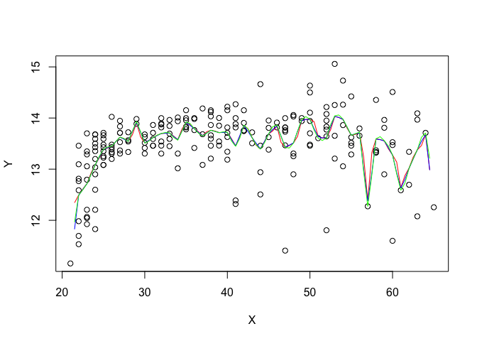
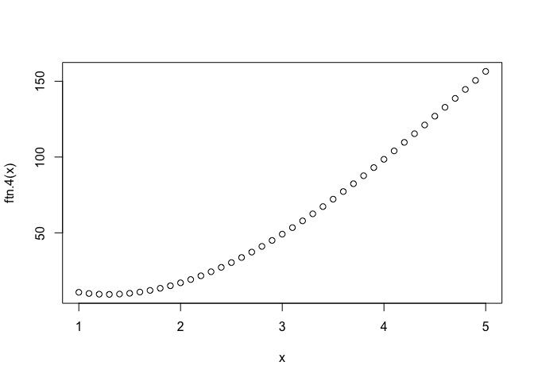
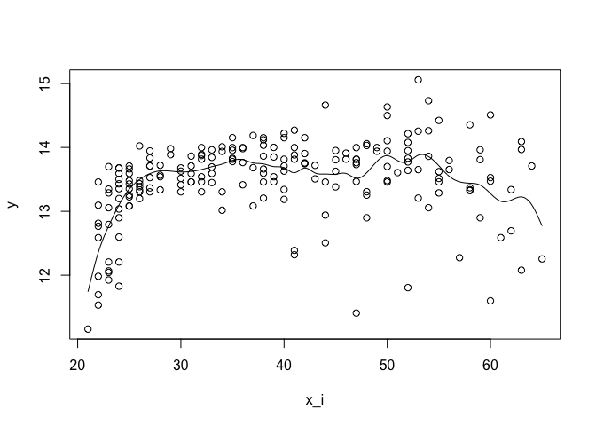

Assignment 6
================
tom
2017-11-09

2
=

1.  Use the data cps71 from the package np in R to fit the following kernel regressions For x = 25, 35, 50,

2.  obtain the local constant kernel estimator of βx, i.e., p = 0.

<!-- -->

1.  obtain the local linear kernel estimator of βx, i.e., p = 1.
2.  obtain the local quadratic kernel estimator of βx, i.e., p = 2. Report these vectors. What are your predicted values at these x?

``` r
# Q2
data("cps71",package='np')

# a)

# create Z matrix given p (degree of polynomial), x (point at which you estimate), X (data matrix)
createZ <- function(p,x,X){
  tmp <- matrix(0,nrow=length(X),ncol=p+1)
  tmp[,1] <- 1
  if(p==0) return(tmp)
  else
    for (i in 1:p){
      tmp[,i+1] <- (X-x)^(i)
    }
  return(tmp)
}

createW <- function(x,X,h=0){
  n <- length(X)
  if (h==0){
  h <- n^(-1/5)}
  tmp <- matrix(0,ncol=n,nrow=n)
  diag(tmp) <- 1/h*dnorm((X-x)/h)
  return(tmp)
}

X <- cps71$age
Y <- cps71$logwage
x <- c(25,35,50)

# i) constant

predict.kernel <- function(p,x,X,Y){
  tmp.result <- c()
  for (i in 1:length(x)){
    tmp.x <- x[i]
    Z_0 <- createZ(p,tmp.x,X)
    W_0 <- createW(tmp.x,X)
    e1 <- rep(0,p+1)
    e1[1] <- 1
    tmp1 <- t(Z_0) %*% W_0
    tmp.beta <- solve(tmp1%*%Z_0)%*%tmp1%*%Y
    tmp.result[[i]] <- list(beta=tmp.beta,fitted.values=e1%*%tmp.beta)
  }
  return(tmp.result)
}

K_0 <- predict.kernel(0,x,X,Y)
K_1 <- predict.kernel(1,x,X,Y)
K_2 <- predict.kernel(2,x,X,Y)
K_0;K_1;K_2
```

    ## [[1]]
    ## [[1]]$beta
    ##          [,1]
    ## [1,] 13.38221
    ## 
    ## [[1]]$fitted.values
    ##          [,1]
    ## [1,] 13.38221
    ## 
    ## 
    ## [[2]]
    ## [[2]]$beta
    ##        [,1]
    ## [1,] 13.917
    ## 
    ## [[2]]$fitted.values
    ##        [,1]
    ## [1,] 13.917
    ## 
    ## 
    ## [[3]]
    ## [[3]]$beta
    ##          [,1]
    ## [1,] 13.97354
    ## 
    ## [[3]]$fitted.values
    ##          [,1]
    ## [1,] 13.97354

    ## [[1]]
    ## [[1]]$beta
    ##            [,1]
    ## [1,] 13.3837636
    ## [2,]  0.2144434
    ## 
    ## [[1]]$fitted.values
    ##          [,1]
    ## [1,] 13.38376
    ## 
    ## 
    ## [[2]]
    ## [[2]]$beta
    ##            [,1]
    ## [1,] 13.9170023
    ## [2,]  0.1111487
    ## 
    ## [[2]]$fitted.values
    ##        [,1]
    ## [1,] 13.917
    ## 
    ## 
    ## [[3]]
    ## [[3]]$beta
    ##            [,1]
    ## [1,] 13.9732874
    ## [2,] -0.1199316
    ## 
    ## [[3]]$fitted.values
    ##          [,1]
    ## [1,] 13.97329

    ## [[1]]
    ## [[1]]$beta
    ##            [,1]
    ## [1,] 13.3868399
    ## [2,]  0.1837910
    ## [3,] -0.1195553
    ## 
    ## [[1]]$fitted.values
    ##          [,1]
    ## [1,] 13.38684
    ## 
    ## 
    ## [[2]]
    ## [[2]]$beta
    ##            [,1]
    ## [1,] 13.9217498
    ## [2,]  0.1111471
    ## [3,] -0.2431643
    ## 
    ## [[2]]$fitted.values
    ##          [,1]
    ## [1,] 13.92175
    ## 
    ## 
    ## [[3]]
    ## [[3]]$beta
    ##            [,1]
    ## [1,] 13.9743428
    ## [2,] -0.1817528
    ## [3,] -0.1865389
    ## 
    ## [[3]]$fitted.values
    ##          [,1]
    ## [1,] 13.97434

1.  Plot the data, along with the three fitted regression functions gˆ(x) in part (a). Use grid of length 0.5 over the range x, do not include the boundaries.

``` r
gX <- function(p,x,X,Y,tmp.h=0){
  # for (i in 1:length(hrange)){
  #   tmp.h <- hrange[i]
  tmp.fitted.values <- rep(0,length(x))
  
  for (j in 1:length(x)){
    tmp.x <- x[j]
    tmp.W <- createW(x=tmp.x,X=X,h=tmp.h)
    tmp.Z <- createZ(p=p,x=tmp.x,X=X)
    e1 <- rep(0,p+1)
    e1[1] <- 1
    tmp1 <- t(tmp.Z) %*% tmp.W
    tmp.l <- e1%*%solve(tmp1%*%tmp.Z)%*%tmp1
    tmp.fitted.values[j] <- tmp.l%*%Y
  }
  return(tmp.fitted.values)
}
summary(X)
```

    ##    Min. 1st Qu.  Median    Mean 3rd Qu.    Max. 
    ##   21.00   27.00   38.00   38.85   49.00   65.00

``` r
x <- seq(from=21.5,to=64.5,by=0.5)

K0f <- gX(p=0,x=x,X=X,Y=Y,tmp.h=0)
K1f <- gX(p=1,x=x,X,Y,0)
K2f <- gX(p=2,x=x,X,Y,0)

plot(x=X,y=Y)
lines(x=x,y=K0f,col='red')
lines(x=x,y=K1f,col='blue')
lines(x=x,y=K2f,col='green')
```



3
=

``` r
constructLF <- function(p,X,Y,tmp.h){
  # for (i in 1:length(hrange)){
  #   tmp.h <- hrange[i]
    tmp.result <- matrix(NA,nrow=length(Y),ncol=length(Y))
    tmp.fitted.values <- rep(0,length(Y))
    
    for (j in 1:length(Y)){
      tmp.x <- X[j]
      tmp.W <- createW(x=tmp.x,X=X,h=tmp.h)
      tmp.Z <- createZ(p=p,x=tmp.x,X=X)
      e1 <- rep(0,p+1)
      e1[1] <- 1
      tmp1 <- t(tmp.Z) %*% tmp.W
      tmp.l <- e1%*%solve(tmp1%*%tmp.Z)%*%tmp1
      tmp.result[j,] <- tmp.l
      tmp.fitted.values[j] <- tmp.l%*%Y
    }
  return(list(L=tmp.result,fitted.values=tmp.fitted.values))  
  # }
}

computeCVh <- function(p,X,Y,tmp.h){
  tmp <- constructLF(p,X,Y,tmp.h)
  if(any(diag(tmp$L)==1)) return(Inf)
  return(sum(((Y-tmp$fitted.values)/(1-diag(tmp$L)))^2))
}

hrange <- seq(from=0.2,to=5,by=0.1)
cv.h <- rep(0,length(hrange))

computeCVhforall <- function(p,X,Y,hrange){
  tmp.cv <- rep(0,length(hrange))
  for ( i in 1:length(hrange)){
  tmp.cv[i] <- computeCVh(p,X,Y,hrange[i])
  }
  return(tmp.cv)
}

find.min.h <- function(hrange,cv){
  hrange[which.min(cv)]
}

cvh0 <- computeCVhforall(0,X,Y,hrange)
find.min.h(hrange,cvh0)
```

    ## [1] 1.9

``` r
cvh0
```

    ##  [1] 79.64615 79.40366 77.29686 74.04455 71.40194 69.52160 68.16855
    ##  [8] 67.18322 66.46712 65.94928 65.57611 65.30795 65.11637 64.98145
    ## [15] 64.88948 64.83111 64.79992 64.79133 64.80194 64.82906 64.87043
    ## [22] 64.92411 64.98838 65.06179 65.14305 65.23112 65.32511 65.42433
    ## [29] 65.52823 65.63638 65.74845 65.86418 65.98338 66.10587 66.23151
    ## [36] 66.36018 66.49174 66.62607 66.76301 66.90243 67.04417 67.18805
    ## [43] 67.33391 67.48156 67.63082 67.78148 67.93337 68.08628 68.24001

``` r
cvh1 <- computeCVhforall(1,X,Y,hrange)
find.min.h(hrange,cvh1)
```

    ## [1] 3.3

``` r
cvh1
```

    ##  [1]      Inf 80.39318 78.53814 75.66399 73.26828 71.43354 70.01411
    ##  [8] 68.92377 68.07875 67.40623 66.84847 66.35922 65.90378 65.46209
    ## [15] 65.02957 64.61248 64.22084 63.86308 63.54385 63.26428 63.02296
    ## [22] 62.81706 62.64317 62.49780 62.37769 62.27997 62.20219 62.14232
    ## [29] 62.09871 62.06996 62.05495 62.05267 62.06222 62.08278 62.11352
    ## [36] 62.15365 62.20238 62.25892 62.32249 62.39236 62.46780 62.54814
    ## [43] 62.63276 62.72106 62.81251 62.90664 63.00302 63.10126 63.20102

``` r
computeGCVh <- function(p,X,Y,tmp.h){
  tmp <- constructLF(p,X,Y,tmp.h)
  vn <- sum(diag(tmp$L))/nrow(tmp$L)
  return(sum(((Y-tmp$fitted.values)/(1-vn))^2))
}

computeGCVhforall <- function(p,X,Y,hrange){
  tmp.cv <- rep(0,length(hrange))
  for ( i in 1:length(hrange)){
    tmp.cv[i] <- computeGCVh(p,X,Y,hrange[i])
  }
  return(tmp.cv)
}

gcvh0 <- computeGCVhforall(0,X,Y,hrange)
find.min.h(hrange,gcvh0)
```

    ## [1] 1.4

``` r
gcvh1 <- computeGCVhforall(1,X,Y,hrange)
find.min.h(hrange,gcvh1)
```

    ## [1] 2.7

4
=

This is for the calculation of matrices.

``` r
A<-matrix(c(1,1,0,0,0,1,3,-1,0,0,0,0,3,9,27,0,0,0,1,9,0,3,0,-1,0),ncol=5,byrow=T)
B<-c(12,0,139.5,0,0)
solve(A,B)
```

    ## [1]  7.6875  4.3125 20.6250 12.9375 -1.4375

``` r
20.6250+6*12.9375+27*(-1.4375)
```

    ## [1] 59.4375

``` r
A<-matrix(c(1,5,0,1),ncol=2,byrow=T)
b<-c(156.5,59.4375)
solve(A,b)
```

    ## [1] -140.6875   59.4375

``` r
y=5
x<--140.6875+59.4375*y
```

``` r
ftn.4<-function(x){
 if(x<=1 && x<2){
    5+7.6875*(x-1)+4.3125*(x-1)^3
  }
 if(x<2 && x<=5){
    17+20.6250*(x-2) +12.9375*(x-2)^2 -1.4375*(x-2)^3
  }
}

x<-seq(1,5,0.1)
y<-sapply(x,ftn.4)
plot(x=x,y=ftn.4(x))
```



5
=

I refered the R codes on Piazza.

``` r
y = cps71$logwage
x_i = cps71$age
knots = min(x_i):max(x_i)
k = length(knots)
n = length(x_i)

# This function computes N''j(x)*N''l(x) as described in
# pg 103 of course notes. I checked the formula, but
# I might have coded this incorrectly...
computeNElement = function(p) {
  if (j <= 2 || l <= 2) {
    return(0)
  } else {
    return(36*((max(p-knots[j-1], 0) - max(p-knots[k], 0))/(knots[k]-knots[j-1]) - 
                 (max(p-knots[1], 0) - max(p-knots[k], 0))/(knots[k]-knots[1]))*
             ((max(p-knots[l-1], 0) - max(p-knots[k], 0))/(knots[k]-knots[l-1]) - 
                (max(p-knots[1], 0) - max(p-knots[k], 0))/(knots[k]-knots[1])))
  }
}

# Construct the N matrix using the function above
N = matrix(NA, nrow=k, ncol=k)
for (j in 1:k) {
  for (l in j:k) {
    # Integrate N''j(x)*N''l(x) from t_1 to t_k
    N[j,l] = N[l,j] = integrate(Vectorize(computeNElement), knots[1], knots[k])$value
  }
}

# Create Z matrix, with first column being 1, second column being x,
# and rest of columns being N_j(x)
Z = matrix(NA, nrow=n, ncol=k)
Z[,1] = rep(1, times=n)
Z[,2] = x_i
for (j in 3:length(knots)) {
  Z[,j] = ((pmax((x_i-knots[j-1])^3, 0) - pmax((x_i-knots[k])^3, 0))/(knots[k]-knots[j-1])  
           - (pmax((x_i-knots[1])^3, 0) - pmax((x_i-knots[k])^3, 0))/(knots[k]-knots[1]))
}

# Solve for beta
beta = solve(t(Z)%*%Z + 2*N)%*%t(Z)%*%y

# Plot natural cubic spline over range of data
x = seq(21, 65, by=0.1)
Y = matrix(NA, nrow=length(x), ncol=k)
Y[,1] = rep(1, times=length(x))
Y[,2] = x
for (j in 3:length(knots)) {
  Y[,j] = ((pmax((x-knots[j-1])^3, 0) - pmax((x-knots[k])^3, 0))/(knots[k]-knots[j-1])  
           - (pmax((x-knots[1])^3, 0) - pmax((x-knots[k])^3, 0))/(knots[k]-knots[1]))
}

fit = Y%*%beta
plot(x_i, y)
lines(x, fit)
```


