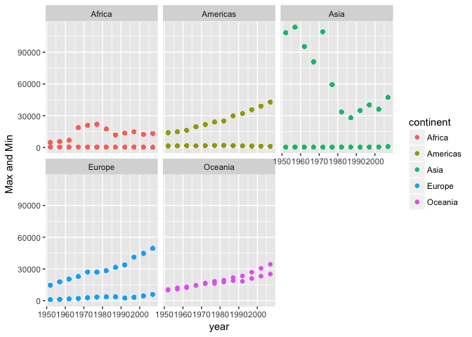
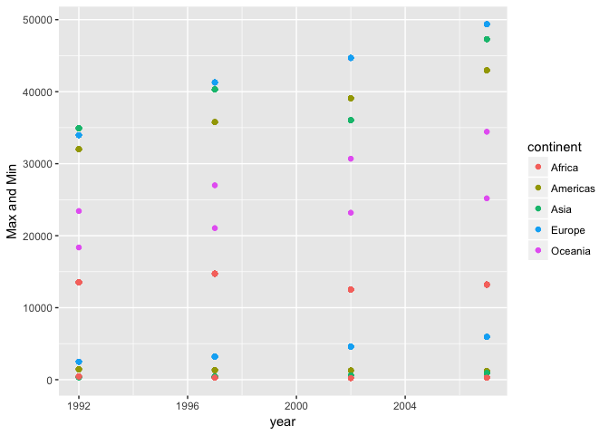
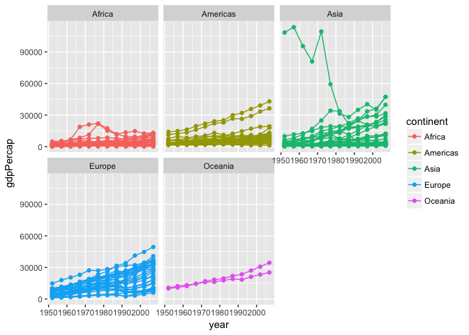
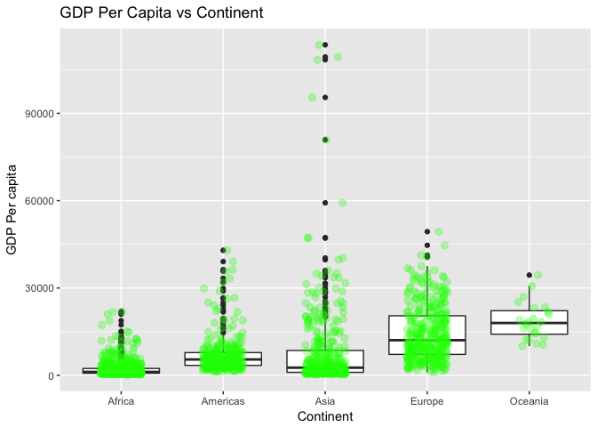
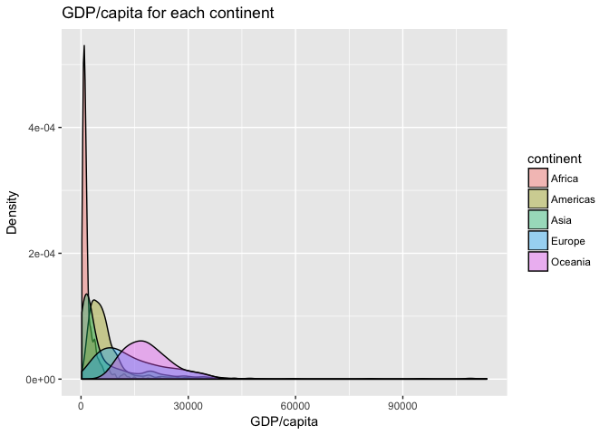
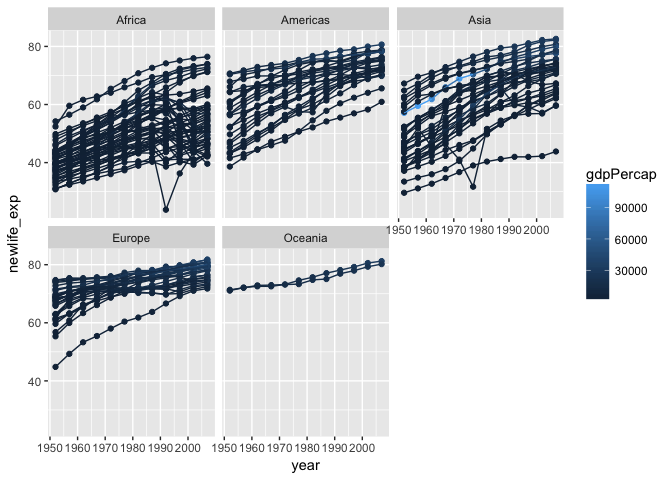
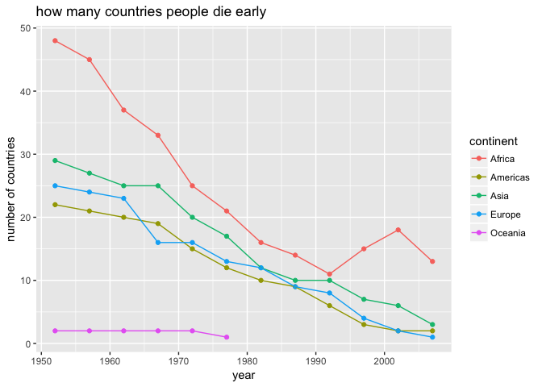
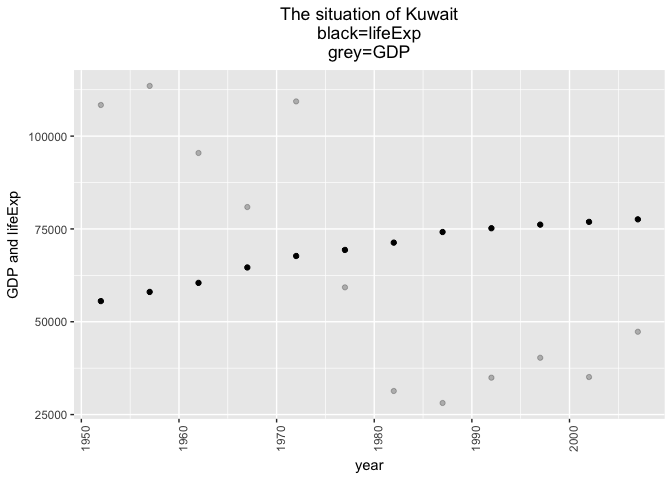

Hw03-hyeongcheol-park
================
tom
2017-09-30

#### warming up- install packages

``` r
suppressPackageStartupMessages(library(tidyverse))
suppressPackageStartupMessages(library(gapminder))
```

### 1.Let's get the maximum and minimum of GDP per capita for all continents!

``` r
(q1<-gapminder %>% 
  group_by(continent, year) %>% 
  mutate(Maxgdp=max(gdpPercap),Mingdp=min(gdpPercap)) %>% 
  select(continent, year, Maxgdp, Mingdp))
```

    ## # A tibble: 1,704 x 4
    ## # Groups:   continent, year [60]
    ##    continent  year    Maxgdp Mingdp
    ##       <fctr> <int>     <dbl>  <dbl>
    ##  1      Asia  1952 108382.35    331
    ##  2      Asia  1957 113523.13    350
    ##  3      Asia  1962  95458.11    388
    ##  4      Asia  1967  80894.88    349
    ##  5      Asia  1972 109347.87    357
    ##  6      Asia  1977  59265.48    371
    ##  7      Asia  1982  33693.18    424
    ##  8      Asia  1987  28118.43    385
    ##  9      Asia  1992  34932.92    347
    ## 10      Asia  1997  40300.62    415
    ## # ... with 1,694 more rows

Max and Min of GDP/capita for each continent per each year!

I will make a graph.

``` r
q1 %>% 
  ggplot(aes(color=continent))+facet_wrap(~ continent) +geom_point(aes(year,Maxgdp))+geom_point(aes(year,Mingdp))+scale_y_continuous("Max and Min")
```

 <br />We can easily see the difference between Min and Max of GDP/capita on each continent per year.

But it seems messy. so I will pick only in 20C and 20C and make a plot.

``` r
q1 %>% 
  filter(year %in% 1992:2017) %>% 
  ggplot(aes(color=continent, group=continent)) +geom_point(aes(year,Maxgdp))+geom_point(aes(year,Mingdp))+scale_y_continuous("Max and Min")
```



### 2.Look at the spread of GDP per capita within the continents.

``` r
gapminder %>% 
  group_by(continent, year) %>% 
  summarize(mean_gdp=mean(gdpPercap), sd_gdp=sd(gdpPercap), min_gdp=min(gdpPercap),max_gdp=max(gdpPercap),median_gdp=median(gdpPercap))
```

    ## # A tibble: 60 x 7
    ## # Groups:   continent [?]
    ##    continent  year mean_gdp    sd_gdp  min_gdp   max_gdp median_gdp
    ##       <fctr> <int>    <dbl>     <dbl>    <dbl>     <dbl>      <dbl>
    ##  1    Africa  1952 1252.572  982.9521 298.8462  4725.296   987.0256
    ##  2    Africa  1957 1385.236 1134.5089 335.9971  5487.104  1024.0230
    ##  3    Africa  1962 1598.079 1461.8392 355.2032  6757.031  1133.7837
    ##  4    Africa  1967 2050.364 2847.7176 412.9775 18772.752  1210.3764
    ##  5    Africa  1972 2339.616 3286.8539 464.0995 21011.497  1443.3725
    ##  6    Africa  1977 2585.939 4142.3987 502.3197 21951.212  1399.6388
    ##  7    Africa  1982 2481.593 3242.6328 462.2114 17364.275  1323.7283
    ##  8    Africa  1987 2282.669 2566.5319 389.8762 11864.408  1219.5856
    ##  9    Africa  1992 2281.810 2644.0756 410.8968 13522.158  1161.6314
    ## 10    Africa  1997 2378.760 2820.7281 312.1884 14722.842  1179.8831
    ## # ... with 50 more rows

It\`s a brief summary for GDP/capita within the continents.

``` r
gapminder %>% 
  ggplot(aes(year, gdpPercap,group=country,color=continent))+facet_wrap( ~ continent) +geom_point()+geom_line()
```

 <br /> It shows the spread of GDP per capita within the continents

``` r
ggplot(gapminder, aes(year, gdpPercap,
                      colour=continent,group=country)) +
    geom_point()+geom_line(alpha=0.2)
```

 <br />Or we can use this.

``` r
gapminder %>%
    ggplot(aes(x = continent, y = gdpPercap)) + geom_boxplot() + 
  geom_jitter(position = position_jitter(width = 0.2, height = 0), alpha = 0.3, size = 2.5, colour = "green") +
  labs(title = "GDP Per Capita vs Continent", x = "Continent", y = "GDP Per capita" )
```

 <br /> Maybe boxplot is better choice.

``` r
gapminder %>%
  ggplot(aes(x = gdpPercap, fill = continent)) +
  geom_density (alpha = 0.4) +
  labs (title = "GDP/capita for each continent", x = "GDP/capita", y = "Density")
```

 <br /> I am trying many things that I have learned from peer reviewing.

### 3.Compute a trimmed mean of life expectancy for different years.

### How is life expectancy changing over time on different continents?

``` r
(newlife<-gapminder %>% 
  group_by(country) %>% 
 mutate(newlife_exp=lifeExp*year[year==2007]/year))
```

    ## # A tibble: 1,704 x 7
    ## # Groups:   country [142]
    ##        country continent  year lifeExp      pop gdpPercap newlife_exp
    ##         <fctr>    <fctr> <int>   <dbl>    <int>     <dbl>       <dbl>
    ##  1 Afghanistan      Asia  1952  28.801  8425333  779.4453    29.61250
    ##  2 Afghanistan      Asia  1957  30.332  9240934  820.8530    31.10696
    ##  3 Afghanistan      Asia  1962  31.997 10267083  853.1007    32.73088
    ##  4 Afghanistan      Asia  1967  34.020 11537966  836.1971    34.71181
    ##  5 Afghanistan      Asia  1972  36.088 13079460  739.9811    36.72851
    ##  6 Afghanistan      Asia  1977  38.438 14880372  786.1134    39.02128
    ##  7 Afghanistan      Asia  1982  39.854 12881816  978.0114    40.35670
    ##  8 Afghanistan      Asia  1987  40.822 13867957  852.3959    41.23289
    ##  9 Afghanistan      Asia  1992  41.674 16317921  649.3414    41.98781
    ## 10 Afghanistan      Asia  1997  41.763 22227415  635.3414    41.97213
    ## # ... with 1,694 more rows

<br /> As time goes by, people tend to live longer. So what I did is lifeExp\*year\[year==2007\]/year, which will correct the tendency a little bit. (Actually I did it by using gdp, but it scales lifeExp too much and I got data on which people at 1952 live longer than people in 2007! so it seems not proper way.)

``` r
newlife %>% 
  ggplot(aes(year,newlife_exp,color=gdpPercap,group=country))+facet_wrap(~ continent)+geom_point()+geom_line()
```



<br />Still there is the tendency that comtemporary people live longer.

### 4.Report the absolute and/or relative abundance of countries with low life expectancy over time by continent

**I will use median lifeExp for each continent.**

``` r
(belowage<-newlife %>% 
  group_by(continent) %>% 
  mutate(meanage=median(lifeExp)))
```

    ## # A tibble: 1,704 x 8
    ## # Groups:   continent [5]
    ##        country continent  year lifeExp      pop gdpPercap newlife_exp
    ##         <fctr>    <fctr> <int>   <dbl>    <int>     <dbl>       <dbl>
    ##  1 Afghanistan      Asia  1952  28.801  8425333  779.4453    29.61250
    ##  2 Afghanistan      Asia  1957  30.332  9240934  820.8530    31.10696
    ##  3 Afghanistan      Asia  1962  31.997 10267083  853.1007    32.73088
    ##  4 Afghanistan      Asia  1967  34.020 11537966  836.1971    34.71181
    ##  5 Afghanistan      Asia  1972  36.088 13079460  739.9811    36.72851
    ##  6 Afghanistan      Asia  1977  38.438 14880372  786.1134    39.02128
    ##  7 Afghanistan      Asia  1982  39.854 12881816  978.0114    40.35670
    ##  8 Afghanistan      Asia  1987  40.822 13867957  852.3959    41.23289
    ##  9 Afghanistan      Asia  1992  41.674 16317921  649.3414    41.98781
    ## 10 Afghanistan      Asia  1997  41.763 22227415  635.3414    41.97213
    ## # ... with 1,694 more rows, and 1 more variables: meanage <dbl>

<br />I got the average of lifeExp for every continent.

``` r
(below<-belowage %>% 
  filter(newlife_exp <= meanage))
```

    ## # A tibble: 792 x 8
    ## # Groups:   continent [5]
    ##        country continent  year lifeExp      pop gdpPercap newlife_exp
    ##         <fctr>    <fctr> <int>   <dbl>    <int>     <dbl>       <dbl>
    ##  1 Afghanistan      Asia  1952  28.801  8425333  779.4453    29.61250
    ##  2 Afghanistan      Asia  1957  30.332  9240934  820.8530    31.10696
    ##  3 Afghanistan      Asia  1962  31.997 10267083  853.1007    32.73088
    ##  4 Afghanistan      Asia  1967  34.020 11537966  836.1971    34.71181
    ##  5 Afghanistan      Asia  1972  36.088 13079460  739.9811    36.72851
    ##  6 Afghanistan      Asia  1977  38.438 14880372  786.1134    39.02128
    ##  7 Afghanistan      Asia  1982  39.854 12881816  978.0114    40.35670
    ##  8 Afghanistan      Asia  1987  40.822 13867957  852.3959    41.23289
    ##  9 Afghanistan      Asia  1992  41.674 16317921  649.3414    41.98781
    ## 10 Afghanistan      Asia  1997  41.763 22227415  635.3414    41.97213
    ## # ... with 782 more rows, and 1 more variables: meanage <dbl>

<br />there are 792 countries whose lifeExp is below their continent's median, from 1952 to 2007.

``` r
below %>% 
  group_by(year, continent) %>% 
  summarize(num=n())
```

    ## # A tibble: 54 x 3
    ## # Groups:   year [?]
    ##     year continent   num
    ##    <int>    <fctr> <int>
    ##  1  1952    Africa    48
    ##  2  1952  Americas    22
    ##  3  1952      Asia    29
    ##  4  1952    Europe    25
    ##  5  1952   Oceania     2
    ##  6  1957    Africa    45
    ##  7  1957  Americas    21
    ##  8  1957      Asia    27
    ##  9  1957    Europe    24
    ## 10  1957   Oceania     2
    ## # ... with 44 more rows

<br />I got for each year, how many countries has lower lifeExp than median lifeExp for their continent!

``` r
knitr::kable(below %>% 
  group_by(year, continent) %>% 
  summarize(num=n()))
```

|  year| continent |  num|
|-----:|:----------|----:|
|  1952| Africa    |   48|
|  1952| Americas  |   22|
|  1952| Asia      |   29|
|  1952| Europe    |   25|
|  1952| Oceania   |    2|
|  1957| Africa    |   45|
|  1957| Americas  |   21|
|  1957| Asia      |   27|
|  1957| Europe    |   24|
|  1957| Oceania   |    2|
|  1962| Africa    |   37|
|  1962| Americas  |   20|
|  1962| Asia      |   25|
|  1962| Europe    |   23|
|  1962| Oceania   |    2|
|  1967| Africa    |   33|
|  1967| Americas  |   19|
|  1967| Asia      |   25|
|  1967| Europe    |   16|
|  1967| Oceania   |    2|
|  1972| Africa    |   25|
|  1972| Americas  |   15|
|  1972| Asia      |   20|
|  1972| Europe    |   16|
|  1972| Oceania   |    2|
|  1977| Africa    |   21|
|  1977| Americas  |   12|
|  1977| Asia      |   17|
|  1977| Europe    |   13|
|  1977| Oceania   |    1|
|  1982| Africa    |   16|
|  1982| Americas  |   10|
|  1982| Asia      |   12|
|  1982| Europe    |   12|
|  1987| Africa    |   14|
|  1987| Americas  |    9|
|  1987| Asia      |   10|
|  1987| Europe    |    9|
|  1992| Africa    |   11|
|  1992| Americas  |    6|
|  1992| Asia      |   10|
|  1992| Europe    |    8|
|  1997| Africa    |   15|
|  1997| Americas  |    3|
|  1997| Asia      |    7|
|  1997| Europe    |    4|
|  2002| Africa    |   18|
|  2002| Americas  |    2|
|  2002| Asia      |    6|
|  2002| Europe    |    2|
|  2007| Africa    |   13|
|  2007| Americas  |    2|
|  2007| Asia      |    3|
|  2007| Europe    |    1|

<br />pretty chart.And for graph,

``` r
below %>% 
  group_by(year, continent) %>% 
  summarize(num=n()) %>% 
  ggplot(aes(year,num, colour=continent,group=continent))+geom_point()+geom_line()+labs(y="number of countries", title="how many countries people die early")
```

 <br /> Early dying people seem to be getting smaller.

5.Find countries with interesting stories.
------------------------------------------

``` r
gapminder %>% 
  mutate(diff=gdpPercap-lifeExp*10^2) %>% 
  arrange(desc(diff)) %>% 
  select(year,country,diff,lifeExp,gdpPercap)
```

    ## # A tibble: 1,704 x 5
    ##     year   country      diff lifeExp gdpPercap
    ##    <int>    <fctr>     <dbl>   <dbl>     <dbl>
    ##  1  1957    Kuwait 107719.83  58.033 113523.13
    ##  2  1952    Kuwait 102825.85  55.565 108382.35
    ##  3  1972    Kuwait 102576.67  67.712 109347.87
    ##  4  1962    Kuwait  89411.11  60.470  95458.11
    ##  5  1967    Kuwait  74432.48  64.624  80894.88
    ##  6  1977    Kuwait  52331.18  69.343  59265.48
    ##  7  2007    Norway  41337.59  80.196  49357.19
    ##  8  2007    Kuwait  39548.19  77.588  47306.99
    ##  9  2007 Singapore  39145.98  79.972  47143.18
    ## 10  2002    Norway  36778.98  79.050  44683.98
    ## # ... with 1,694 more rows

I made some well-being index, diff, which means higher gdp with longer lifeExp. That is to say, some countries where people should be happy in common sense.

It turns out Kuwait has many ranks, so I made a plot only for Kuwait.

``` r
gapminder %>% 
  mutate(diff=gdpPercap-lifeExp*10^2) %>% 
  arrange(desc(diff)) %>% 
  filter(country=="Kuwait") %>% 
  ggplot() + geom_point(aes(year,gdpPercap),alpha = 0.25)+
  geom_point(aes(year,lifeExp*10^3))+
    labs(title="The situation of Kuwait\nblack=lifeExp\ngrey=GDP") + scale_y_continuous("GDP and lifeExp")+
    theme(axis.text.x = element_text(angle=90),
          plot.title = element_text(hjust=0.5),
          legend.position = "bottom")
```

 <br /> So the Black colour is for lifeExp, scaled 10^3, and grey for Gdp.

To report my process.
---------------------

The most difficult thing was that I would like to make a chart of "how many countries people die early" without overlapping same years five times for each continent. I tried to do it but I gave up to find the solution. And It seems that I am getting use to using %&gt;% function. It was not fully free for me to analize whatever I want to try, but I think I am getting better for that. However, honestly, I still don't know well how to decorate plots changing axis, scale, and so on. So I skipped many of that in my assignment3. Helpful tutorial was absolutely the lecture note, [here](https://stat545.com/cm007-notes_and_exercises.html). And I searched some [blog](http://www.dodomira.com/2016/03/18/ggplot2-기초/), which was more readable for me, while I don't think it will be helpful to others. Moreover, my peer review was helpful! here it comes HeatherSummer's homework2 [HeatherSummers](https://github.com/heathersummers/STAT545-hw-Summers-Heather/blob/master/hw02/hw02.md)
