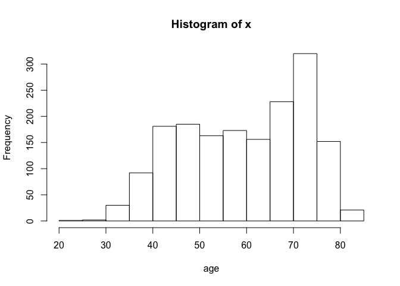
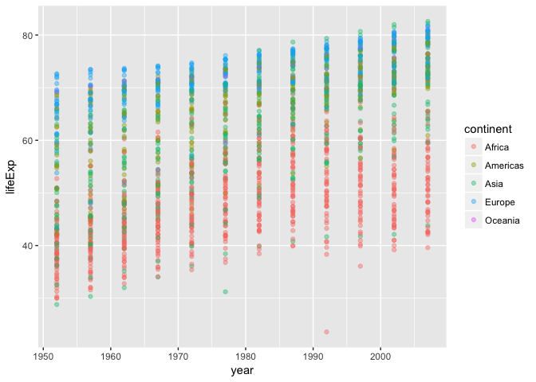
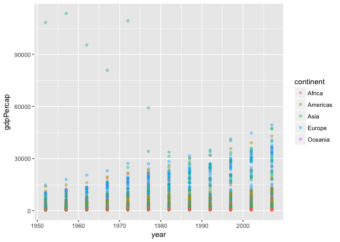
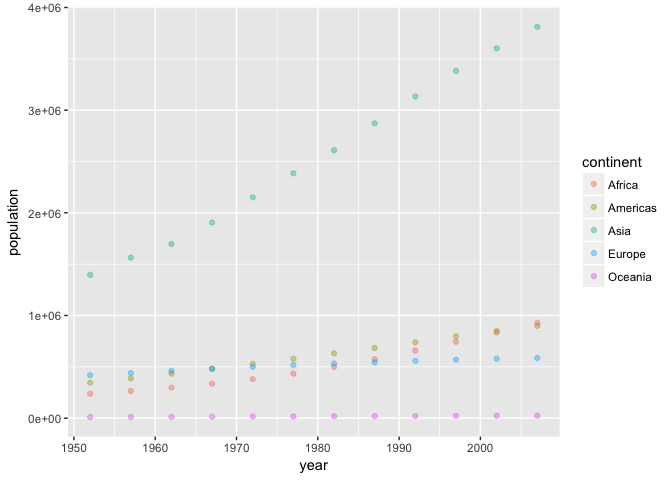
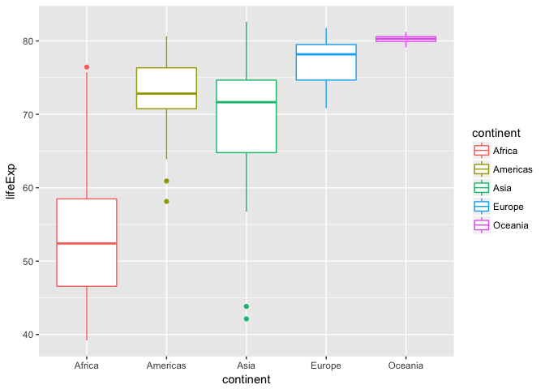
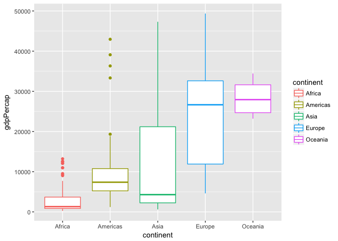
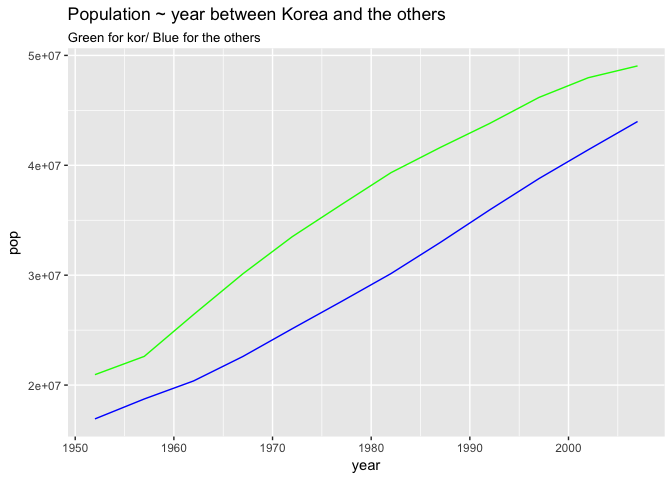
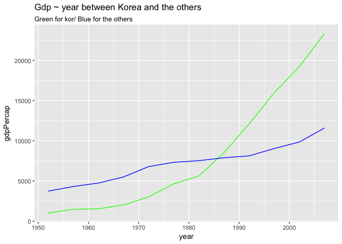

hw02\_exploit\_gapminder
================
tom
2017-09-24

### Warming up

``` r
library(gapminder)
library(tidyverse)
```

    ## Loading tidyverse: ggplot2
    ## Loading tidyverse: tibble
    ## Loading tidyverse: tidyr
    ## Loading tidyverse: readr
    ## Loading tidyverse: purrr
    ## Loading tidyverse: dplyr

    ## Conflicts with tidy packages ----------------------------------------------

    ## filter(): dplyr, stats
    ## lag():    dplyr, stats

------------------------------------------------------------------------

Smell test the data
===================

Explore the gapminder object
----------------------------

``` r
head(gapminder)
```

    ## # A tibble: 6 x 6
    ##       country continent  year lifeExp      pop gdpPercap
    ##        <fctr>    <fctr> <int>   <dbl>    <int>     <dbl>
    ## 1 Afghanistan      Asia  1952  28.801  8425333  779.4453
    ## 2 Afghanistan      Asia  1957  30.332  9240934  820.8530
    ## 3 Afghanistan      Asia  1962  31.997 10267083  853.1007
    ## 4 Afghanistan      Asia  1967  34.020 11537966  836.1971
    ## 5 Afghanistan      Asia  1972  36.088 13079460  739.9811
    ## 6 Afghanistan      Asia  1977  38.438 14880372  786.1134

Glipse of data.

``` r
str(gapminder)
```

    ## Classes 'tbl_df', 'tbl' and 'data.frame':    1704 obs. of  6 variables:
    ##  $ country  : Factor w/ 142 levels "Afghanistan",..: 1 1 1 1 1 1 1 1 1 1 ...
    ##  $ continent: Factor w/ 5 levels "Africa","Americas",..: 3 3 3 3 3 3 3 3 3 3 ...
    ##  $ year     : int  1952 1957 1962 1967 1972 1977 1982 1987 1992 1997 ...
    ##  $ lifeExp  : num  28.8 30.3 32 34 36.1 ...
    ##  $ pop      : int  8425333 9240934 10267083 11537966 13079460 14880372 12881816 13867957 16317921 22227415 ...
    ##  $ gdpPercap: num  779 821 853 836 740 ...

It is a data.frame, and also a tlbble. Country, Continent is factor(qualitative), year, pop is integer and lifeExp, gdpPercap is number(quantitative).

``` r
typeof(gapminder$pop)
```

    ## [1] "integer"

we can also use typeof function to check type of variables.

``` r
class(gapminder)
```

    ## [1] "tbl_df"     "tbl"        "data.frame"

Classes are ‘tbl\_df’, ‘tbl’ and 'data.frame', but we can check it even with str( ) function.

``` r
ncol(gapminder)
```

    ## [1] 6

``` r
nrow(gapminder)
```

    ## [1] 1704

6 variables/colums, 1704 observations/rows.

``` r
dim(gapminder)
```

    ## [1] 1704    6

*this also works. same result!*

Explore individual variables
============================

**I will search for lifeExp, population, continent and country.**

``` r
summary(gapminder$lifeExp)
```

    ##    Min. 1st Qu.  Median    Mean 3rd Qu.    Max. 
    ##   23.60   48.20   60.71   59.47   70.85   82.60

-   minimum value is 23, maximum 82 years old.

``` r
x <- gapminder$lifeExp
hist(x, xlab="age" )
```



Histogram of how old people live in whole history of mankind. People typically live till 70~75 years old.

``` r
summary(gapminder$pop)
```

    ##      Min.   1st Qu.    Median      Mean   3rd Qu.      Max. 
    ## 6.001e+04 2.794e+06 7.024e+06 2.960e+07 1.959e+07 1.319e+09

-   Variation of Population is huge.

``` r
y<- gapminder $ country
n_distinct(y)
```

    ## [1] 142

we have 142 countries.

``` r
levels(gapminder$continent)
```

    ## [1] "Africa"   "Americas" "Asia"     "Europe"   "Oceania"

from 5 continents.

``` r
gapminder %>%
  group_by(continent) %>%
  summarize(how_many_contries_in_there= n())
```

    ## # A tibble: 5 x 2
    ##   continent how_many_contries_in_there
    ##      <fctr>                      <int>
    ## 1    Africa                        624
    ## 2  Americas                        300
    ## 3      Asia                        396
    ## 4    Europe                        360
    ## 5   Oceania                         24

while each continent has different number of countries.

``` r
gapminder %>% 
  count(continent)
```

    ## # A tibble: 5 x 2
    ##   continent     n
    ##      <fctr> <int>
    ## 1    Africa   624
    ## 2  Americas   300
    ## 3      Asia   396
    ## 4    Europe   360
    ## 5   Oceania    24

we have many ways to do so.

Explore various plot types
==========================

``` r
ggplot(gapminder,aes(x=year, y=lifeExp, color=continent))+geom_point(alpha=0.4)
```

 We can see people live longer as time goes by, and there is a consistent tendency between continents.

``` r
ggplot(gapminder,aes(x=year, y=gdpPercap, color=continent))+geom_point(alpha=0.4)
```

 GDP seems to increase, especially for Eurpoean countries.

``` r
gap2<-gapminder %>% 
  group_by(continent, year) %>% 
  mutate(pop1 = pop*0.001) %>% 
  summarise(population=sum(pop1))
gap2
```

    ## # A tibble: 60 x 3
    ## # Groups:   continent [?]
    ##    continent  year population
    ##       <fctr> <int>      <dbl>
    ##  1    Africa  1952   237640.5
    ##  2    Africa  1957   264837.7
    ##  3    Africa  1962   296516.9
    ##  4    Africa  1967   335289.5
    ##  5    Africa  1972   379879.5
    ##  6    Africa  1977   433061.0
    ##  7    Africa  1982   499348.6
    ##  8    Africa  1987   574834.1
    ##  9    Africa  1992   659081.5
    ## 10    Africa  1997   743833.0
    ## # ... with 50 more rows

``` r
ggplot(gap2,aes(x=year, y=population, color=continent))+geom_point(alpha=0.4)
```

 As time goes by, the population of Asia is going high, while in Oceania people don't have a baby.

``` r
gap1<-gapminder %>% 
  filter(year>2000) 
  
ggplot(gap1,aes(x=continent, y=lifeExp,color=continent))+geom_boxplot()
```

 Box plof of lifeExp by continent. In this 21C, people's life Expectancies vary a lot by continents.

``` r
gap1<-gapminder %>% 
  filter(year>2000) 
  
ggplot(gap1,aes(x=continent, y=gdpPercap,color=continent))+geom_boxplot()
```

 Box plof of GDP/person by continent. In this 21C, people's life Expectancies vary a lot by continents. It is a pretty plot for unpretty capital polarization.

``` r
Kor<-gapminder %>%
  filter(country=="Korea, Rep.")

gap_butkor<-gapminder %>% 
  filter(country!="Korea, Rep.") %>% 
  group_by(year) %>% 
  summarise(pop=mean(pop))
  gap_butkor
```

    ## # A tibble: 12 x 2
    ##     year      pop
    ##    <int>    <dbl>
    ##  1  1952 16922054
    ##  2  1957 18736121
    ##  3  1962 20378459
    ##  4  1967 22605301
    ##  5  1972 25131008
    ##  6  1977 27614254
    ##  7  1982 30142630
    ##  8  1987 32977698
    ##  9  1992 35935495
    ## 10  1997 38787451
    ## 11  2002 41411407
    ## 12  2007 43985591

``` r
ggplot()+geom_line(data=Kor,aes(x=year,y=pop), color="Green")+geom_line(data=gap_butkor,aes(x=year, y=pop),color="Blue",)+ggtitle("Population ~ year between Korea and the others", xlab("Green for kor/ Blue for the others"))
```

 Korea's population increases as like average.

``` r
gdp_butkor<-gapminder %>% 
  filter(country!="Korea, Rep.") %>% 
  group_by(year) %>% 
  summarise(gdpPercap=mean(gdpPercap))
  
ggplot()+geom_line(data=Kor, aes(x=year,y=gdpPercap), color="Green")+geom_line(data=gdp_butkor,aes(x=year, y=gdpPercap),color="Blue")+ggtitle("Gdp ~ year between Korea and the others",xlab("Green for kor/ Blue for the others"))
```

 Korea's GDP increases exponentially.

I want to do more!
------------------

*For people who want to take things further.* *Evaluate this code and describe the result. Presumably the analyst’s intent was to get the data for Rwanda and Afghanistan. Did they succeed? Why or why not? If not, what is the correct way to do this?*

``` r
filter(gapminder, country == c("Rwanda", "Afghanistan"))
```

    ## # A tibble: 12 x 6
    ##        country continent  year lifeExp      pop gdpPercap
    ##         <fctr>    <fctr> <int>   <dbl>    <int>     <dbl>
    ##  1 Afghanistan      Asia  1957  30.332  9240934  820.8530
    ##  2 Afghanistan      Asia  1967  34.020 11537966  836.1971
    ##  3 Afghanistan      Asia  1977  38.438 14880372  786.1134
    ##  4 Afghanistan      Asia  1987  40.822 13867957  852.3959
    ##  5 Afghanistan      Asia  1997  41.763 22227415  635.3414
    ##  6 Afghanistan      Asia  2007  43.828 31889923  974.5803
    ##  7      Rwanda    Africa  1952  40.000  2534927  493.3239
    ##  8      Rwanda    Africa  1962  43.000  3051242  597.4731
    ##  9      Rwanda    Africa  1972  44.600  3992121  590.5807
    ## 10      Rwanda    Africa  1982  46.218  5507565  881.5706
    ## 11      Rwanda    Africa  1992  23.599  7290203  737.0686
    ## 12      Rwanda    Africa  2002  43.413  7852401  785.6538

It only has half of the data because of the logical sentence. a == b a is equal to b. So if we use ==, then as the value of country can only have one value, it will ignore the other value.

``` r
filter(gapminder, country %in% c("Rwanda", "Afghanistan"))
```

    ## # A tibble: 24 x 6
    ##        country continent  year lifeExp      pop gdpPercap
    ##         <fctr>    <fctr> <int>   <dbl>    <int>     <dbl>
    ##  1 Afghanistan      Asia  1952  28.801  8425333  779.4453
    ##  2 Afghanistan      Asia  1957  30.332  9240934  820.8530
    ##  3 Afghanistan      Asia  1962  31.997 10267083  853.1007
    ##  4 Afghanistan      Asia  1967  34.020 11537966  836.1971
    ##  5 Afghanistan      Asia  1972  36.088 13079460  739.9811
    ##  6 Afghanistan      Asia  1977  38.438 14880372  786.1134
    ##  7 Afghanistan      Asia  1982  39.854 12881816  978.0114
    ##  8 Afghanistan      Asia  1987  40.822 13867957  852.3959
    ##  9 Afghanistan      Asia  1992  41.674 16317921  649.3414
    ## 10 Afghanistan      Asia  1997  41.763 22227415  635.3414
    ## # ... with 14 more rows

a %in% b means a is an element in b. So, whenever country is an element in a row, the row is counted. So, we can get all the data from the original.
