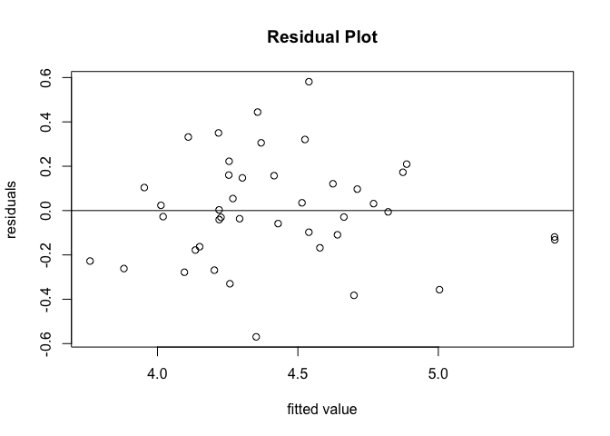
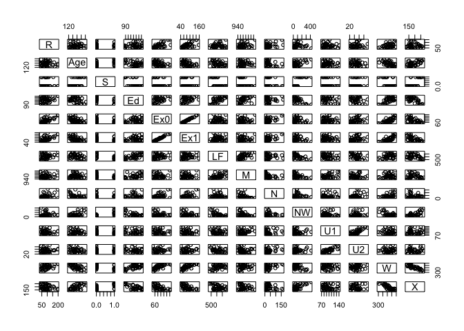
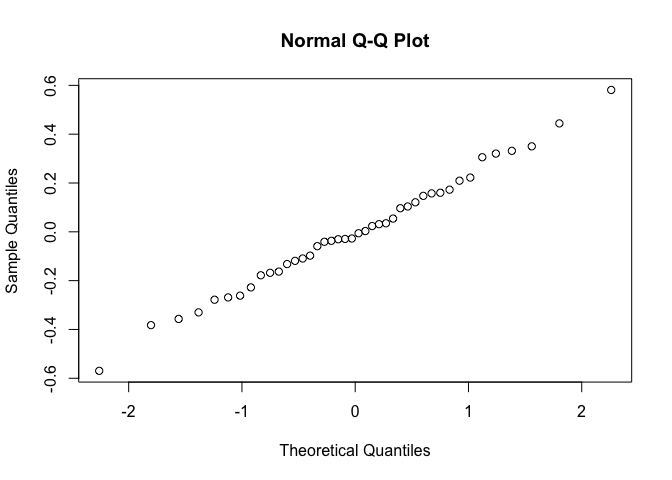

GLM Assignment 2
================
Hyeongcheol Park
2017-11-23

1.Fit a linear regression model to the data. What variables are most predictive for the crime rate?

As a set of variable, *Age, Education, Ex0, U2 and X* are most effective linear model covariates for the crime rate. R = -536.8031+1.1338\*Age + 2.0046\*Ed + 1.2429\*Ex0 + 0.9285\*U2 + 0.6277\*X

*Process*

-   I read table and fitted the full model(fit1). By stepwise function, I selected variables.(fit2) \_ ANOVA ensured smaller model is more adequate with p-value 0.9021.
-   Comparing AIC by drop1 function, I dropped covariate 'M'.(fit3)
-   I checked scatter Plot Matrix and correlation matrix. I deleted insignificant covariate U1 which has the Multicollinearity with U2.(fit4)
-   ANOVA ensured smallest model(fit4) is better than any other 2 models.
-   Residual plot implies nonconstant variance. I conduct log transformation on Y.

``` r
crime.dat <- read.table("~/Library/Mobile Documents/com~apple~CloudDocs/crime.dat.txt", header = T)
crime.dat<-na.omit(crime.dat)
fit4<-lm(log(R) ~ Age + Ed + Ex0  + U2 + X, data=crime.dat)
plot(fitted(fit4), resid(fit4), main="Residual Plot",
     xlab="fitted value", ylab="residuals") 
abline(a=0,b=0)
```



``` r
qqnorm(resid(fit4))
```

 It seems that the model satisfy the assumptions for the linear model quite well.

2.A crime rate may be viewed as “high” if it is above 105 and “low” otherwise. Fit a logistic regression model to the data. What variables are most predictive for a “high” crime rate?

As a set of variable, *Age , Ex1 , LF , NW , U2 , X* are most effective quasibinomial model covariates for the crime rate. R1&lt;-as.numeric(R&gt;105) R1= -224.80112 +0.49310\*Age+0.36407\*Ex1 +0.11835\*LF+-0.05242\*NW+ 0.36543\*U2+0.25849\*X

*Process*

-   I conducted logit model on the data, but it didn't converge.(fit1\_bin)
-   After stepwise variable selection, the model didnt' converge.(fit2\_bin)
-   Comparing AIC by drop1 function, I droped U1 which increase smallest AIC.(fit3\_bin)
-   I checked dispersion parameter by fitting quasibinomial model, and dispersion parameter for quasi model is 0.4. (fit4\_bin\_quasi)
-   As dispersion parameter is not near 1, it turns out that binomial model not fit well, so we use quasibinomial model.

3.Round off crime rate numbers to the nearest integers and then fit a Poisson GLM to the new crime rate data. What variables are most predictive for the crime rate? Does the Poisson GLM fit the data well?

-   Full poisson model (fit1\_poi) has many insignificant covariates.
-   After stepwise variable selection, the model has smaller explanatory variable.(fit2\_poi)
-   The covariate LF of fit2 model has significant but largest P-value. By conducting ANOVA, I dropped LF covariate.(fit3\_poi)
-   By drop1 function, I droped U1 which increase the smallest amount of AIC, and has multicollinearity with U2.(fit4\_poi)
-   I checked dispersion parameter by fitting quasipoisson model, and dispersion parameter for quasi model is 5.3. (fit4\_poi\_quasi)
-   As dispersion parameter is not near 1, it turns out that binomial model not fit well, so we use quasibinomial model.

4.Compare the results from 1) – 3), and comment on what you find. What do you learn from the analysis? What is your final conclusion?

<table style="width:100%;">
<colgroup>
<col width="18%" />
<col width="81%" />
</colgroup>
<thead>
<tr class="header">
<th>Model</th>
<th>Coefficients</th>
</tr>
</thead>
<tbody>
<tr class="odd">
<td>Linear model</td>
<td>R = -536.8031+1.1338*Age + 2.0046*Ed + 1.2429*Ex0 + 0.9285*U2 + 0.6277*X</td>
</tr>
<tr class="even">
<td>Quasibinomial</td>
<td>R1= -224.80112 +0.49310*Age+0.36407*Ex1 +0.11835*LF+-0.05242*NW+ 0.36543*U2+0.25849*X</td>
</tr>
<tr class="odd">
<td>Quasipoisson</td>
<td>R2=-3.150188+0.013210*Age +0.020228*Ed+0.008352*Ex0-0.006783*U1+0.020648*U2+0.002132*W+0.009040*X</td>
</tr>
</tbody>
</table>

| Model         | Equation                              |
|---------------|---------------------------------------|
| Linear model  | R ~ Age + U2 + X + Ex0 + Ed           |
| Quasibinomial | R1 ~ Age + U2 + X + Ex1 + LF + NW     |
| Quasipoisson  | R2 ~ Age + U2 + X + Ex0 + Ed + U1 + W |

| covariate  | number of appreance |
|------------|---------------------|
| Age U2 X   | 3                   |
| Ex0 Ed     | 2                   |
| LF NW U1 W | 1                   |

We can conclude that these three types of different models lead to similar conclusions. Therefore, we are more confident about these conclusions than those based on a single model. However, there are some difference between the models one another because each model has its own assumptions which does not hold.

In this case, we can say linear model fits the data the best. As we confirmed, the assumptions for the linear model hold well. On the other hand, the dispersion parameter for quasi logit model and quasi poisson model are 0.4 and 5.3, which means the assumptions do not hold well. Therefore, we conclude the linear model fits the data well.

power of predictor table

``` r
#Read Table and omit NA.
crime.dat <- read.table("~/Library/Mobile Documents/com~apple~CloudDocs/crime.dat.txt", header = T)
crime.dat<-na.omit(crime.dat)
attach(crime.dat)

#Full model test
fit1=lm(R~.,data=crime.dat)
summary(fit1)
```

    ## 
    ## Call:
    ## lm(formula = R ~ ., data = crime.dat)
    ## 
    ## Residuals:
    ##     Min      1Q  Median      3Q     Max 
    ## -37.084 -13.299   1.818  13.953  48.498 
    ## 
    ## Coefficients:
    ##               Estimate Std. Error t value Pr(>|t|)    
    ## (Intercept) -753.94415  173.40191  -4.348 0.000164 ***
    ## Age            1.38771    0.58150   2.386 0.024011 *  
    ## S             -3.77882   16.78753  -0.225 0.823539    
    ## Ed             1.46481    0.80926   1.810 0.081030 .  
    ## Ex0            1.13689    1.22329   0.929 0.360640    
    ## Ex1           -0.12237    1.35167  -0.091 0.928510    
    ## LF             0.06729    0.25164   0.267 0.791102    
    ## M              0.15977    0.25792   0.619 0.540609    
    ## N             -0.02862    0.14343  -0.200 0.843264    
    ## NW            -0.02844    0.07612  -0.374 0.711450    
    ## U1            -0.70749    0.52643  -1.344 0.189758    
    ## U2             2.23189    0.98459   2.267 0.031319 *  
    ## W              0.12587    0.11359   1.108 0.277217    
    ## X              0.76347    0.27209   2.806 0.009025 ** 
    ## ---
    ## Signif. codes:  0 '***' 0.001 '**' 0.01 '*' 0.05 '.' 0.1 ' ' 1
    ## 
    ## Residual standard error: 23.14 on 28 degrees of freedom
    ## Multiple R-squared:  0.779,  Adjusted R-squared:  0.6764 
    ## F-statistic: 7.592 on 13 and 28 DF,  p-value: 4.026e-06

``` r
#Variable selection by Stepwise
fit2 <- step(fit1, direction="both")
```

    ## Start:  AIC=274.88
    ## R ~ Age + S + Ed + Ex0 + Ex1 + LF + M + N + NW + U1 + U2 + W + 
    ##     X
    ## 
    ##        Df Sum of Sq   RSS    AIC
    ## - Ex1   1       4.4 15003 272.89
    ## - N     1      21.3 15020 272.94
    ## - S     1      27.1 15026 272.95
    ## - LF    1      38.3 15037 272.99
    ## - NW    1      74.8 15074 273.09
    ## - M     1     205.6 15204 273.45
    ## - Ex0   1     462.7 15462 274.15
    ## - W     1     657.8 15657 274.68
    ## <none>              14999 274.88
    ## - U1    1     967.5 15966 275.50
    ## - Ed    1    1755.1 16754 277.53
    ## - U2    1    2752.5 17752 279.95
    ## - Age   1    3050.7 18050 280.65
    ## - X     1    4217.5 19216 283.29
    ## 
    ## Step:  AIC=272.89
    ## R ~ Age + S + Ed + Ex0 + LF + M + N + NW + U1 + U2 + W + X
    ## 
    ##        Df Sum of Sq   RSS    AIC
    ## - N     1      21.6 15025 270.95
    ## - S     1      24.5 15028 270.96
    ## - LF    1      59.3 15063 271.06
    ## - NW    1      88.5 15092 271.14
    ## - M     1     201.2 15204 271.45
    ## - W     1     653.8 15657 272.68
    ## <none>              15003 272.89
    ## - U1    1     964.6 15968 273.51
    ## + Ex1   1       4.4 14999 274.88
    ## - Ed    1    1892.2 16896 275.88
    ## - U2    1    2827.2 17830 278.14
    ## - Age   1    3419.3 18423 279.51
    ## - X     1    4216.2 19220 281.29
    ## - Ex0   1    8044.7 23048 288.92
    ## 
    ## Step:  AIC=270.95
    ## R ~ Age + S + Ed + Ex0 + LF + M + NW + U1 + U2 + W + X
    ## 
    ##        Df Sum of Sq   RSS    AIC
    ## - S     1      22.3 15047 269.01
    ## - LF    1      49.0 15074 269.09
    ## - NW    1      89.1 15114 269.20
    ## - M     1     359.2 15384 269.94
    ## - W     1     632.2 15657 270.68
    ## <none>              15025 270.95
    ## - U1    1    1080.6 16106 271.87
    ## + N     1      21.6 15003 272.89
    ## + Ex1   1       4.6 15020 272.94
    ## - Ed    1    1901.4 16926 273.96
    ## - U2    1    2851.5 17876 276.25
    ## - Age   1    3449.0 18474 277.63
    ## - X     1    4430.4 19455 279.81
    ## - Ex0   1    9427.3 24452 289.41
    ## 
    ## Step:  AIC=269.01
    ## R ~ Age + Ed + Ex0 + LF + M + NW + U1 + U2 + W + X
    ## 
    ##        Df Sum of Sq   RSS    AIC
    ## - LF    1     136.8 15184 267.39
    ## - NW    1     170.8 15218 267.49
    ## - M     1     341.1 15388 267.95
    ## - W     1     610.6 15658 268.68
    ## <none>              15047 269.01
    ## - U1    1    1136.0 16183 270.07
    ## + S     1      22.3 15025 270.95
    ## + N     1      19.3 15028 270.96
    ## + Ex1   1       2.0 15045 271.01
    ## - Ed    1    1898.8 16946 272.00
    ## - U2    1    2839.1 17886 274.27
    ## - Age   1    3596.6 18644 276.01
    ## - X     1    4912.5 19960 278.88
    ## - Ex0   1   10406.1 25453 289.09
    ## 
    ## Step:  AIC=267.39
    ## R ~ Age + Ed + Ex0 + M + NW + U1 + U2 + W + X
    ## 
    ##        Df Sum of Sq   RSS    AIC
    ## - NW    1     199.8 15384 265.94
    ## - W     1     622.3 15806 267.08
    ## <none>              15184 267.39
    ## - M     1     942.7 16127 267.92
    ## + LF    1     136.8 15047 269.01
    ## + S     1     110.1 15074 269.09
    ## + Ex1   1      35.3 15149 269.30
    ## + N     1       2.1 15182 269.39
    ## - U1    1    1604.4 16788 269.61
    ## - U2    1    2803.5 17988 272.51
    ## - Ed    1    3076.7 18261 273.14
    ## - Age   1    3730.2 18914 274.62
    ## - X     1    5696.8 20881 278.77
    ## - Ex0   1   10271.2 25455 287.09
    ## 
    ## Step:  AIC=265.94
    ## R ~ Age + Ed + Ex0 + M + U1 + U2 + W + X
    ## 
    ##        Df Sum of Sq   RSS    AIC
    ## - W     1     749.8 16134 265.94
    ## <none>              15384 265.94
    ## - M     1    1050.2 16434 266.72
    ## + S     1     242.2 15142 267.28
    ## + NW    1     199.8 15184 267.39
    ## + LF    1     165.8 15218 267.49
    ## + Ex1   1      76.1 15308 267.73
    ## - U1    1    1464.7 16848 267.76
    ## + N     1       0.8 15383 267.94
    ## - U2    1    2610.2 17994 270.52
    ## - Ed    1    3284.9 18669 272.07
    ## - Age   1    3554.4 18938 272.67
    ## - X     1    5623.6 21007 277.03
    ## - Ex0   1   10726.5 26110 286.16
    ## 
    ## Step:  AIC=265.94
    ## R ~ Age + Ed + Ex0 + M + U1 + U2 + X
    ## 
    ##        Df Sum of Sq   RSS    AIC
    ## <none>              16134 265.94
    ## + W     1     749.8 15384 265.94
    ## + NW    1     327.3 15806 267.08
    ## - M     1    1345.0 17479 267.31
    ## + S     1     206.4 15927 267.40
    ## + LF    1     189.8 15944 267.44
    ## + Ex1   1      78.0 16056 267.74
    ## + N     1      16.6 16117 267.90
    ## - U1    1    1972.7 18106 268.79
    ## - Age   1    3146.2 19280 271.42
    ## - U2    1    3400.3 19534 271.97
    ## - Ed    1    4161.6 20295 273.58
    ## - X     1    5559.9 21693 276.38
    ## - Ex0   1   18654.3 34788 296.21

``` r
summary(fit2)
```

    ## 
    ## Call:
    ## lm(formula = R ~ Age + Ed + Ex0 + M + U1 + U2 + X, data = crime.dat)
    ## 
    ## Residuals:
    ##     Min      1Q  Median      3Q     Max 
    ## -41.252 -10.029   0.014  15.006  54.445 
    ## 
    ## Coefficients:
    ##              Estimate Std. Error t value Pr(>|t|)    
    ## (Intercept) -713.4473   139.5666  -5.112 1.23e-05 ***
    ## Age            1.1238     0.4364   2.575  0.01455 *  
    ## Ed             1.7967     0.6067   2.961  0.00555 ** 
    ## Ex0            1.0798     0.1722   6.270 3.85e-07 ***
    ## M              0.2662     0.1581   1.684  0.10142    
    ## U1            -0.8218     0.4030  -2.039  0.04929 *  
    ## U2             2.3159     0.8651   2.677  0.01135 *  
    ## X              0.5461     0.1595   3.423  0.00163 ** 
    ## ---
    ## Signif. codes:  0 '***' 0.001 '**' 0.01 '*' 0.05 '.' 0.1 ' ' 1
    ## 
    ## Residual standard error: 21.78 on 34 degrees of freedom
    ## Multiple R-squared:  0.7623, Adjusted R-squared:  0.7133 
    ## F-statistic: 15.57 on 7 and 34 DF,  p-value: 5.996e-09

``` r
#Model selection
anova(fit2, fit1)
```

    ## Analysis of Variance Table
    ## 
    ## Model 1: R ~ Age + Ed + Ex0 + M + U1 + U2 + X
    ## Model 2: R ~ Age + S + Ed + Ex0 + Ex1 + LF + M + N + NW + U1 + U2 + W + 
    ##     X
    ##   Res.Df   RSS Df Sum of Sq     F Pr(>F)
    ## 1     34 16134                          
    ## 2     28 14999  6    1134.7 0.353 0.9021

``` r
#drop test->comparing AIC
drop1(fit2, test="Chi")
```

    ## Single term deletions
    ## 
    ## Model:
    ## R ~ Age + Ed + Ex0 + M + U1 + U2 + X
    ##        Df Sum of Sq   RSS    AIC  Pr(>Chi)    
    ## <none>              16134 265.94              
    ## Age     1    3146.2 19280 271.42  0.006230 ** 
    ## Ed      1    4161.6 20295 273.58  0.001906 ** 
    ## Ex0     1   18654.3 34788 296.21 1.341e-08 ***
    ## M       1    1345.0 17479 267.31  0.066672 .  
    ## U1      1    1972.7 18106 268.79  0.027726 *  
    ## U2      1    3400.3 19534 271.97  0.004595 ** 
    ## X       1    5559.9 21693 276.38  0.000421 ***
    ## ---
    ## Signif. codes:  0 '***' 0.001 '**' 0.01 '*' 0.05 '.' 0.1 ' ' 1

``` r
fit3<-lm(R ~ Age + Ed + Ex0  + U1 + U2 + X, data=crime.dat)
summary(fit3)
```

    ## 
    ## Call:
    ## lm(formula = R ~ Age + Ed + Ex0 + U1 + U2 + X, data = crime.dat)
    ## 
    ## Residuals:
    ##     Min      1Q  Median      3Q     Max 
    ## -50.029 -12.701   1.412  13.178  58.768 
    ## 
    ## Coefficients:
    ##              Estimate Std. Error t value Pr(>|t|)    
    ## (Intercept) -548.8628   102.1876  -5.371 5.21e-06 ***
    ## Age            1.2143     0.4443   2.733 0.009774 ** 
    ## Ed             2.2658     0.5528   4.098 0.000235 ***
    ## Ex0            1.1253     0.1745   6.449 1.99e-07 ***
    ## U1            -0.4693     0.3533  -1.328 0.192678    
    ## U2             1.8645     0.8438   2.210 0.033774 *  
    ## X              0.6102     0.1589   3.839 0.000496 ***
    ## ---
    ## Signif. codes:  0 '***' 0.001 '**' 0.01 '*' 0.05 '.' 0.1 ' ' 1
    ## 
    ## Residual standard error: 22.35 on 35 degrees of freedom
    ## Multiple R-squared:  0.7425, Adjusted R-squared:  0.6983 
    ## F-statistic: 16.82 on 6 and 35 DF,  p-value: 5.056e-09

``` r
#Check Multicollinearity by scatter plot.
#Multicollinearity searching out.
pairs(crime.dat)
```



``` r
cor(Age, X)
```

    ## [1] 0.5900998

``` r
#I fifuted out U1, U2 has corralation, so I deleted U1.
fit4<-lm(log(R) ~ Age + Ed + Ex0  + U2 + X, data=crime.dat)
summary(fit4)
```

    ## 
    ## Call:
    ## lm(formula = log(R) ~ Age + Ed + Ex0 + U2 + X, data = crime.dat)
    ## 
    ## Residuals:
    ##      Min       1Q   Median       3Q      Max 
    ## -0.56958 -0.15524 -0.01662  0.15487  0.58120 
    ## 
    ## Coefficients:
    ##              Estimate Std. Error t value Pr(>|t|)    
    ## (Intercept) -2.310635   1.157462  -1.996 0.053508 .  
    ## Age          0.012725   0.005005   2.542 0.015462 *  
    ## Ed           0.021344   0.005876   3.633 0.000867 ***
    ## Ex0          0.012930   0.001710   7.563 6.08e-09 ***
    ## U2           0.009798   0.005280   1.856 0.071695 .  
    ## X            0.006608   0.001801   3.669 0.000782 ***
    ## ---
    ## Signif. codes:  0 '***' 0.001 '**' 0.01 '*' 0.05 '.' 0.1 ' ' 1
    ## 
    ## Residual standard error: 0.2541 on 36 degrees of freedom
    ## Multiple R-squared:  0.6986, Adjusted R-squared:  0.6567 
    ## F-statistic: 16.69 on 5 and 36 DF,  p-value: 1.618e-08

``` r
#Anova test and check which model is the best.
anova(fit4,fit2,fit1)
```

    ## Warning in anova.lmlist(object, ...): models with response 'c("R", "R")'
    ## removed because response differs from model 1

    ## Analysis of Variance Table
    ## 
    ## Response: log(R)
    ##           Df Sum Sq Mean Sq F value    Pr(>F)    
    ## Age        1 0.0130  0.0130  0.2017 0.6560687    
    ## Ed         1 0.8019  0.8019 12.4173 0.0011779 ** 
    ## Ex0        1 3.4928  3.4928 54.0843 1.132e-08 ***
    ## U2         1 0.2112  0.2112  3.2706 0.0788929 .  
    ## X          1 0.8695  0.8695 13.4636 0.0007817 ***
    ## Residuals 36 2.3249  0.0646                      
    ## ---
    ## Signif. codes:  0 '***' 0.001 '**' 0.01 '*' 0.05 '.' 0.1 ' ' 1

``` r
#Residual Plot and Normal QQ Plot.
plot(fitted(fit4), resid(fit4), main="Residual Plot",
     xlab="fitted value", ylab="residuals") 
abline(a=0,b=0)
```


``` r
qqnorm(resid(fit4))
```



``` r
#####################################Binomial Logit model.


# Nonconverging logit GLM
R1<-as.numeric(R>105)
fit1_bin<-glm(R1~.-R,family=binomial,data=crime.dat)
```

    ## Warning: glm.fit: algorithm did not converge

    ## Warning: glm.fit: fitted probabilities numerically 0 or 1 occurred

``` r
summary(fit1_bin)
```

    ## 
    ## Call:
    ## glm(formula = R1 ~ . - R, family = binomial, data = crime.dat)
    ## 
    ## Deviance Residuals: 
    ##        Min          1Q      Median          3Q         Max  
    ## -2.101e-05  -2.110e-08  -2.110e-08   2.110e-08   2.163e-05  
    ## 
    ## Coefficients:
    ##               Estimate Std. Error z value Pr(>|z|)
    ## (Intercept) -2.555e+03  1.826e+06  -0.001    0.999
    ## Age          6.172e+00  5.277e+03   0.001    0.999
    ## S            3.456e+01  1.171e+05   0.000    1.000
    ## Ed           6.155e-02  6.552e+03   0.000    1.000
    ## Ex0          2.021e+00  5.144e+03   0.000    1.000
    ## Ex1          2.714e+00  6.356e+03   0.000    1.000
    ## LF           2.085e+00  2.026e+03   0.001    0.999
    ## M           -9.660e-01  1.723e+03  -0.001    1.000
    ## N           -7.047e-01  1.197e+03  -0.001    1.000
    ## NW          -6.412e-01  6.642e+02  -0.001    0.999
    ## U1          -1.408e+00  2.366e+03  -0.001    1.000
    ## U2           7.340e+00  7.361e+03   0.001    0.999
    ## W            4.749e-01  8.717e+02   0.001    1.000
    ## X            3.812e+00  3.733e+03   0.001    0.999
    ## 
    ## (Dispersion parameter for binomial family taken to be 1)
    ## 
    ##     Null deviance: 5.0255e+01  on 41  degrees of freedom
    ## Residual deviance: 3.5072e-09  on 28  degrees of freedom
    ## AIC: 28
    ## 
    ## Number of Fisher Scoring iterations: 25

``` r
# stepwise. But there happens to be no P value.

fit2_bin <- step(fit1_bin, direction="both")
```

    ## Start:  AIC=28
    ## R1 ~ (R + Age + S + Ed + Ex0 + Ex1 + LF + M + N + NW + U1 + U2 + 
    ##     W + X) - R

    ## Warning: glm.fit: algorithm did not converge

    ## Warning: glm.fit: fitted probabilities numerically 0 or 1 occurred

    ## Warning: glm.fit: algorithm did not converge

    ## Warning: glm.fit: fitted probabilities numerically 0 or 1 occurred

    ## Warning: glm.fit: algorithm did not converge

    ## Warning: glm.fit: fitted probabilities numerically 0 or 1 occurred

    ## Warning: glm.fit: algorithm did not converge

    ## Warning: glm.fit: fitted probabilities numerically 0 or 1 occurred

    ## Warning: glm.fit: algorithm did not converge

    ## Warning: glm.fit: fitted probabilities numerically 0 or 1 occurred

    ## Warning: glm.fit: algorithm did not converge

    ## Warning: glm.fit: fitted probabilities numerically 0 or 1 occurred

    ## Warning: glm.fit: algorithm did not converge

    ## Warning: glm.fit: fitted probabilities numerically 0 or 1 occurred

    ## Warning: glm.fit: algorithm did not converge

    ## Warning: glm.fit: fitted probabilities numerically 0 or 1 occurred

    ## Warning: glm.fit: algorithm did not converge

    ## Warning: glm.fit: fitted probabilities numerically 0 or 1 occurred

    ## Warning: glm.fit: algorithm did not converge

    ## Warning: glm.fit: fitted probabilities numerically 0 or 1 occurred

    ## Warning: glm.fit: algorithm did not converge

    ## Warning: glm.fit: fitted probabilities numerically 0 or 1 occurred

    ## Warning: glm.fit: algorithm did not converge

    ## Warning: glm.fit: fitted probabilities numerically 0 or 1 occurred

    ##        Df Deviance   AIC
    ## - Ed    1    0.000 26.00
    ## - S     1    0.000 26.00
    ## - Ex1   1    0.000 26.00
    ## - Ex0   1    0.000 26.00
    ## - U1    1    0.000 26.00
    ## - N     1    0.000 26.00
    ## - M     1    0.000 26.00
    ## - W     1    0.000 26.00
    ## - LF    1    0.000 26.00
    ## - Age   1    0.000 26.00
    ## - U2    1    0.000 26.00
    ## - NW    1    0.000 26.00
    ## <none>       0.000 28.00
    ## - X     1   25.441 51.44

    ## Warning: glm.fit: algorithm did not converge

    ## Warning: glm.fit: fitted probabilities numerically 0 or 1 occurred

    ## 
    ## Step:  AIC=26
    ## R1 ~ Age + S + Ex0 + Ex1 + LF + M + N + NW + U1 + U2 + W + X

    ## Warning: glm.fit: algorithm did not converge

    ## Warning: glm.fit: fitted probabilities numerically 0 or 1 occurred

    ## Warning: glm.fit: algorithm did not converge

    ## Warning: glm.fit: fitted probabilities numerically 0 or 1 occurred

    ## Warning: glm.fit: algorithm did not converge

    ## Warning: glm.fit: fitted probabilities numerically 0 or 1 occurred

    ## Warning: glm.fit: algorithm did not converge

    ## Warning: glm.fit: fitted probabilities numerically 0 or 1 occurred

    ## Warning: glm.fit: algorithm did not converge

    ## Warning: glm.fit: fitted probabilities numerically 0 or 1 occurred

    ## Warning: glm.fit: algorithm did not converge

    ## Warning: glm.fit: fitted probabilities numerically 0 or 1 occurred

    ## Warning: glm.fit: fitted probabilities numerically 0 or 1 occurred

    ## Warning: glm.fit: algorithm did not converge

    ## Warning: glm.fit: fitted probabilities numerically 0 or 1 occurred

    ## Warning: glm.fit: algorithm did not converge

    ## Warning: glm.fit: fitted probabilities numerically 0 or 1 occurred

    ## Warning: glm.fit: algorithm did not converge

    ## Warning: glm.fit: fitted probabilities numerically 0 or 1 occurred

    ##        Df Deviance    AIC
    ## - S     1    0.000 24.000
    ## - Ex0   1    0.000 24.000
    ## - Ex1   1    0.000 24.000
    ## - U1    1    0.000 24.000
    ## - N     1    0.000 24.000
    ## - M     1    0.000 24.000
    ## - W     1    0.000 24.000
    ## <none>       0.000 26.000
    ## + Ed    1    0.000 28.000
    ## - U2    1   13.505 37.505
    ## - NW    1   17.414 41.414
    ## - LF    1   17.959 41.959
    ## - Age   1   20.829 44.829
    ## - X     1   26.403 50.403

    ## Warning: glm.fit: algorithm did not converge

    ## Warning: glm.fit: fitted probabilities numerically 0 or 1 occurred

    ## 
    ## Step:  AIC=24
    ## R1 ~ Age + Ex0 + Ex1 + LF + M + N + NW + U1 + U2 + W + X

    ## Warning: glm.fit: algorithm did not converge

    ## Warning: glm.fit: fitted probabilities numerically 0 or 1 occurred

    ## Warning: glm.fit: algorithm did not converge

    ## Warning: glm.fit: fitted probabilities numerically 0 or 1 occurred

    ## Warning: glm.fit: algorithm did not converge

    ## Warning: glm.fit: fitted probabilities numerically 0 or 1 occurred

    ## Warning: glm.fit: algorithm did not converge

    ## Warning: glm.fit: fitted probabilities numerically 0 or 1 occurred

    ## Warning: glm.fit: algorithm did not converge

    ## Warning: glm.fit: fitted probabilities numerically 0 or 1 occurred

    ## Warning: glm.fit: fitted probabilities numerically 0 or 1 occurred

    ## Warning: glm.fit: algorithm did not converge

    ## Warning: glm.fit: fitted probabilities numerically 0 or 1 occurred

    ## Warning: glm.fit: algorithm did not converge

    ## Warning: glm.fit: fitted probabilities numerically 0 or 1 occurred

    ## Warning: glm.fit: algorithm did not converge

    ## Warning: glm.fit: fitted probabilities numerically 0 or 1 occurred

    ## Warning: glm.fit: algorithm did not converge

    ## Warning: glm.fit: fitted probabilities numerically 0 or 1 occurred

    ##        Df Deviance    AIC
    ## - Ex0   1    0.000 22.000
    ## - M     1    0.000 22.000
    ## - U1    1    0.000 22.000
    ## - W     1    0.000 22.000
    ## - Ex1   1    0.000 22.000
    ## - N     1    0.000 22.000
    ## <none>       0.000 24.000
    ## + S     1    0.000 26.000
    ## + Ed    1    0.000 26.000
    ## - U2    1   13.863 35.863
    ## - NW    1   17.794 39.794
    ## - LF    1   18.347 40.347
    ## - Age   1   20.934 42.934
    ## - X     1   26.578 48.577

    ## Warning: glm.fit: algorithm did not converge

    ## Warning: glm.fit: fitted probabilities numerically 0 or 1 occurred

    ## 
    ## Step:  AIC=22
    ## R1 ~ Age + Ex1 + LF + M + N + NW + U1 + U2 + W + X

    ## Warning: glm.fit: algorithm did not converge

    ## Warning: glm.fit: fitted probabilities numerically 0 or 1 occurred

    ## Warning: glm.fit: algorithm did not converge

    ## Warning: glm.fit: fitted probabilities numerically 0 or 1 occurred

    ## Warning: glm.fit: algorithm did not converge

    ## Warning: glm.fit: fitted probabilities numerically 0 or 1 occurred

    ## Warning: glm.fit: algorithm did not converge

    ## Warning: glm.fit: fitted probabilities numerically 0 or 1 occurred

    ## Warning: glm.fit: algorithm did not converge

    ## Warning: glm.fit: fitted probabilities numerically 0 or 1 occurred

    ## Warning: glm.fit: algorithm did not converge

    ## Warning: glm.fit: fitted probabilities numerically 0 or 1 occurred

    ## Warning: glm.fit: algorithm did not converge

    ## Warning: glm.fit: fitted probabilities numerically 0 or 1 occurred

    ## Warning: glm.fit: algorithm did not converge

    ## Warning: glm.fit: fitted probabilities numerically 0 or 1 occurred

    ##        Df Deviance    AIC
    ## - W     1    0.000 20.000
    ## - U1    1    0.000 20.000
    ## - N     1    0.000 20.000
    ## - M     1    0.000 20.000
    ## <none>       0.000 22.000
    ## + Ex0   1    0.000 24.000
    ## + Ed    1    0.000 24.000
    ## + S     1    0.000 24.000
    ## - U2    1   18.999 38.999
    ## - NW    1   19.629 39.629
    ## - LF    1   20.247 40.247
    ## - Age   1   23.575 43.575
    ## - X     1   28.012 48.012
    ## - Ex1   1   31.657 51.657

    ## Warning: glm.fit: algorithm did not converge

    ## Warning: glm.fit: fitted probabilities numerically 0 or 1 occurred

    ## 
    ## Step:  AIC=20
    ## R1 ~ Age + Ex1 + LF + M + N + NW + U1 + U2 + X

    ## Warning: glm.fit: algorithm did not converge

    ## Warning: glm.fit: fitted probabilities numerically 0 or 1 occurred

    ## Warning: glm.fit: algorithm did not converge

    ## Warning: glm.fit: fitted probabilities numerically 0 or 1 occurred

    ## Warning: glm.fit: algorithm did not converge

    ## Warning: glm.fit: fitted probabilities numerically 0 or 1 occurred

    ## Warning: glm.fit: algorithm did not converge

    ## Warning: glm.fit: fitted probabilities numerically 0 or 1 occurred

    ## Warning: glm.fit: algorithm did not converge

    ## Warning: glm.fit: fitted probabilities numerically 0 or 1 occurred

    ## Warning: glm.fit: algorithm did not converge

    ## Warning: glm.fit: fitted probabilities numerically 0 or 1 occurred

    ## Warning: glm.fit: algorithm did not converge

    ## Warning: glm.fit: fitted probabilities numerically 0 or 1 occurred

    ## Warning: glm.fit: algorithm did not converge

    ## Warning: glm.fit: fitted probabilities numerically 0 or 1 occurred

    ##        Df Deviance    AIC
    ## - N     1    0.000 18.000
    ## - U1    1    0.000 18.000
    ## - M     1    0.000 18.000
    ## <none>       0.000 20.000
    ## + W     1    0.000 22.000
    ## + Ex0   1    0.000 22.000
    ## + S     1    0.000 22.000
    ## + Ed    1    0.000 22.000
    ## - U2    1   21.012 39.012
    ## - NW    1   21.080 39.080
    ## - LF    1   22.134 40.134
    ## - Age   1   24.510 42.510
    ## - X     1   31.681 49.681
    ## - Ex1   1   36.398 54.398

    ## Warning: glm.fit: algorithm did not converge

    ## Warning: glm.fit: fitted probabilities numerically 0 or 1 occurred

    ## 
    ## Step:  AIC=18
    ## R1 ~ Age + Ex1 + LF + M + NW + U1 + U2 + X

    ## Warning: glm.fit: algorithm did not converge

    ## Warning: glm.fit: fitted probabilities numerically 0 or 1 occurred

    ## Warning: glm.fit: fitted probabilities numerically 0 or 1 occurred

    ## Warning: glm.fit: algorithm did not converge

    ## Warning: glm.fit: fitted probabilities numerically 0 or 1 occurred

    ## Warning: glm.fit: algorithm did not converge

    ## Warning: glm.fit: fitted probabilities numerically 0 or 1 occurred

    ## Warning: glm.fit: algorithm did not converge

    ## Warning: glm.fit: fitted probabilities numerically 0 or 1 occurred

    ## Warning: glm.fit: algorithm did not converge

    ## Warning: glm.fit: fitted probabilities numerically 0 or 1 occurred

    ## Warning: glm.fit: algorithm did not converge

    ## Warning: glm.fit: fitted probabilities numerically 0 or 1 occurred

    ## Warning: glm.fit: algorithm did not converge

    ## Warning: glm.fit: fitted probabilities numerically 0 or 1 occurred

    ##        Df Deviance    AIC
    ## - M     1    0.000 16.000
    ## <none>       0.000 18.000
    ## + N     1    0.000 20.000
    ## + Ed    1    0.000 20.000
    ## + Ex0   1    0.000 20.000
    ## + S     1    0.000 20.000
    ## + W     1    0.000 20.000
    ## - U1    1    9.467 25.467
    ## - U2    1   21.705 37.705
    ## - NW    1   22.093 38.093
    ## - LF    1   22.569 38.569
    ## - Age   1   27.130 43.130
    ## - X     1   31.872 47.872
    ## - Ex1   1   39.914 55.914

    ## Warning: glm.fit: algorithm did not converge

    ## Warning: glm.fit: fitted probabilities numerically 0 or 1 occurred

    ## 
    ## Step:  AIC=16
    ## R1 ~ Age + Ex1 + LF + NW + U1 + U2 + X

    ## Warning: glm.fit: algorithm did not converge

    ## Warning: glm.fit: fitted probabilities numerically 0 or 1 occurred

    ## Warning: glm.fit: algorithm did not converge

    ## Warning: glm.fit: fitted probabilities numerically 0 or 1 occurred

    ## Warning: glm.fit: algorithm did not converge

    ## Warning: glm.fit: fitted probabilities numerically 0 or 1 occurred

    ## Warning: glm.fit: algorithm did not converge

    ## Warning: glm.fit: fitted probabilities numerically 0 or 1 occurred

    ## Warning: glm.fit: algorithm did not converge

    ## Warning: glm.fit: fitted probabilities numerically 0 or 1 occurred

    ## Warning: glm.fit: algorithm did not converge

    ## Warning: glm.fit: fitted probabilities numerically 0 or 1 occurred

    ## Warning: glm.fit: algorithm did not converge

    ## Warning: glm.fit: fitted probabilities numerically 0 or 1 occurred

    ##        Df Deviance    AIC
    ## <none>       0.000 16.000
    ## + M     1    0.000 18.000
    ## + Ex0   1    0.000 18.000
    ## + S     1    0.000 18.000
    ## + W     1    0.000 18.000
    ## + Ed    1    0.000 18.000
    ## + N     1    0.000 18.000
    ## - U1    1   14.925 28.925
    ## - U2    1   22.827 36.827
    ## - NW    1   23.203 37.203
    ## - LF    1   26.015 40.015
    ## - Age   1   28.406 42.406
    ## - X     1   32.277 46.277
    ## - Ex1   1   40.340 54.340

``` r
summary(fit2_bin)
```

    ## 
    ## Call:
    ## glm(formula = R1 ~ Age + Ex1 + LF + NW + U1 + U2 + X, family = binomial, 
    ##     data = crime.dat)
    ## 
    ## Deviance Residuals: 
    ##        Min          1Q      Median          3Q         Max  
    ## -1.624e-04  -2.100e-08  -2.100e-08   2.100e-08   1.497e-04  
    ## 
    ## Coefficients:
    ##               Estimate Std. Error z value Pr(>|z|)
    ## (Intercept) -2.981e+04  4.173e+06  -0.007    0.994
    ## Age          6.292e+01  8.893e+03   0.007    0.994
    ## Ex1          4.703e+01  6.593e+03   0.007    0.994
    ## LF           1.703e+01  2.376e+03   0.007    0.994
    ## NW          -7.794e+00  1.128e+03  -0.007    0.994
    ## U1          -1.681e+01  2.434e+03  -0.007    0.994
    ## U2           7.053e+01  9.971e+03   0.007    0.994
    ## X            3.730e+01  5.235e+03   0.007    0.994
    ## 
    ## (Dispersion parameter for binomial family taken to be 1)
    ## 
    ##     Null deviance: 5.0255e+01  on 41  degrees of freedom
    ## Residual deviance: 1.1303e-07  on 34  degrees of freedom
    ## AIC: 16
    ## 
    ## Number of Fisher Scoring iterations: 25

``` r
#Comparing AIC by drop1
drop1(fit2_bin, test = "Chisq")
```

    ## Single term deletions
    ## 
    ## Model:
    ## R1 ~ Age + Ex1 + LF + NW + U1 + U2 + X
    ##        Df Deviance    AIC    LRT  Pr(>Chi)    
    ## <none>       0.000 16.000                     
    ## Age     1   28.406 42.406 28.406 9.837e-08 ***
    ## Ex1     1   40.340 54.340 40.340 2.134e-10 ***
    ## LF      1   26.015 40.015 26.015 3.387e-07 ***
    ## NW      1   23.203 37.203 23.203 1.458e-06 ***
    ## U1      1   14.925 28.925 14.925 0.0001119 ***
    ## U2      1   22.827 36.827 22.827 1.772e-06 ***
    ## X       1   32.277 46.277 32.277 1.337e-08 ***
    ## ---
    ## Signif. codes:  0 '***' 0.001 '**' 0.01 '*' 0.05 '.' 0.1 ' ' 1

``` r
#As we figured out there is a multicollinearity between U1, U2,
# After deleting U2, it's not converging but deleting U1 makes everyone happy.
fit3_bin<-glm(R1 ~ Age + Ex1 + LF + NW + U2 + X,family=binomial,data=crime.dat)
summary(fit3_bin)
```

    ## 
    ## Call:
    ## glm(formula = R1 ~ Age + Ex1 + LF + NW + U2 + X, family = binomial, 
    ##     data = crime.dat)
    ## 
    ## Deviance Residuals: 
    ##      Min        1Q    Median        3Q       Max  
    ## -1.61813  -0.17334  -0.00911   0.00064   1.89104  
    ## 
    ## Coefficients:
    ##               Estimate Std. Error z value Pr(>|z|)  
    ## (Intercept) -224.80112   99.85226  -2.251   0.0244 *
    ## Age            0.49310    0.23287   2.117   0.0342 *
    ## Ex1            0.36407    0.15493   2.350   0.0188 *
    ## LF             0.11835    0.05567   2.126   0.0335 *
    ## NW            -0.05242    0.02409  -2.175   0.0296 *
    ## U2             0.36543    0.18594   1.965   0.0494 *
    ## X              0.25849    0.11386   2.270   0.0232 *
    ## ---
    ## Signif. codes:  0 '***' 0.001 '**' 0.01 '*' 0.05 '.' 0.1 ' ' 1
    ## 
    ## (Dispersion parameter for binomial family taken to be 1)
    ## 
    ##     Null deviance: 50.255  on 41  degrees of freedom
    ## Residual deviance: 14.925  on 35  degrees of freedom
    ## AIC: 28.925
    ## 
    ## Number of Fisher Scoring iterations: 8

``` r
#we check the dispersion parameter. By using quasibinomial.
fit4_bin<-glm(R1 ~ Age + Ex1 + LF + NW + U2 + X,family=quasibinomial,data=crime.dat)
summary(fit4_bin)#As quasibinimial's dispersion parameter is 0.4, we should use quasibinomial.
```

    ## 
    ## Call:
    ## glm(formula = R1 ~ Age + Ex1 + LF + NW + U2 + X, family = quasibinomial, 
    ##     data = crime.dat)
    ## 
    ## Deviance Residuals: 
    ##      Min        1Q    Median        3Q       Max  
    ## -1.61813  -0.17334  -0.00911   0.00064   1.89104  
    ## 
    ## Coefficients:
    ##               Estimate Std. Error t value Pr(>|t|)    
    ## (Intercept) -224.80112   63.60497  -3.534  0.00117 ** 
    ## Age            0.49310    0.14834   3.324  0.00209 ** 
    ## Ex1            0.36407    0.09869   3.689  0.00076 ***
    ## LF             0.11835    0.03546   3.338  0.00201 ** 
    ## NW            -0.05242    0.01535  -3.415  0.00163 ** 
    ## U2             0.36543    0.11844   3.085  0.00396 ** 
    ## X              0.25849    0.07253   3.564  0.00108 ** 
    ## ---
    ## Signif. codes:  0 '***' 0.001 '**' 0.01 '*' 0.05 '.' 0.1 ' ' 1
    ## 
    ## (Dispersion parameter for quasibinomial family taken to be 0.4057573)
    ## 
    ##     Null deviance: 50.255  on 41  degrees of freedom
    ## Residual deviance: 14.925  on 35  degrees of freedom
    ## AIC: NA
    ## 
    ## Number of Fisher Scoring iterations: 8

``` r
##################Poisson
crime.dat
```

    ##        R Age S  Ed Ex0 Ex1  LF    M   N  NW  U1 U2   W   X
    ## 1   79.1 151 1  91  58  56 510  950  33 301 108 41 394 261
    ## 2  163.5 143 0 113 103  95 583 1012  13 102  96 36 557 194
    ## 3   57.8 142 1  89  45  44 533  969  18 219  94 33 318 250
    ## 4  196.9 136 0 121 149 141 577  994 157  80 102 39 673 167
    ## 5  123.4 141 0 121 109 101 591  985  18  30  91 20 578 174
    ## 6   68.2 121 0 110 118 115 547  964  25  44  84 29 689 126
    ## 7   96.3 127 1 111  82  79 519  982   4 139  97 38 620 168
    ## 8  155.5 131 1 109 115 109 542  969  50 179  79 35 472 206
    ## 9   85.6 157 1  90  65  62 553  955  39 286  81 28 421 239
    ## 10  70.5 140 0 118  71  68 632 1029   7  15 100 24 526 174
    ## 11 167.4 124 0 105 121 116 580  966 101 106  77 35 657 170
    ## 12  84.9 134 0 108  75  71 595  972  47  59  83 31 580 172
    ## 13  51.1 128 0 113  67  60 624  972  28  10  77 25 507 206
    ## 14  66.4 135 0 117  62  61 595  986  22  46  77 27 529 190
    ## 16  94.6 142 1  88  81  77 497  956  33 321 116 47 427 247
    ## 17  53.9 143 0 110  66  63 537  977  10   6 114 35 487 166
    ## 18  92.9 135 1 104 123 115 537  978  31 170  89 34 631 165
    ## 19  75.0 130 0 116 128 128 536  934  51  24  78 34 627 135
    ## 20 122.5 125 0 108 113 105 567  985  78  94 130 58 626 166
    ## 22  43.9 157 1  89  47  44 512  962  22 423  97 34 288 276
    ## 23 121.6 132 0  96  87  83 564  953  43  92  83 32 513 227
    ## 24  96.8 131 0 116  78  73 574 1038   7  36 142 42 540 176
    ## 25  52.3 130 0 116  63  57 641  984  14  26  70 21 486 196
    ## 26 199.3 131 0 121 160 143 631 1071   3  77 102 41 674 152
    ## 27  34.2 135 0 109  69  71 540  965   6   4  80 22 564 139
    ## 28 121.6 152 0 112  82  76 571 1018  10  79 103 28 537 215
    ## 29 104.3 119 0 107 166 157 521  938 168  89  92 36 637 154
    ## 31  37.3 140 0  93  55  54 535 1045   6  20 135 40 453 200
    ## 32  75.4 125 0 109  90  81 586  964  97  82 105 43 617 163
    ## 33 107.2 147 1 104  63  64 560  972  23  95  76 24 462 233
    ## 35  65.3 123 0 102  97  87 526  948 113  76 124 50 572 158
    ## 36 127.2 150 0 100 109  98 531  964   9  24  87 38 559 153
    ## 38  56.6 133 0 104  51  47 599 1024   7  40  99 27 425 225
    ## 39  82.6 149 1  88  61  54 515  953  36 165  86 35 395 251
    ## 40 115.1 145 1 104  82  74 560  981  96 126  88 31 488 228
    ## 41  88.0 148 0 122  72  66 601  998   9  19  84 20 590 144
    ## 42  54.2 141 0 109  56  54 523  968   4   2 107 37 489 170
    ## 43  82.3 162 1  99  75  70 522  996  40 208  73 27 496 224
    ## 44 103.0 136 0 121  95  96 574 1012  29  36 111 37 622 162
    ## 45  45.5 139 1  88  46  41 480  968  19  49 135 53 457 249
    ## 46  50.8 126 0 104 106  97 599  989  40  24  78 25 593 171
    ## 47  84.9 130 0 121  90  91 623 1049   3  22 113 40 588 160

``` r
R2<-round(R,digits=0)

#Full model
fit1_poi<-glm(R2~.-R,family=poisson,data=crime.dat)
summary(fit1_poi)
```

    ## 
    ## Call:
    ## glm(formula = R2 ~ . - R, family = poisson, data = crime.dat)
    ## 
    ## Deviance Residuals: 
    ##     Min       1Q   Median       3Q      Max  
    ## -3.7355  -1.2341   0.0658   1.1255   4.3997  
    ## 
    ## Coefficients:
    ##               Estimate Std. Error z value Pr(>|z|)    
    ## (Intercept) -3.0141649  0.7310482  -4.123 3.74e-05 ***
    ## Age          0.0156173  0.0026862   5.814 6.11e-09 ***
    ## S            0.0253864  0.0753745   0.337   0.7363    
    ## Ed           0.0155140  0.0038996   3.978 6.94e-05 ***
    ## Ex0          0.0076323  0.0053997   1.413   0.1575    
    ## Ex1          0.0025791  0.0061120   0.422   0.6730    
    ## LF           0.0020777  0.0011782   1.763   0.0778 .  
    ## M           -0.0015422  0.0012046  -1.280   0.2005    
    ## N           -0.0010813  0.0005883  -1.838   0.0660 .  
    ## NW          -0.0003319  0.0003683  -0.901   0.3674    
    ## U1          -0.0053533  0.0023458  -2.282   0.0225 *  
    ## U2           0.0219713  0.0043048   5.104 3.33e-07 ***
    ## W            0.0021971  0.0005283   4.159 3.20e-05 ***
    ## X            0.0094817  0.0012779   7.420 1.17e-13 ***
    ## ---
    ## Signif. codes:  0 '***' 0.001 '**' 0.01 '*' 0.05 '.' 0.1 ' ' 1
    ## 
    ## (Dispersion parameter for poisson family taken to be 1)
    ## 
    ##     Null deviance: 696.75  on 41  degrees of freedom
    ## Residual deviance: 159.16  on 28  degrees of freedom
    ## AIC: 450.41
    ## 
    ## Number of Fisher Scoring iterations: 4

``` r
# stepwise. 
fit2_poi <- step(fit1_poi, direction="both")
```

    ## Start:  AIC=450.41
    ## R2 ~ (R + Age + S + Ed + Ex0 + Ex1 + LF + M + N + NW + U1 + U2 + 
    ##     W + X) - R
    ## 
    ##        Df Deviance    AIC
    ## - S     1   159.28 448.52
    ## - Ex1   1   159.34 448.58
    ## - NW    1   159.98 449.22
    ## - M     1   160.81 450.05
    ## <none>      159.16 450.41
    ## - Ex0   1   161.17 450.42
    ## - LF    1   162.27 451.51
    ## - N     1   162.56 451.80
    ## - U1    1   164.38 453.63
    ## - Ed    1   175.11 464.35
    ## - W     1   176.56 465.80
    ## - U2    1   185.57 474.81
    ## - Age   1   192.86 482.11
    ## - X     1   213.26 502.50
    ## 
    ## Step:  AIC=448.52
    ## R2 ~ Age + Ed + Ex0 + Ex1 + LF + M + N + NW + U1 + U2 + W + X
    ## 
    ##        Df Deviance    AIC
    ## - Ex1   1   159.41 446.66
    ## - NW    1   159.99 447.23
    ## - M     1   160.82 448.06
    ## <none>      159.28 448.52
    ## - Ex0   1   161.42 448.66
    ## - N     1   162.69 449.93
    ## - LF    1   162.95 450.19
    ## + S     1   159.16 450.41
    ## - U1    1   166.27 453.51
    ## - Ed    1   176.82 464.06
    ## - W     1   177.08 464.32
    ## - U2    1   186.41 473.66
    ## - Age   1   194.05 481.29
    ## - X     1   219.81 507.05
    ## 
    ## Step:  AIC=446.66
    ## R2 ~ Age + Ed + Ex0 + LF + M + N + NW + U1 + U2 + W + X
    ## 
    ##        Df Deviance    AIC
    ## - NW    1   160.04 445.28
    ## - M     1   160.97 446.21
    ## <none>      159.41 446.66
    ## - N     1   162.74 447.98
    ## - LF    1   163.10 448.34
    ## + Ex1   1   159.28 448.52
    ## + S     1   159.34 448.58
    ## - U1    1   166.53 451.78
    ## - W     1   177.60 462.85
    ## - Ed    1   181.28 466.52
    ## - U2    1   186.47 471.71
    ## - Age   1   195.30 480.54
    ## - X     1   219.90 505.14
    ## - Ex0   1   237.62 522.87
    ## 
    ## Step:  AIC=445.28
    ## R2 ~ Age + Ed + Ex0 + LF + M + N + U1 + U2 + W + X
    ## 
    ##        Df Deviance    AIC
    ## - M     1   161.60 444.85
    ## <none>      160.04 445.28
    ## - N     1   163.29 446.53
    ## + NW    1   159.41 446.66
    ## + Ex1   1   159.99 447.23
    ## + S     1   160.02 447.27
    ## - LF    1   164.12 447.37
    ## - U1    1   166.64 449.88
    ## - W     1   179.38 462.63
    ## - Ed    1   182.88 466.12
    ## - U2    1   186.69 469.94
    ## - Age   1   195.49 478.73
    ## - X     1   224.55 507.79
    ## - Ex0   1   242.05 525.29
    ## 
    ## Step:  AIC=444.85
    ## R2 ~ Age + Ed + Ex0 + LF + N + U1 + U2 + W + X
    ## 
    ##        Df Deviance    AIC
    ## - N     1   163.33 444.58
    ## <none>      161.60 444.85
    ## + M     1   160.04 445.28
    ## - LF    1   164.12 445.37
    ## + NW    1   160.97 446.21
    ## + S     1   161.36 446.61
    ## + Ex1   1   161.54 446.79
    ## - U1    1   176.47 457.71
    ## - W     1   179.57 460.82
    ## - Ed    1   183.56 464.80
    ## - U2    1   189.65 470.89
    ## - Age   1   196.54 477.78
    ## - X     1   225.85 507.09
    ## - Ex0   1   249.40 530.64
    ## 
    ## Step:  AIC=444.58
    ## R2 ~ Age + Ed + Ex0 + LF + U1 + U2 + W + X
    ## 
    ##        Df Deviance    AIC
    ## <none>      163.33 444.58
    ## + N     1   161.60 444.85
    ## + NW    1   162.78 446.02
    ## + M     1   163.29 446.53
    ## + S     1   163.32 446.56
    ## + Ex1   1   163.32 446.57
    ## - LF    1   167.61 446.85
    ## - U1    1   177.63 456.87
    ## - W     1   179.72 458.96
    ## - Ed    1   184.55 463.79
    ## - U2    1   191.44 470.68
    ## - Age   1   206.25 485.50
    ## - X     1   228.35 507.60
    ## - Ex0   1   251.31 530.55

``` r
summary(fit2_poi)#formula = R2 ~ Age + Ed + Ex0 + LF + U1 + U2 + W + X
```

    ## 
    ## Call:
    ## glm(formula = R2 ~ Age + Ed + Ex0 + LF + U1 + U2 + W + X, family = poisson, 
    ##     data = crime.dat)
    ## 
    ## Deviance Residuals: 
    ##     Min       1Q   Median       3Q      Max  
    ## -3.4850  -1.3918   0.0021   1.1219   4.1006  
    ## 
    ## Coefficients:
    ##               Estimate Std. Error z value Pr(>|z|)    
    ## (Intercept) -3.5084194  0.5675745  -6.181 6.35e-10 ***
    ## Age          0.0144503  0.0021869   6.608 3.91e-11 ***
    ## Ed           0.0159117  0.0034594   4.600 4.23e-06 ***
    ## Ex0          0.0086052  0.0009136   9.419  < 2e-16 ***
    ## LF           0.0013713  0.0006634   2.067 0.038739 *  
    ## U1          -0.0066845  0.0017783  -3.759 0.000171 ***
    ## U2           0.0217280  0.0041314   5.259 1.45e-07 ***
    ## W            0.0020099  0.0004985   4.032 5.53e-05 ***
    ## X            0.0083884  0.0010567   7.939 2.05e-15 ***
    ## ---
    ## Signif. codes:  0 '***' 0.001 '**' 0.01 '*' 0.05 '.' 0.1 ' ' 1
    ## 
    ## (Dispersion parameter for poisson family taken to be 1)
    ## 
    ##     Null deviance: 696.75  on 41  degrees of freedom
    ## Residual deviance: 163.33  on 33  degrees of freedom
    ## AIC: 444.58
    ## 
    ## Number of Fisher Scoring iterations: 4

``` r
fit3_poi<-glm(R2 ~ Age + Ed + Ex0 + U1 + U2 + W + X,family=poisson,data=crime.dat)#Without LF
summary(fit3_poi) 
```

    ## 
    ## Call:
    ## glm(formula = R2 ~ Age + Ed + Ex0 + U1 + U2 + W + X, family = poisson, 
    ##     data = crime.dat)
    ## 
    ## Deviance Residuals: 
    ##     Min       1Q   Median       3Q      Max  
    ## -3.6629  -1.6059  -0.1006   1.3050   4.3640  
    ## 
    ## Coefficients:
    ##               Estimate Std. Error z value Pr(>|z|)    
    ## (Intercept) -3.1501881  0.5371649  -5.864 4.51e-09 ***
    ## Age          0.0132097  0.0021080   6.266 3.70e-10 ***
    ## Ed           0.0202276  0.0027580   7.334 2.23e-13 ***
    ## Ex0          0.0083517  0.0008991   9.289  < 2e-16 ***
    ## U1          -0.0067829  0.0017716  -3.829 0.000129 ***
    ## U2           0.0206477  0.0040942   5.043 4.58e-07 ***
    ## W            0.0021321  0.0004913   4.340 1.43e-05 ***
    ## X            0.0090396  0.0010070   8.977  < 2e-16 ***
    ## ---
    ## Signif. codes:  0 '***' 0.001 '**' 0.01 '*' 0.05 '.' 0.1 ' ' 1
    ## 
    ## (Dispersion parameter for poisson family taken to be 1)
    ## 
    ##     Null deviance: 696.75  on 41  degrees of freedom
    ## Residual deviance: 167.61  on 34  degrees of freedom
    ## AIC: 446.85
    ## 
    ## Number of Fisher Scoring iterations: 4

``` r
anova(fit3_poi,fit2_poi)# 4.2712 is the Deviance.
```

    ## Analysis of Deviance Table
    ## 
    ## Model 1: R2 ~ Age + Ed + Ex0 + U1 + U2 + W + X
    ## Model 2: R2 ~ Age + Ed + Ex0 + LF + U1 + U2 + W + X
    ##   Resid. Df Resid. Dev Df Deviance
    ## 1        34     167.61            
    ## 2        33     163.33  1   4.2712

``` r
qchisq(0.95,1)  # qualtile of chisq is 3.84. 4.27>3.84. So we reject the null. we accept the model
```

    ## [1] 3.841459

``` r
# without LF.
fit4_poi<-glm(R2 ~ Age + Ed + Ex0 + U2 + W + X,family=poisson,data=crime.dat)
summary(fit4_poi) # tried a model without U1.
```

    ## 
    ## Call:
    ## glm(formula = R2 ~ Age + Ed + Ex0 + U2 + W + X, family = poisson, 
    ##     data = crime.dat)
    ## 
    ## Deviance Residuals: 
    ##    Min      1Q  Median      3Q     Max  
    ## -3.517  -1.574  -0.409   1.207   5.028  
    ## 
    ## Coefficients:
    ##               Estimate Std. Error z value Pr(>|z|)    
    ## (Intercept) -2.9674251  0.5295779  -5.603 2.10e-08 ***
    ## Age          0.0121605  0.0021131   5.755 8.67e-09 ***
    ## Ed           0.0155893  0.0024813   6.283 3.33e-10 ***
    ## Ex0          0.0096107  0.0008400  11.441  < 2e-16 ***
    ## U2           0.0075216  0.0022144   3.397 0.000682 ***
    ## W            0.0023109  0.0004942   4.676 2.93e-06 ***
    ## X            0.0092949  0.0010098   9.205  < 2e-16 ***
    ## ---
    ## Signif. codes:  0 '***' 0.001 '**' 0.01 '*' 0.05 '.' 0.1 ' ' 1
    ## 
    ## (Dispersion parameter for poisson family taken to be 1)
    ## 
    ##     Null deviance: 696.75  on 41  degrees of freedom
    ## Residual deviance: 182.44  on 35  degrees of freedom
    ## AIC: 459.69
    ## 
    ## Number of Fisher Scoring iterations: 4

``` r
anova(fit4_poi,fit3_poi)
```

    ## Analysis of Deviance Table
    ## 
    ## Model 1: R2 ~ Age + Ed + Ex0 + U2 + W + X
    ## Model 2: R2 ~ Age + Ed + Ex0 + U1 + U2 + W + X
    ##   Resid. Df Resid. Dev Df Deviance
    ## 1        35     182.44            
    ## 2        34     167.61  1   14.838

``` r
qchisq(0.95,1)  # qualtile of chisq is 3.84. 14.8>3.84. So we reject the null. we accept the model
```

    ## [1] 3.841459

``` r
# without U1. That is , fit4_poi.


#Comparing AIC by drop1 #R2 ~ Age + Ed + Ex0 + U2 + W + X
drop1(fit4_poi, test = "Chisq")#I tried this but it doesn't drop anything.
```

    ## Single term deletions
    ## 
    ## Model:
    ## R2 ~ Age + Ed + Ex0 + U2 + W + X
    ##        Df Deviance    AIC     LRT  Pr(>Chi)    
    ## <none>      182.44 459.69                      
    ## Age     1   215.27 490.52  32.829 1.006e-08 ***
    ## Ed      1   222.31 497.56  39.870 2.714e-10 ***
    ## Ex0     1   309.52 584.76 127.077 < 2.2e-16 ***
    ## U2      1   193.91 469.16  11.471 0.0007071 ***
    ## W       1   204.54 479.78  22.094 2.596e-06 ***
    ## X       1   271.16 546.41  88.719 < 2.2e-16 ***
    ## ---
    ## Signif. codes:  0 '***' 0.001 '**' 0.01 '*' 0.05 '.' 0.1 ' ' 1

``` r
#To check out the dispersion parameter, I will run quasichisq 
fit4_poi_quasi<-glm(R2 ~ Age + Ed + Ex0+ U1+U2+W + X,family=quasipoisson,data=crime.dat)
summary(fit4_poi_quasi)# model with U1, U2
```

    ## 
    ## Call:
    ## glm(formula = R2 ~ Age + Ed + Ex0 + U1 + U2 + W + X, family = quasipoisson, 
    ##     data = crime.dat)
    ## 
    ## Deviance Residuals: 
    ##     Min       1Q   Median       3Q      Max  
    ## -3.6629  -1.6059  -0.1006   1.3050   4.3640  
    ## 
    ## Coefficients:
    ##              Estimate Std. Error t value Pr(>|t|)    
    ## (Intercept) -3.150188   1.190714  -2.646 0.012258 *  
    ## Age          0.013210   0.004673   2.827 0.007818 ** 
    ## Ed           0.020228   0.006113   3.309 0.002224 ** 
    ## Ex0          0.008352   0.001993   4.190 0.000187 ***
    ## U1          -0.006783   0.003927  -1.727 0.093197 .  
    ## U2           0.020648   0.009076   2.275 0.029324 *  
    ## W            0.002132   0.001089   1.958 0.058509 .  
    ## X            0.009040   0.002232   4.050 0.000281 ***
    ## ---
    ## Signif. codes:  0 '***' 0.001 '**' 0.01 '*' 0.05 '.' 0.1 ' ' 1
    ## 
    ## (Dispersion parameter for quasipoisson family taken to be 4.913596)
    ## 
    ##     Null deviance: 696.75  on 41  degrees of freedom
    ## Residual deviance: 167.61  on 34  degrees of freedom
    ## AIC: NA
    ## 
    ## Number of Fisher Scoring iterations: 4

``` r
fit5_poi_quasi<-glm(R2 ~ Age + Ed + Ex0+ U1+W + X,family=quasipoisson,data=crime.dat)
summary(fit5_poi_quasi)# model with U1
```

    ## 
    ## Call:
    ## glm(formula = R2 ~ Age + Ed + Ex0 + U1 + W + X, family = quasipoisson, 
    ##     data = crime.dat)
    ## 
    ## Deviance Residuals: 
    ##     Min       1Q   Median       3Q      Max  
    ## -4.0311  -1.6774  -0.2056   1.4599   4.5939  
    ## 
    ## Coefficients:
    ##               Estimate Std. Error t value Pr(>|t|)    
    ## (Intercept) -2.4744682  1.2122080  -2.041 0.048818 *  
    ## Age          0.0106356  0.0048469   2.194 0.034942 *  
    ## Ed           0.0128415  0.0055024   2.334 0.025476 *  
    ## Ex0          0.0100254  0.0019801   5.063 1.33e-05 ***
    ## U1           0.0006784  0.0022787   0.298 0.767681    
    ## W            0.0025101  0.0011592   2.165 0.037254 *  
    ## X            0.0096057  0.0023803   4.035 0.000282 ***
    ## ---
    ## Signif. codes:  0 '***' 0.001 '**' 0.01 '*' 0.05 '.' 0.1 ' ' 1
    ## 
    ## (Dispersion parameter for quasipoisson family taken to be 5.569706)
    ## 
    ##     Null deviance: 696.75  on 41  degrees of freedom
    ## Residual deviance: 193.42  on 35  degrees of freedom
    ## AIC: NA
    ## 
    ## Number of Fisher Scoring iterations: 4

``` r
fit6_poi_quasi<-glm(R2 ~ Age + Ed + Ex0+U2+W + X,family=quasipoisson,data=crime.dat)
summary(fit6_poi_quasi)# model with U2
```

    ## 
    ## Call:
    ## glm(formula = R2 ~ Age + Ed + Ex0 + U2 + W + X, family = quasipoisson, 
    ##     data = crime.dat)
    ## 
    ## Deviance Residuals: 
    ##    Min      1Q  Median      3Q     Max  
    ## -3.517  -1.574  -0.409   1.207   5.028  
    ## 
    ## Coefficients:
    ##              Estimate Std. Error t value Pr(>|t|)    
    ## (Intercept) -2.967425   1.219691  -2.433 0.020227 *  
    ## Age          0.012161   0.004867   2.499 0.017310 *  
    ## Ed           0.015589   0.005715   2.728 0.009898 ** 
    ## Ex0          0.009611   0.001935   4.968 1.77e-05 ***
    ## U2           0.007522   0.005100   1.475 0.149207    
    ## W            0.002311   0.001138   2.030 0.049986 *  
    ## X            0.009295   0.002326   3.997 0.000315 ***
    ## ---
    ## Signif. codes:  0 '***' 0.001 '**' 0.01 '*' 0.05 '.' 0.1 ' ' 1
    ## 
    ## (Dispersion parameter for quasipoisson family taken to be 5.304443)
    ## 
    ##     Null deviance: 696.75  on 41  degrees of freedom
    ## Residual deviance: 182.44  on 35  degrees of freedom
    ## AIC: NA
    ## 
    ## Number of Fisher Scoring iterations: 4

``` r
fit7_poi_quasi<-glm(R2 ~ Age + Ed + Ex0+W + X,family=quasipoisson,data=crime.dat)
summary(fit7_poi_quasi)# model without U1, U2.
```

    ## 
    ## Call:
    ## glm(formula = R2 ~ Age + Ed + Ex0 + W + X, family = quasipoisson, 
    ##     data = crime.dat)
    ## 
    ## Deviance Residuals: 
    ##     Min       1Q   Median       3Q      Max  
    ## -4.1473  -1.7209  -0.1406   1.4135   4.4257  
    ## 
    ## Coefficients:
    ##              Estimate Std. Error t value Pr(>|t|)    
    ## (Intercept) -2.392016   1.163235  -2.056 0.047053 *  
    ## Age          0.010454   0.004724   2.213 0.033330 *  
    ## Ed           0.012839   0.005416   2.370 0.023253 *  
    ## Ex0          0.009969   0.001940   5.138 9.86e-06 ***
    ## W            0.002525   0.001140   2.215 0.033208 *  
    ## X            0.009632   0.002344   4.110 0.000219 ***
    ## ---
    ## Signif. codes:  0 '***' 0.001 '**' 0.01 '*' 0.05 '.' 0.1 ' ' 1
    ## 
    ## (Dispersion parameter for quasipoisson family taken to be 5.405504)
    ## 
    ##     Null deviance: 696.75  on 41  degrees of freedom
    ## Residual deviance: 193.91  on 36  degrees of freedom
    ## AIC: NA
    ## 
    ## Number of Fisher Scoring iterations: 4

``` r
anova(fit5_poi_quasi,fit4_poi_quasi)
```

    ## Analysis of Deviance Table
    ## 
    ## Model 1: R2 ~ Age + Ed + Ex0 + U1 + W + X
    ## Model 2: R2 ~ Age + Ed + Ex0 + U1 + U2 + W + X
    ##   Resid. Df Resid. Dev Df Deviance
    ## 1        35     193.42            
    ## 2        34     167.61  1   25.816

``` r
anova(fit6_poi_quasi,fit4_poi_quasi)
```

    ## Analysis of Deviance Table
    ## 
    ## Model 1: R2 ~ Age + Ed + Ex0 + U2 + W + X
    ## Model 2: R2 ~ Age + Ed + Ex0 + U1 + U2 + W + X
    ##   Resid. Df Resid. Dev Df Deviance
    ## 1        35     182.44            
    ## 2        34     167.61  1   14.838

``` r
anova(fit7_poi_quasi,fit4_poi_quasi)
```

    ## Analysis of Deviance Table
    ## 
    ## Model 1: R2 ~ Age + Ed + Ex0 + W + X
    ## Model 2: R2 ~ Age + Ed + Ex0 + U1 + U2 + W + X
    ##   Resid. Df Resid. Dev Df Deviance
    ## 1        36     193.91            
    ## 2        34     167.61  2   26.309

``` r
qchisq(0.95,2)
```

    ## [1] 5.991465

``` r
#Comparing 3 models, U1 or U1+U2 or U2, U1+U2 model has smallest quasipoisson dispersion parameter 
#(Dispersion parameter for quasipoisson family taken to be 5.304443) So we choose quasipoisson!

#For linear model R ~ Age + Ed + Ex0  + U2 + X,
#QuasibinomialR1 ~ Age + Ex1 + LF + NW + U2 + X,
#Quasipoisson R2 ~ Age + Ed + Ex0 +U2 + W + X
```
