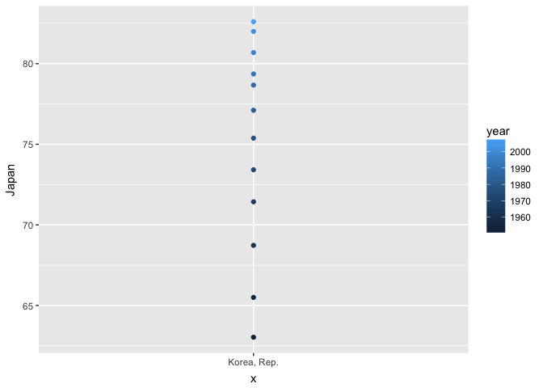
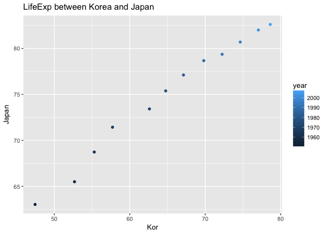
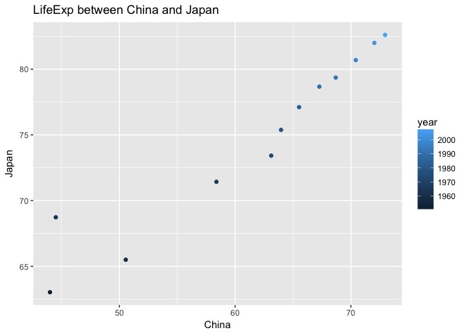
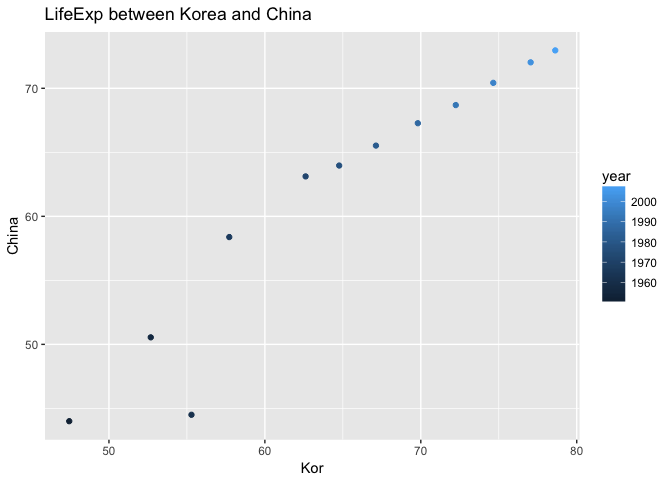
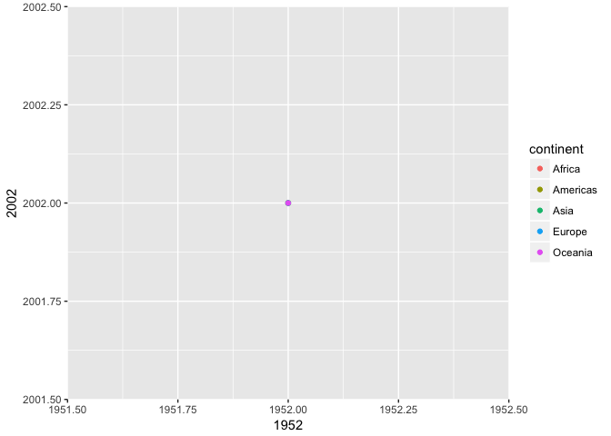
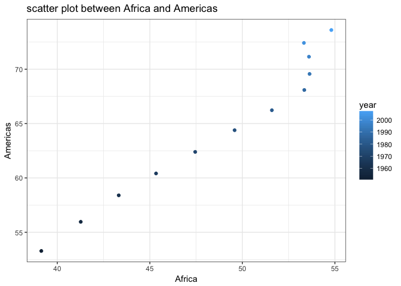
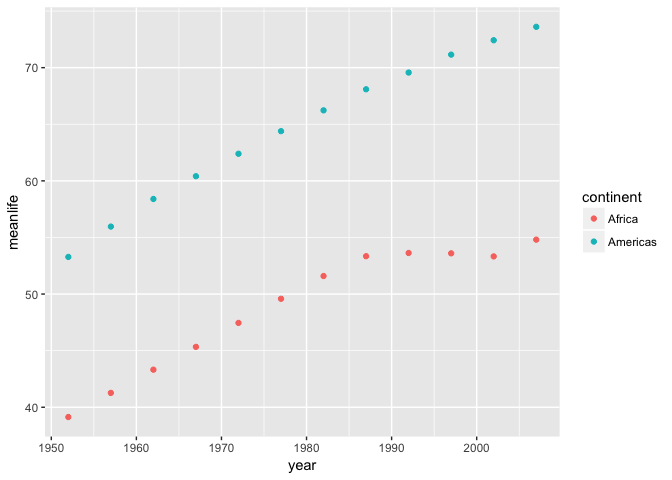

hw04
================
tom
2017-10-06

<table style="width:25%;">
<colgroup>
<col width="25%" />
</colgroup>
<tbody>
<tr class="odd">
<td><em>warminig up- set up the environment</em></td>
</tr>
<tr class="even">
<td><code>r library(tidyverse)</code></td>
</tr>
<tr class="odd">
<td><code>## Loading tidyverse: ggplot2 ## Loading tidyverse: tibble ## Loading tidyverse: tidyr ## Loading tidyverse: readr ## Loading tidyverse: purrr ## Loading tidyverse: dplyr</code></td>
</tr>
<tr class="even">
<td><code>## Conflicts with tidy packages ----------------------------------------------</code></td>
</tr>
<tr class="odd">
<td><code>## filter(): dplyr, stats ## lag():    dplyr, stats</code></td>
</tr>
<tr class="even">
<td><code>r library(gapminder) knitr::opts_chunk$set(echo = TRUE)</code></td>
</tr>
<tr class="odd">
<td>##spread, gather</td>
</tr>
<tr class="even">
<td>###Activity #2</td>
</tr>
<tr class="odd">
<td><em>Make a tibble with one row per year and columns for life expectancy for two or more countries. </em>Use knitr::kable() to make this table look pretty in your rendered homework. *Take advantage of this new data shape to scatterplot life expectancy for one country against that of another.</td>
</tr>
</tbody>
</table>

I choosed Kor, China, and Japan to compare.

``` r
 three<-gapminder %>% 
  select(year, country, lifeExp) %>% 
  spread(key=country,value=lifeExp) %>% 
  rename(Kor='Korea, Rep.') %>%
    select(year,'Kor', Japan, China)
             
  knitr::kable(three)
```

|  year|     Kor|   Japan|     China|
|-----:|-------:|-------:|---------:|
|  1952|  47.453|  63.030|  44.00000|
|  1957|  52.681|  65.500|  50.54896|
|  1962|  55.292|  68.730|  44.50136|
|  1967|  57.716|  71.430|  58.38112|
|  1972|  62.612|  73.420|  63.11888|
|  1977|  64.766|  75.380|  63.96736|
|  1982|  67.123|  77.110|  65.52500|
|  1987|  69.810|  78.670|  67.27400|
|  1992|  72.244|  79.360|  68.69000|
|  1997|  74.647|  80.690|  70.42600|
|  2002|  77.045|  82.000|  72.02800|
|  2007|  78.623|  82.603|  72.96100|

<br /> Above, I *changed variable name to Kor*. This is because there was a problem due to the variable name, Korea, Rep. As it contains , and . on its name inside, scatterplot doesn't seem right. Here is the **bad example**.

``` r
gapminder %>% 
  select(year, country, lifeExp) %>% 
  spread(key=country,value=lifeExp) %>% 
    select(year,'Korea, Rep.', Japan, China) %>% 
ggplot(aes(x='Korea, Rep.', y=Japan, color=year)) +geom_point()
```



<br /> So I changed the variable name as Kor. [This website](http://rfriend.tistory.com/41) was helpful to change variable name.

``` r
three %>% 
  ggplot(aes(Kor, Japan, color=year)) +geom_point()+labs(title="LifeExp between Korea and Japan")
```

 <br /> LifeExp between Korea and Japan It's good! But I tried two more thing;Comparing three countries on one plot.

``` r
three %>% 
  ggplot(aes(China, Japan, color=year)) +geom_point()+labs(title="LifeExp between China and Japan")
```

 <br />LifeExp between China and Japan

``` r
three %>% 
  ggplot(aes(Kor,China, color=year)) +geom_point()+labs(title="LifeExp between Korea and China")
```

 <br />LifeExp between Korea and China.

### Activity \#3

Compute some measure of life expectancy (mean? median? min? max?) for all possible combinations of continent and year.

``` r
(gapminder %>% 
  group_by(year,continent) %>% 
  summarise(meanlife=mean(lifeExp)) %>% 
  knitr::kable())
```

|     year| continent |  meanlife|
|--------:|:----------|---------:|
|     1952| Africa    |  39.13550|
|     1952| Americas  |  53.27984|
|     1952| Asia      |  46.31439|
|     1952| Europe    |  64.40850|
|     1952| Oceania   |  69.25500|
|     1957| Africa    |  41.26635|
|     1957| Americas  |  55.96028|
|     1957| Asia      |  49.31854|
|     1957| Europe    |  66.70307|
|     1957| Oceania   |  70.29500|
|     1962| Africa    |  43.31944|
|     1962| Americas  |  58.39876|
|     1962| Asia      |  51.56322|
|     1962| Europe    |  68.53923|
|     1962| Oceania   |  71.08500|
|     1967| Africa    |  45.33454|
|     1967| Americas  |  60.41092|
|     1967| Asia      |  54.66364|
|     1967| Europe    |  69.73760|
|     1967| Oceania   |  71.31000|
|     1972| Africa    |  47.45094|
|     1972| Americas  |  62.39492|
|     1972| Asia      |  57.31927|
|     1972| Europe    |  70.77503|
|     1972| Oceania   |  71.91000|
|     1977| Africa    |  49.58042|
|     1977| Americas  |  64.39156|
|     1977| Asia      |  59.61056|
|     1977| Europe    |  71.93777|
|     1977| Oceania   |  72.85500|
|     1982| Africa    |  51.59287|
|     1982| Americas  |  66.22884|
|     1982| Asia      |  62.61794|
|     1982| Europe    |  72.80640|
|     1982| Oceania   |  74.29000|
|     1987| Africa    |  53.34479|
|     1987| Americas  |  68.09072|
|     1987| Asia      |  64.85118|
|     1987| Europe    |  73.64217|
|     1987| Oceania   |  75.32000|
|     1992| Africa    |  53.62958|
|     1992| Americas  |  69.56836|
|     1992| Asia      |  66.53721|
|     1992| Europe    |  74.44010|
|     1992| Oceania   |  76.94500|
|     1997| Africa    |  53.59827|
|     1997| Americas  |  71.15048|
|     1997| Asia      |  68.02052|
|     1997| Europe    |  75.50517|
|     1997| Oceania   |  78.19000|
|     2002| Africa    |  53.32523|
|     2002| Americas  |  72.42204|
|     2002| Asia      |  69.23388|
|     2002| Europe    |  76.70060|
|     2002| Oceania   |  79.74000|
|     2007| Africa    |  54.80604|
|     2007| Americas  |  73.60812|
|     2007| Asia      |  70.72848|
|     2007| Europe    |  77.64860|
|     2007| Oceania   |  80.71950|
|   <br />|           |          |
|  it's ea| sy.       |          |

Reshape that to have one row per year and one variable for each continent.

``` r
knitr::kable(gapminder %>% 
  group_by(year,continent) %>% 
  summarise(meanlife=mean(lifeExp)) %>% 
  spread(key=continent, value=meanlife))
```

|     year|       Africa|     Americas|      Asia|    Europe|  Oceania|
|--------:|------------:|------------:|---------:|---------:|--------:|
|     1952|     39.13550|     53.27984|  46.31439|  64.40850|  69.2550|
|     1957|     41.26635|     55.96028|  49.31854|  66.70307|  70.2950|
|     1962|     43.31944|     58.39876|  51.56322|  68.53923|  71.0850|
|     1967|     45.33454|     60.41092|  54.66364|  69.73760|  71.3100|
|     1972|     47.45094|     62.39492|  57.31927|  70.77503|  71.9100|
|     1977|     49.58042|     64.39156|  59.61056|  71.93777|  72.8550|
|     1982|     51.59287|     66.22884|  62.61794|  72.80640|  74.2900|
|     1987|     53.34479|     68.09072|  64.85118|  73.64217|  75.3200|
|     1992|     53.62958|     69.56836|  66.53721|  74.44010|  76.9450|
|     1997|     53.59827|     71.15048|  68.02052|  75.50517|  78.1900|
|     2002|     53.32523|     72.42204|  69.23388|  76.70060|  79.7400|
|     2007|     54.80604|     73.60812|  70.72848|  77.64860|  80.7195|
|  <br />s|  pread ftn i|  s amazing..|         .|          |         |

\*Or the other way around: one row per continent and one variable per year.

``` r
knitr::kable(gapminder %>% 
  group_by(year,continent) %>% 
  summarise(meanlife=mean(lifeExp)) %>% 
  spread(key=year, value=meanlife))
```

| continent    |         1952|         1957|      1962|      1967|      1972|      1977|      1982|      1987|      1992|      1997|      2002|      2007|
|:-------------|------------:|------------:|---------:|---------:|---------:|---------:|---------:|---------:|---------:|---------:|---------:|---------:|
| Africa       |     39.13550|     41.26635|  43.31944|  45.33454|  47.45094|  49.58042|  51.59287|  53.34479|  53.62958|  53.59827|  53.32523|  54.80604|
| Americas     |     53.27984|     55.96028|  58.39876|  60.41092|  62.39492|  64.39156|  66.22884|  68.09072|  69.56836|  71.15048|  72.42204|  73.60812|
| Asia         |     46.31439|     49.31854|  51.56322|  54.66364|  57.31927|  59.61056|  62.61794|  64.85118|  66.53721|  68.02052|  69.23388|  70.72848|
| Europe       |     64.40850|     66.70307|  68.53923|  69.73760|  70.77503|  71.93777|  72.80640|  73.64217|  74.44010|  75.50517|  76.70060|  77.64860|
| Oceania      |     69.25500|     70.29500|  71.08500|  71.31000|  71.91000|  72.85500|  74.29000|  75.32000|  76.94500|  78.19000|  79.74000|  80.71950|
| <br /> untid |  y by spread|  , pretty by|    kable.|          |          |          |          |          |          |          |          |          |

Is there a plot that is easier to make with the data in this shape versis the usual form? If so (or you think so), try it! Reflect.

In my opinion, as only one variable can be on one axis, x or y, the untidy plot has some disadvantage when we plan to use geom\_line or geom\_point with whole data frame. Then the advantage of the dataframe with many variable, should be when we want to compare in a specific way- such as, comparing lifeExp of 1952 with that of 2002 by each continent, as we did in Activity 2.

``` r
untidy<-gapminder %>% 
  group_by(year,continent) %>% 
  summarise(meanlife=mean(lifeExp)) %>% 
  spread(key=year, value=meanlife)
untidy %>% 
  ggplot(aes(1952, 2002, color=continent))+geom_point()
```

 <br \> No..... I didn't mean it.

well I guess, scatter plot, or histogram would be fitter for this data frame. scattor plot

``` r
untidy <- gapminder %>% 
  group_by(year,continent) %>% 
  summarise(meanlife=mean(lifeExp)) %>% 
  spread(key=continent, value=meanlife)


  untidy %>% 
    ggplot(aes(Africa,Americas,colour=year))+geom_point()+theme_bw()+labs(title="scatter plot between Africa and Americas")
```

 <br \> Then I will try this plot with original dataframe.

``` r
gapminder %>% 
  group_by(year,continent) %>% 
  summarise(meanlife=mean(lifeExp)) %>% 
  filter(continent %in% c("Africa", "Americas")) %>% 
ggplot(aes(x=year,y= meanlife, color=continent))+geom_point()
```

 <br \> I don't know how to make scatter plot with original data and this is my best that I can do. So for scatterplot, untidy data might be better.

p.s. I figured out that histogram is not proper for this data. Histogram is used for frequency, so this data is not proper to use that.

<table style="width:18%;">
<colgroup>
<col width="18%" />
</colgroup>
<tbody>
<tr class="odd">
<td align="left">## Join</td>
</tr>
<tr class="even">
<td align="left">###Activity #1</td>
</tr>
<tr class="odd">
<td align="left">Create a second data frame, complementary to Gapminder.</td>
</tr>
<tr class="even">
<td align="left"><code>r country&lt;-c('Korea, Rep.', 'Japan', 'China', 'Austria') capital&lt;-c(&quot;Seoul&quot;,&quot;Tyoko&quot;,NA,NA) language&lt;-c(&quot;Korean&quot;,&quot;Japanese&quot;,&quot;Mandarin&quot;,&quot;German&quot;) messenger&lt;-c(&quot;Kakaotalk&quot;,&quot;Line&quot;,&quot;Wechat&quot;,NA) compl&lt;-data_frame(country, capital, language, messenger) compl %&gt;% knitr::kable()</code></td>
</tr>
<tr class="odd">
<td align="left">country capital language messenger</td>
</tr>
</tbody>
</table>

Korea, Rep. Seoul Korean Kakaotalk Japan Tyoko Japanese Line
China NA Mandarin Wechat
Austria NA German NA
<br />

``` r
continent<-c('Asia',"Africa",NA,"Europe","Oceania")
hemishpere<-c("Northen","Southern",NA,"Northen","Southern")
summer<-c("humid","hoooot","soso","soso",NA)
conti<-data_frame(continent,hemishpere,summer)
conti
```

    ## # A tibble: 5 x 3
    ##   continent hemishpere summer
    ##       <chr>      <chr>  <chr>
    ## 1      Asia    Northen  humid
    ## 2    Africa   Southern hoooot
    ## 3      <NA>       <NA>   soso
    ## 4    Europe    Northen   soso
    ## 5   Oceania   Southern   <NA>

``` r
knitr::kable(conti)
```

| continent    | hemishpere | summer |
|:-------------|:-----------|:-------|
| Asia         | Northen    | humid  |
| Africa       | Southern   | hoooot |
| NA           | NA         | soso   |
| Europe       | Northen    | soso   |
| Oceania      | Southern   | NA     |
| <br />       |            |        |
| I made new d | ataframes. |        |

Join this with (part of) Gapminder using a dplyr join function and make some observations about the process and result. Explore the different types of joins.

we have left, right join, inner, full join, and anti, semi join.

#### Inner join

``` r
inner_join(gapminder, compl) %>% 
  knitr::kable()
```

    ## Joining, by = "country"

    ## Warning: Column `country` joining factor and character vector, coercing
    ## into character vector

| country     | continent |  year|   lifeExp|         pop|   gdpPercap| capital | language | messenger |
|:------------|:----------|-----:|---------:|-----------:|-----------:|:--------|:---------|:----------|
| Austria     | Europe    |  1952|  66.80000|     6927772|   6137.0765| NA      | German   | NA        |
| Austria     | Europe    |  1957|  67.48000|     6965860|   8842.5980| NA      | German   | NA        |
| Austria     | Europe    |  1962|  69.54000|     7129864|  10750.7211| NA      | German   | NA        |
| Austria     | Europe    |  1967|  70.14000|     7376998|  12834.6024| NA      | German   | NA        |
| Austria     | Europe    |  1972|  70.63000|     7544201|  16661.6256| NA      | German   | NA        |
| Austria     | Europe    |  1977|  72.17000|     7568430|  19749.4223| NA      | German   | NA        |
| Austria     | Europe    |  1982|  73.18000|     7574613|  21597.0836| NA      | German   | NA        |
| Austria     | Europe    |  1987|  74.94000|     7578903|  23687.8261| NA      | German   | NA        |
| Austria     | Europe    |  1992|  76.04000|     7914969|  27042.0187| NA      | German   | NA        |
| Austria     | Europe    |  1997|  77.51000|     8069876|  29095.9207| NA      | German   | NA        |
| Austria     | Europe    |  2002|  78.98000|     8148312|  32417.6077| NA      | German   | NA        |
| Austria     | Europe    |  2007|  79.82900|     8199783|  36126.4927| NA      | German   | NA        |
| China       | Asia      |  1952|  44.00000|   556263527|    400.4486| NA      | Mandarin | Wechat    |
| China       | Asia      |  1957|  50.54896|   637408000|    575.9870| NA      | Mandarin | Wechat    |
| China       | Asia      |  1962|  44.50136|   665770000|    487.6740| NA      | Mandarin | Wechat    |
| China       | Asia      |  1967|  58.38112|   754550000|    612.7057| NA      | Mandarin | Wechat    |
| China       | Asia      |  1972|  63.11888|   862030000|    676.9001| NA      | Mandarin | Wechat    |
| China       | Asia      |  1977|  63.96736|   943455000|    741.2375| NA      | Mandarin | Wechat    |
| China       | Asia      |  1982|  65.52500|  1000281000|    962.4214| NA      | Mandarin | Wechat    |
| China       | Asia      |  1987|  67.27400|  1084035000|   1378.9040| NA      | Mandarin | Wechat    |
| China       | Asia      |  1992|  68.69000|  1164970000|   1655.7842| NA      | Mandarin | Wechat    |
| China       | Asia      |  1997|  70.42600|  1230075000|   2289.2341| NA      | Mandarin | Wechat    |
| China       | Asia      |  2002|  72.02800|  1280400000|   3119.2809| NA      | Mandarin | Wechat    |
| China       | Asia      |  2007|  72.96100|  1318683096|   4959.1149| NA      | Mandarin | Wechat    |
| Japan       | Asia      |  1952|  63.03000|    86459025|   3216.9563| Tyoko   | Japanese | Line      |
| Japan       | Asia      |  1957|  65.50000|    91563009|   4317.6944| Tyoko   | Japanese | Line      |
| Japan       | Asia      |  1962|  68.73000|    95831757|   6576.6495| Tyoko   | Japanese | Line      |
| Japan       | Asia      |  1967|  71.43000|   100825279|   9847.7886| Tyoko   | Japanese | Line      |
| Japan       | Asia      |  1972|  73.42000|   107188273|  14778.7864| Tyoko   | Japanese | Line      |
| Japan       | Asia      |  1977|  75.38000|   113872473|  16610.3770| Tyoko   | Japanese | Line      |
| Japan       | Asia      |  1982|  77.11000|   118454974|  19384.1057| Tyoko   | Japanese | Line      |
| Japan       | Asia      |  1987|  78.67000|   122091325|  22375.9419| Tyoko   | Japanese | Line      |
| Japan       | Asia      |  1992|  79.36000|   124329269|  26824.8951| Tyoko   | Japanese | Line      |
| Japan       | Asia      |  1997|  80.69000|   125956499|  28816.5850| Tyoko   | Japanese | Line      |
| Japan       | Asia      |  2002|  82.00000|   127065841|  28604.5919| Tyoko   | Japanese | Line      |
| Japan       | Asia      |  2007|  82.60300|   127467972|  31656.0681| Tyoko   | Japanese | Line      |
| Korea, Rep. | Asia      |  1952|  47.45300|    20947571|   1030.5922| Seoul   | Korean   | Kakaotalk |
| Korea, Rep. | Asia      |  1957|  52.68100|    22611552|   1487.5935| Seoul   | Korean   | Kakaotalk |
| Korea, Rep. | Asia      |  1962|  55.29200|    26420307|   1536.3444| Seoul   | Korean   | Kakaotalk |
| Korea, Rep. | Asia      |  1967|  57.71600|    30131000|   2029.2281| Seoul   | Korean   | Kakaotalk |
| Korea, Rep. | Asia      |  1972|  62.61200|    33505000|   3030.8767| Seoul   | Korean   | Kakaotalk |
| Korea, Rep. | Asia      |  1977|  64.76600|    36436000|   4657.2210| Seoul   | Korean   | Kakaotalk |
| Korea, Rep. | Asia      |  1982|  67.12300|    39326000|   5622.9425| Seoul   | Korean   | Kakaotalk |
| Korea, Rep. | Asia      |  1987|  69.81000|    41622000|   8533.0888| Seoul   | Korean   | Kakaotalk |
| Korea, Rep. | Asia      |  1992|  72.24400|    43805450|  12104.2787| Seoul   | Korean   | Kakaotalk |
| Korea, Rep. | Asia      |  1997|  74.64700|    46173816|  15993.5280| Seoul   | Korean   | Kakaotalk |
| Korea, Rep. | Asia      |  2002|  77.04500|    47969150|  19233.9882| Seoul   | Korean   | Kakaotalk |
| Korea, Rep. | Asia      |  2007|  78.62300|    49044790|  23348.1397| Seoul   | Korean   | Kakaotalk |
| <br />      |           |      |          |            |            |         |          |           |

I got this message; Joining, by = "country" Column `country` joining factor and character vector, coercing into character vector

``` r
str(gapminder)
```

    ## Classes 'tbl_df', 'tbl' and 'data.frame':    1704 obs. of  6 variables:
    ##  $ country  : Factor w/ 142 levels "Afghanistan",..: 1 1 1 1 1 1 1 1 1 1 ...
    ##  $ continent: Factor w/ 5 levels "Africa","Americas",..: 3 3 3 3 3 3 3 3 3 3 ...
    ##  $ year     : int  1952 1957 1962 1967 1972 1977 1982 1987 1992 1997 ...
    ##  $ lifeExp  : num  28.8 30.3 32 34 36.1 ...
    ##  $ pop      : int  8425333 9240934 10267083 11537966 13079460 14880372 12881816 13867957 16317921 22227415 ...
    ##  $ gdpPercap: num  779 821 853 836 740 ...

``` r
str(compl)
```

    ## Classes 'tbl_df', 'tbl' and 'data.frame':    4 obs. of  4 variables:
    ##  $ country  : chr  "Korea, Rep." "Japan" "China" "Austria"
    ##  $ capital  : chr  "Seoul" "Tyoko" NA NA
    ##  $ language : chr  "Korean" "Japanese" "Mandarin" "German"
    ##  $ messenger: chr  "Kakaotalk" "Line" "Wechat" NA

<br /> I realized that in gapminder, country is a Factor, which means that it is a categorical variable, consisting of differernt levels. Meanwhile, in copl, contry is a character vector.

``` r
knitr::kable(inner_join(gapminder, compl) %>% 
  arrange(year) %>% 
  filter(year==1952) %>% 
  select(-year, -lifeExp, -pop, -gdpPercap))
```

    ## Joining, by = "country"

    ## Warning: Column `country` joining factor and character vector, coercing
    ## into character vector

| country     | continent | capital | language | messenger |
|:------------|:----------|:--------|:---------|:----------|
| Austria     | Europe    | NA      | German   | NA        |
| China       | Asia      | NA      | Mandarin | Wechat    |
| Japan       | Asia      | Tyoko   | Japanese | Line      |
| Korea, Rep. | Asia      | Seoul   | Korean   | Kakaotalk |

<br /> It is a pretty version of new table with new info from copl table, removing data related with year.

#### Right Join

Next, left, right join!

``` r
left_join(compl,gapminder) %>% 
    knitr::kable()
```

    ## Joining, by = "country"

    ## Warning: Column `country` joining character vector and factor, coercing
    ## into character vector

| country        | capital    | language    | messenger    | continent    |    year|      lifeExp|            pop|                                                       gdpPercap|
|:---------------|:-----------|:------------|:-------------|:-------------|-------:|------------:|--------------:|---------------------------------------------------------------:|
| Korea, Rep.    | Seoul      | Korean      | Kakaotalk    | Asia         |    1952|     47.45300|       20947571|                                                       1030.5922|
| Korea, Rep.    | Seoul      | Korean      | Kakaotalk    | Asia         |    1957|     52.68100|       22611552|                                                       1487.5935|
| Korea, Rep.    | Seoul      | Korean      | Kakaotalk    | Asia         |    1962|     55.29200|       26420307|                                                       1536.3444|
| Korea, Rep.    | Seoul      | Korean      | Kakaotalk    | Asia         |    1967|     57.71600|       30131000|                                                       2029.2281|
| Korea, Rep.    | Seoul      | Korean      | Kakaotalk    | Asia         |    1972|     62.61200|       33505000|                                                       3030.8767|
| Korea, Rep.    | Seoul      | Korean      | Kakaotalk    | Asia         |    1977|     64.76600|       36436000|                                                       4657.2210|
| Korea, Rep.    | Seoul      | Korean      | Kakaotalk    | Asia         |    1982|     67.12300|       39326000|                                                       5622.9425|
| Korea, Rep.    | Seoul      | Korean      | Kakaotalk    | Asia         |    1987|     69.81000|       41622000|                                                       8533.0888|
| Korea, Rep.    | Seoul      | Korean      | Kakaotalk    | Asia         |    1992|     72.24400|       43805450|                                                      12104.2787|
| Korea, Rep.    | Seoul      | Korean      | Kakaotalk    | Asia         |    1997|     74.64700|       46173816|                                                      15993.5280|
| Korea, Rep.    | Seoul      | Korean      | Kakaotalk    | Asia         |    2002|     77.04500|       47969150|                                                      19233.9882|
| Korea, Rep.    | Seoul      | Korean      | Kakaotalk    | Asia         |    2007|     78.62300|       49044790|                                                      23348.1397|
| Japan          | Tyoko      | Japanese    | Line         | Asia         |    1952|     63.03000|       86459025|                                                       3216.9563|
| Japan          | Tyoko      | Japanese    | Line         | Asia         |    1957|     65.50000|       91563009|                                                       4317.6944|
| Japan          | Tyoko      | Japanese    | Line         | Asia         |    1962|     68.73000|       95831757|                                                       6576.6495|
| Japan          | Tyoko      | Japanese    | Line         | Asia         |    1967|     71.43000|      100825279|                                                       9847.7886|
| Japan          | Tyoko      | Japanese    | Line         | Asia         |    1972|     73.42000|      107188273|                                                      14778.7864|
| Japan          | Tyoko      | Japanese    | Line         | Asia         |    1977|     75.38000|      113872473|                                                      16610.3770|
| Japan          | Tyoko      | Japanese    | Line         | Asia         |    1982|     77.11000|      118454974|                                                      19384.1057|
| Japan          | Tyoko      | Japanese    | Line         | Asia         |    1987|     78.67000|      122091325|                                                      22375.9419|
| Japan          | Tyoko      | Japanese    | Line         | Asia         |    1992|     79.36000|      124329269|                                                      26824.8951|
| Japan          | Tyoko      | Japanese    | Line         | Asia         |    1997|     80.69000|      125956499|                                                      28816.5850|
| Japan          | Tyoko      | Japanese    | Line         | Asia         |    2002|     82.00000|      127065841|                                                      28604.5919|
| Japan          | Tyoko      | Japanese    | Line         | Asia         |    2007|     82.60300|      127467972|                                                      31656.0681|
| China          | NA         | Mandarin    | Wechat       | Asia         |    1952|     44.00000|      556263527|                                                        400.4486|
| China          | NA         | Mandarin    | Wechat       | Asia         |    1957|     50.54896|      637408000|                                                        575.9870|
| China          | NA         | Mandarin    | Wechat       | Asia         |    1962|     44.50136|      665770000|                                                        487.6740|
| China          | NA         | Mandarin    | Wechat       | Asia         |    1967|     58.38112|      754550000|                                                        612.7057|
| China          | NA         | Mandarin    | Wechat       | Asia         |    1972|     63.11888|      862030000|                                                        676.9001|
| China          | NA         | Mandarin    | Wechat       | Asia         |    1977|     63.96736|      943455000|                                                        741.2375|
| China          | NA         | Mandarin    | Wechat       | Asia         |    1982|     65.52500|     1000281000|                                                        962.4214|
| China          | NA         | Mandarin    | Wechat       | Asia         |    1987|     67.27400|     1084035000|                                                       1378.9040|
| China          | NA         | Mandarin    | Wechat       | Asia         |    1992|     68.69000|     1164970000|                                                       1655.7842|
| China          | NA         | Mandarin    | Wechat       | Asia         |    1997|     70.42600|     1230075000|                                                       2289.2341|
| China          | NA         | Mandarin    | Wechat       | Asia         |    2002|     72.02800|     1280400000|                                                       3119.2809|
| China          | NA         | Mandarin    | Wechat       | Asia         |    2007|     72.96100|     1318683096|                                                       4959.1149|
| Austria        | NA         | German      | NA           | Europe       |    1952|     66.80000|        6927772|                                                       6137.0765|
| Austria        | NA         | German      | NA           | Europe       |    1957|     67.48000|        6965860|                                                       8842.5980|
| Austria        | NA         | German      | NA           | Europe       |    1962|     69.54000|        7129864|                                                      10750.7211|
| Austria        | NA         | German      | NA           | Europe       |    1967|     70.14000|        7376998|                                                      12834.6024|
| Austria        | NA         | German      | NA           | Europe       |    1972|     70.63000|        7544201|                                                      16661.6256|
| Austria        | NA         | German      | NA           | Europe       |    1977|     72.17000|        7568430|                                                      19749.4223|
| Austria        | NA         | German      | NA           | Europe       |    1982|     73.18000|        7574613|                                                      21597.0836|
| Austria        | NA         | German      | NA           | Europe       |    1987|     74.94000|        7578903|                                                      23687.8261|
| Austria        | NA         | German      | NA           | Europe       |    1992|     76.04000|        7914969|                                                      27042.0187|
| Austria        | NA         | German      | NA           | Europe       |    1997|     77.51000|        8069876|                                                      29095.9207|
| Austria        | NA         | German      | NA           | Europe       |    2002|     78.98000|        8148312|                                                      32417.6077|
| Austria        | NA         | German      | NA           | Europe       |    2007|     79.82900|        8199783|                                                      36126.4927|
| <br />         |            |             |              |              |        |             |               |                                                                |
| I could see th | e differen | ce between  | variable ord | er.          |        |             |               |                                                                |
| Sadly, number  | of rows an | d colums ar | e the same w | ith inner jo |  in. It|  was not a g|  ood example b|  ecause there was no "NA" on country name, leading this result!|

``` r
left_join(compl,gapminder) %>%
  filter(year==1952) %>% 
  select(-year, -lifeExp, -pop, -gdpPercap) %>% 
  knitr::kable()
```

    ## Joining, by = "country"

    ## Warning: Column `country` joining character vector and factor, coercing
    ## into character vector

| country     | capital | language | messenger | continent |
|:------------|:--------|:---------|:----------|:----------|
| Korea, Rep. | Seoul   | Korean   | Kakaotalk | Asia      |
| Japan       | Tyoko   | Japanese | Line      | Asia      |
| China       | NA      | Mandarin | Wechat    | Asia      |
| Austria     | NA      | German   | NA        | Europe    |

<br /> same result with inner, the variable order is the only difference :(

For makeing difference, I will try with conti(continent) dataframe.

``` r
gapminder %>% 
  inner_join(conti)
```

    ## Joining, by = "continent"

    ## Warning: Column `continent` joining factor and character vector, coercing
    ## into character vector

    ## # A tibble: 1,404 x 8
    ##        country continent  year lifeExp      pop gdpPercap hemishpere
    ##         <fctr>     <chr> <int>   <dbl>    <int>     <dbl>      <chr>
    ##  1 Afghanistan      Asia  1952  28.801  8425333  779.4453    Northen
    ##  2 Afghanistan      Asia  1957  30.332  9240934  820.8530    Northen
    ##  3 Afghanistan      Asia  1962  31.997 10267083  853.1007    Northen
    ##  4 Afghanistan      Asia  1967  34.020 11537966  836.1971    Northen
    ##  5 Afghanistan      Asia  1972  36.088 13079460  739.9811    Northen
    ##  6 Afghanistan      Asia  1977  38.438 14880372  786.1134    Northen
    ##  7 Afghanistan      Asia  1982  39.854 12881816  978.0114    Northen
    ##  8 Afghanistan      Asia  1987  40.822 13867957  852.3959    Northen
    ##  9 Afghanistan      Asia  1992  41.674 16317921  649.3414    Northen
    ## 10 Afghanistan      Asia  1997  41.763 22227415  635.3414    Northen
    ## # ... with 1,394 more rows, and 1 more variables: summer <chr>

<br />

``` r
gapminder %>% 
  right_join(conti)
```

    ## Joining, by = "continent"

    ## Warning: Column `continent` joining factor and character vector, coercing
    ## into character vector

    ## # A tibble: 1,405 x 8
    ##        country continent  year lifeExp      pop gdpPercap hemishpere
    ##         <fctr>     <chr> <int>   <dbl>    <int>     <dbl>      <chr>
    ##  1 Afghanistan      Asia  1952  28.801  8425333  779.4453    Northen
    ##  2 Afghanistan      Asia  1957  30.332  9240934  820.8530    Northen
    ##  3 Afghanistan      Asia  1962  31.997 10267083  853.1007    Northen
    ##  4 Afghanistan      Asia  1967  34.020 11537966  836.1971    Northen
    ##  5 Afghanistan      Asia  1972  36.088 13079460  739.9811    Northen
    ##  6 Afghanistan      Asia  1977  38.438 14880372  786.1134    Northen
    ##  7 Afghanistan      Asia  1982  39.854 12881816  978.0114    Northen
    ##  8 Afghanistan      Asia  1987  40.822 13867957  852.3959    Northen
    ##  9 Afghanistan      Asia  1992  41.674 16317921  649.3414    Northen
    ## 10 Afghanistan      Asia  1997  41.763 22227415  635.3414    Northen
    ## # ... with 1,395 more rows, and 1 more variables: summer <chr>

<br /> So inner join- 1404 rows, while right join 1405 rows.

This is not what I expected. I wanted to make a short-row dataframe as what I did on previous example with compl dataframe without filter(year==1952). Then it's time to try semi, anti join.

#### Semi, Anti join

``` r
conti %>% 
  semi_join(gapminder) %>% 
    knitr::kable()
```

    ## Joining, by = "continent"

    ## Warning: Column `continent` joining character vector and factor, coercing
    ## into character vector

| continent | hemishpere | summer |
|:----------|:-----------|:-------|
| Asia      | Northen    | humid  |
| Europe    | Northen    | soso   |
| Africa    | Southern   | hoooot |
| Oceania   | Southern   | NA     |

<br /> This is it. semi\_join keeps all obervations on conti that have a match in gapminder.

``` r
conti
```

    ## # A tibble: 5 x 3
    ##   continent hemishpere summer
    ##       <chr>      <chr>  <chr>
    ## 1      Asia    Northen  humid
    ## 2    Africa   Southern hoooot
    ## 3      <NA>       <NA>   soso
    ## 4    Europe    Northen   soso
    ## 5   Oceania   Southern   <NA>

<br /> That is to say, it deleted NA continent because gapminder doesn't have NA.

Anti join is,

``` r
conti %>%
  anti_join(gapminder) %>% 
    knitr::kable()
```

    ## Joining, by = "continent"

    ## Warning: Column `continent` joining character vector and factor, coercing
    ## into character vector

| continent | hemishpere | summer |
|:----------|:-----------|:-------|
| NA        | NA         | soso   |

<br /> I deliberately had deleted one of continent, and that was the only one that cannot match its pair on gapminder because there is no NA on continent variable on gapminder. So only this survivied.

However, it does not combined two dataframe. So,

``` r
conti %>% 
  inner_join(gapminder %>% 
               select(-year, -lifeExp, -gdpPercap, -pop,country)) %>% 
  unique() %>% 
    knitr::kable()
```

    ## Joining, by = "continent"

    ## Warning: Column `continent` joining character vector and factor, coercing
    ## into character vector

| continent | hemishpere | summer | country                  |
|:----------|:-----------|:-------|:-------------------------|
| Asia      | Northen    | humid  | Afghanistan              |
| Asia      | Northen    | humid  | Bahrain                  |
| Asia      | Northen    | humid  | Bangladesh               |
| Asia      | Northen    | humid  | Cambodia                 |
| Asia      | Northen    | humid  | China                    |
| Asia      | Northen    | humid  | Hong Kong, China         |
| Asia      | Northen    | humid  | India                    |
| Asia      | Northen    | humid  | Indonesia                |
| Asia      | Northen    | humid  | Iran                     |
| Asia      | Northen    | humid  | Iraq                     |
| Asia      | Northen    | humid  | Israel                   |
| Asia      | Northen    | humid  | Japan                    |
| Asia      | Northen    | humid  | Jordan                   |
| Asia      | Northen    | humid  | Korea, Dem. Rep.         |
| Asia      | Northen    | humid  | Korea, Rep.              |
| Asia      | Northen    | humid  | Kuwait                   |
| Asia      | Northen    | humid  | Lebanon                  |
| Asia      | Northen    | humid  | Malaysia                 |
| Asia      | Northen    | humid  | Mongolia                 |
| Asia      | Northen    | humid  | Myanmar                  |
| Asia      | Northen    | humid  | Nepal                    |
| Asia      | Northen    | humid  | Oman                     |
| Asia      | Northen    | humid  | Pakistan                 |
| Asia      | Northen    | humid  | Philippines              |
| Asia      | Northen    | humid  | Saudi Arabia             |
| Asia      | Northen    | humid  | Singapore                |
| Asia      | Northen    | humid  | Sri Lanka                |
| Asia      | Northen    | humid  | Syria                    |
| Asia      | Northen    | humid  | Taiwan                   |
| Asia      | Northen    | humid  | Thailand                 |
| Asia      | Northen    | humid  | Vietnam                  |
| Asia      | Northen    | humid  | West Bank and Gaza       |
| Asia      | Northen    | humid  | Yemen, Rep.              |
| Africa    | Southern   | hoooot | Algeria                  |
| Africa    | Southern   | hoooot | Angola                   |
| Africa    | Southern   | hoooot | Benin                    |
| Africa    | Southern   | hoooot | Botswana                 |
| Africa    | Southern   | hoooot | Burkina Faso             |
| Africa    | Southern   | hoooot | Burundi                  |
| Africa    | Southern   | hoooot | Cameroon                 |
| Africa    | Southern   | hoooot | Central African Republic |
| Africa    | Southern   | hoooot | Chad                     |
| Africa    | Southern   | hoooot | Comoros                  |
| Africa    | Southern   | hoooot | Congo, Dem. Rep.         |
| Africa    | Southern   | hoooot | Congo, Rep.              |
| Africa    | Southern   | hoooot | Cote d'Ivoire            |
| Africa    | Southern   | hoooot | Djibouti                 |
| Africa    | Southern   | hoooot | Egypt                    |
| Africa    | Southern   | hoooot | Equatorial Guinea        |
| Africa    | Southern   | hoooot | Eritrea                  |
| Africa    | Southern   | hoooot | Ethiopia                 |
| Africa    | Southern   | hoooot | Gabon                    |
| Africa    | Southern   | hoooot | Gambia                   |
| Africa    | Southern   | hoooot | Ghana                    |
| Africa    | Southern   | hoooot | Guinea                   |
| Africa    | Southern   | hoooot | Guinea-Bissau            |
| Africa    | Southern   | hoooot | Kenya                    |
| Africa    | Southern   | hoooot | Lesotho                  |
| Africa    | Southern   | hoooot | Liberia                  |
| Africa    | Southern   | hoooot | Libya                    |
| Africa    | Southern   | hoooot | Madagascar               |
| Africa    | Southern   | hoooot | Malawi                   |
| Africa    | Southern   | hoooot | Mali                     |
| Africa    | Southern   | hoooot | Mauritania               |
| Africa    | Southern   | hoooot | Mauritius                |
| Africa    | Southern   | hoooot | Morocco                  |
| Africa    | Southern   | hoooot | Mozambique               |
| Africa    | Southern   | hoooot | Namibia                  |
| Africa    | Southern   | hoooot | Niger                    |
| Africa    | Southern   | hoooot | Nigeria                  |
| Africa    | Southern   | hoooot | Reunion                  |
| Africa    | Southern   | hoooot | Rwanda                   |
| Africa    | Southern   | hoooot | Sao Tome and Principe    |
| Africa    | Southern   | hoooot | Senegal                  |
| Africa    | Southern   | hoooot | Sierra Leone             |
| Africa    | Southern   | hoooot | Somalia                  |
| Africa    | Southern   | hoooot | South Africa             |
| Africa    | Southern   | hoooot | Sudan                    |
| Africa    | Southern   | hoooot | Swaziland                |
| Africa    | Southern   | hoooot | Tanzania                 |
| Africa    | Southern   | hoooot | Togo                     |
| Africa    | Southern   | hoooot | Tunisia                  |
| Africa    | Southern   | hoooot | Uganda                   |
| Africa    | Southern   | hoooot | Zambia                   |
| Africa    | Southern   | hoooot | Zimbabwe                 |
| Europe    | Northen    | soso   | Albania                  |
| Europe    | Northen    | soso   | Austria                  |
| Europe    | Northen    | soso   | Belgium                  |
| Europe    | Northen    | soso   | Bosnia and Herzegovina   |
| Europe    | Northen    | soso   | Bulgaria                 |
| Europe    | Northen    | soso   | Croatia                  |
| Europe    | Northen    | soso   | Czech Republic           |
| Europe    | Northen    | soso   | Denmark                  |
| Europe    | Northen    | soso   | Finland                  |
| Europe    | Northen    | soso   | France                   |
| Europe    | Northen    | soso   | Germany                  |
| Europe    | Northen    | soso   | Greece                   |
| Europe    | Northen    | soso   | Hungary                  |
| Europe    | Northen    | soso   | Iceland                  |
| Europe    | Northen    | soso   | Ireland                  |
| Europe    | Northen    | soso   | Italy                    |
| Europe    | Northen    | soso   | Montenegro               |
| Europe    | Northen    | soso   | Netherlands              |
| Europe    | Northen    | soso   | Norway                   |
| Europe    | Northen    | soso   | Poland                   |
| Europe    | Northen    | soso   | Portugal                 |
| Europe    | Northen    | soso   | Romania                  |
| Europe    | Northen    | soso   | Serbia                   |
| Europe    | Northen    | soso   | Slovak Republic          |
| Europe    | Northen    | soso   | Slovenia                 |
| Europe    | Northen    | soso   | Spain                    |
| Europe    | Northen    | soso   | Sweden                   |
| Europe    | Northen    | soso   | Switzerland              |
| Europe    | Northen    | soso   | Turkey                   |
| Europe    | Northen    | soso   | United Kingdom           |
| Oceania   | Southern   | NA     | Australia                |
| Oceania   | Southern   | NA     | New Zealand              |

<br /> This is what I wanted to show! I used unique() funciton from google [search](http://lightblog.tistory.com/18).

So I will try full join.

#### Full join

``` r
gapminder %>% 
  full_join(conti) %>% 
  select(-c(year, lifeExp, pop, gdpPercap)) %>% 
  unique() %>% 
    knitr::kable()
```

    ## Joining, by = "continent"

    ## Warning: Column `continent` joining factor and character vector, coercing
    ## into character vector

| country                  | continent | hemishpere | summer |
|:-------------------------|:----------|:-----------|:-------|
| Afghanistan              | Asia      | Northen    | humid  |
| Albania                  | Europe    | Northen    | soso   |
| Algeria                  | Africa    | Southern   | hoooot |
| Angola                   | Africa    | Southern   | hoooot |
| Argentina                | Americas  | NA         | NA     |
| Australia                | Oceania   | Southern   | NA     |
| Austria                  | Europe    | Northen    | soso   |
| Bahrain                  | Asia      | Northen    | humid  |
| Bangladesh               | Asia      | Northen    | humid  |
| Belgium                  | Europe    | Northen    | soso   |
| Benin                    | Africa    | Southern   | hoooot |
| Bolivia                  | Americas  | NA         | NA     |
| Bosnia and Herzegovina   | Europe    | Northen    | soso   |
| Botswana                 | Africa    | Southern   | hoooot |
| Brazil                   | Americas  | NA         | NA     |
| Bulgaria                 | Europe    | Northen    | soso   |
| Burkina Faso             | Africa    | Southern   | hoooot |
| Burundi                  | Africa    | Southern   | hoooot |
| Cambodia                 | Asia      | Northen    | humid  |
| Cameroon                 | Africa    | Southern   | hoooot |
| Canada                   | Americas  | NA         | NA     |
| Central African Republic | Africa    | Southern   | hoooot |
| Chad                     | Africa    | Southern   | hoooot |
| Chile                    | Americas  | NA         | NA     |
| China                    | Asia      | Northen    | humid  |
| Colombia                 | Americas  | NA         | NA     |
| Comoros                  | Africa    | Southern   | hoooot |
| Congo, Dem. Rep.         | Africa    | Southern   | hoooot |
| Congo, Rep.              | Africa    | Southern   | hoooot |
| Costa Rica               | Americas  | NA         | NA     |
| Cote d'Ivoire            | Africa    | Southern   | hoooot |
| Croatia                  | Europe    | Northen    | soso   |
| Cuba                     | Americas  | NA         | NA     |
| Czech Republic           | Europe    | Northen    | soso   |
| Denmark                  | Europe    | Northen    | soso   |
| Djibouti                 | Africa    | Southern   | hoooot |
| Dominican Republic       | Americas  | NA         | NA     |
| Ecuador                  | Americas  | NA         | NA     |
| Egypt                    | Africa    | Southern   | hoooot |
| El Salvador              | Americas  | NA         | NA     |
| Equatorial Guinea        | Africa    | Southern   | hoooot |
| Eritrea                  | Africa    | Southern   | hoooot |
| Ethiopia                 | Africa    | Southern   | hoooot |
| Finland                  | Europe    | Northen    | soso   |
| France                   | Europe    | Northen    | soso   |
| Gabon                    | Africa    | Southern   | hoooot |
| Gambia                   | Africa    | Southern   | hoooot |
| Germany                  | Europe    | Northen    | soso   |
| Ghana                    | Africa    | Southern   | hoooot |
| Greece                   | Europe    | Northen    | soso   |
| Guatemala                | Americas  | NA         | NA     |
| Guinea                   | Africa    | Southern   | hoooot |
| Guinea-Bissau            | Africa    | Southern   | hoooot |
| Haiti                    | Americas  | NA         | NA     |
| Honduras                 | Americas  | NA         | NA     |
| Hong Kong, China         | Asia      | Northen    | humid  |
| Hungary                  | Europe    | Northen    | soso   |
| Iceland                  | Europe    | Northen    | soso   |
| India                    | Asia      | Northen    | humid  |
| Indonesia                | Asia      | Northen    | humid  |
| Iran                     | Asia      | Northen    | humid  |
| Iraq                     | Asia      | Northen    | humid  |
| Ireland                  | Europe    | Northen    | soso   |
| Israel                   | Asia      | Northen    | humid  |
| Italy                    | Europe    | Northen    | soso   |
| Jamaica                  | Americas  | NA         | NA     |
| Japan                    | Asia      | Northen    | humid  |
| Jordan                   | Asia      | Northen    | humid  |
| Kenya                    | Africa    | Southern   | hoooot |
| Korea, Dem. Rep.         | Asia      | Northen    | humid  |
| Korea, Rep.              | Asia      | Northen    | humid  |
| Kuwait                   | Asia      | Northen    | humid  |
| Lebanon                  | Asia      | Northen    | humid  |
| Lesotho                  | Africa    | Southern   | hoooot |
| Liberia                  | Africa    | Southern   | hoooot |
| Libya                    | Africa    | Southern   | hoooot |
| Madagascar               | Africa    | Southern   | hoooot |
| Malawi                   | Africa    | Southern   | hoooot |
| Malaysia                 | Asia      | Northen    | humid  |
| Mali                     | Africa    | Southern   | hoooot |
| Mauritania               | Africa    | Southern   | hoooot |
| Mauritius                | Africa    | Southern   | hoooot |
| Mexico                   | Americas  | NA         | NA     |
| Mongolia                 | Asia      | Northen    | humid  |
| Montenegro               | Europe    | Northen    | soso   |
| Morocco                  | Africa    | Southern   | hoooot |
| Mozambique               | Africa    | Southern   | hoooot |
| Myanmar                  | Asia      | Northen    | humid  |
| Namibia                  | Africa    | Southern   | hoooot |
| Nepal                    | Asia      | Northen    | humid  |
| Netherlands              | Europe    | Northen    | soso   |
| New Zealand              | Oceania   | Southern   | NA     |
| Nicaragua                | Americas  | NA         | NA     |
| Niger                    | Africa    | Southern   | hoooot |
| Nigeria                  | Africa    | Southern   | hoooot |
| Norway                   | Europe    | Northen    | soso   |
| Oman                     | Asia      | Northen    | humid  |
| Pakistan                 | Asia      | Northen    | humid  |
| Panama                   | Americas  | NA         | NA     |
| Paraguay                 | Americas  | NA         | NA     |
| Peru                     | Americas  | NA         | NA     |
| Philippines              | Asia      | Northen    | humid  |
| Poland                   | Europe    | Northen    | soso   |
| Portugal                 | Europe    | Northen    | soso   |
| Puerto Rico              | Americas  | NA         | NA     |
| Reunion                  | Africa    | Southern   | hoooot |
| Romania                  | Europe    | Northen    | soso   |
| Rwanda                   | Africa    | Southern   | hoooot |
| Sao Tome and Principe    | Africa    | Southern   | hoooot |
| Saudi Arabia             | Asia      | Northen    | humid  |
| Senegal                  | Africa    | Southern   | hoooot |
| Serbia                   | Europe    | Northen    | soso   |
| Sierra Leone             | Africa    | Southern   | hoooot |
| Singapore                | Asia      | Northen    | humid  |
| Slovak Republic          | Europe    | Northen    | soso   |
| Slovenia                 | Europe    | Northen    | soso   |
| Somalia                  | Africa    | Southern   | hoooot |
| South Africa             | Africa    | Southern   | hoooot |
| Spain                    | Europe    | Northen    | soso   |
| Sri Lanka                | Asia      | Northen    | humid  |
| Sudan                    | Africa    | Southern   | hoooot |
| Swaziland                | Africa    | Southern   | hoooot |
| Sweden                   | Europe    | Northen    | soso   |
| Switzerland              | Europe    | Northen    | soso   |
| Syria                    | Asia      | Northen    | humid  |
| Taiwan                   | Asia      | Northen    | humid  |
| Tanzania                 | Africa    | Southern   | hoooot |
| Thailand                 | Asia      | Northen    | humid  |
| Togo                     | Africa    | Southern   | hoooot |
| Trinidad and Tobago      | Americas  | NA         | NA     |
| Tunisia                  | Africa    | Southern   | hoooot |
| Turkey                   | Europe    | Northen    | soso   |
| Uganda                   | Africa    | Southern   | hoooot |
| United Kingdom           | Europe    | Northen    | soso   |
| United States            | Americas  | NA         | NA     |
| Uruguay                  | Americas  | NA         | NA     |
| Venezuela                | Americas  | NA         | NA     |
| Vietnam                  | Asia      | Northen    | humid  |
| West Bank and Gaza       | Asia      | Northen    | humid  |
| Yemen, Rep.              | Asia      | Northen    | humid  |
| Zambia                   | Africa    | Southern   | hoooot |
| Zimbabwe                 | Africa    | Southern   | hoooot |
| NA                       | NA        | NA         | soso   |

<br /> While previous one doesn't have any Americas continent, it has all becuase it is full join.

### Activity \#3

Explore the base function merge(), which also does joins. Compare and contrast with dplyr joins.

``` r
merge(compl, gapminder) %>% 
    knitr::kable()
```

| country       | capital   | language   | messenger | continent |  year|   lifeExp|         pop|   gdpPercap|
|:--------------|:----------|:-----------|:----------|:----------|-----:|---------:|-----------:|-----------:|
| Austria       | NA        | German     | NA        | Europe    |  1962|  69.54000|     7129864|  10750.7211|
| Austria       | NA        | German     | NA        | Europe    |  1967|  70.14000|     7376998|  12834.6024|
| Austria       | NA        | German     | NA        | Europe    |  1977|  72.17000|     7568430|  19749.4223|
| Austria       | NA        | German     | NA        | Europe    |  1982|  73.18000|     7574613|  21597.0836|
| Austria       | NA        | German     | NA        | Europe    |  1987|  74.94000|     7578903|  23687.8261|
| Austria       | NA        | German     | NA        | Europe    |  1972|  70.63000|     7544201|  16661.6256|
| Austria       | NA        | German     | NA        | Europe    |  1997|  77.51000|     8069876|  29095.9207|
| Austria       | NA        | German     | NA        | Europe    |  2002|  78.98000|     8148312|  32417.6077|
| Austria       | NA        | German     | NA        | Europe    |  2007|  79.82900|     8199783|  36126.4927|
| Austria       | NA        | German     | NA        | Europe    |  1992|  76.04000|     7914969|  27042.0187|
| Austria       | NA        | German     | NA        | Europe    |  1952|  66.80000|     6927772|   6137.0765|
| Austria       | NA        | German     | NA        | Europe    |  1957|  67.48000|     6965860|   8842.5980|
| China         | NA        | Mandarin   | Wechat    | Asia      |  1967|  58.38112|   754550000|    612.7057|
| China         | NA        | Mandarin   | Wechat    | Asia      |  1962|  44.50136|   665770000|    487.6740|
| China         | NA        | Mandarin   | Wechat    | Asia      |  1987|  67.27400|  1084035000|   1378.9040|
| China         | NA        | Mandarin   | Wechat    | Asia      |  1972|  63.11888|   862030000|    676.9001|
| China         | NA        | Mandarin   | Wechat    | Asia      |  1977|  63.96736|   943455000|    741.2375|
| China         | NA        | Mandarin   | Wechat    | Asia      |  1982|  65.52500|  1000281000|    962.4214|
| China         | NA        | Mandarin   | Wechat    | Asia      |  2007|  72.96100|  1318683096|   4959.1149|
| China         | NA        | Mandarin   | Wechat    | Asia      |  1992|  68.69000|  1164970000|   1655.7842|
| China         | NA        | Mandarin   | Wechat    | Asia      |  1997|  70.42600|  1230075000|   2289.2341|
| China         | NA        | Mandarin   | Wechat    | Asia      |  2002|  72.02800|  1280400000|   3119.2809|
| China         | NA        | Mandarin   | Wechat    | Asia      |  1957|  50.54896|   637408000|    575.9870|
| China         | NA        | Mandarin   | Wechat    | Asia      |  1952|  44.00000|   556263527|    400.4486|
| Japan         | Tyoko     | Japanese   | Line      | Asia      |  1992|  79.36000|   124329269|  26824.8951|
| Japan         | Tyoko     | Japanese   | Line      | Asia      |  1952|  63.03000|    86459025|   3216.9563|
| Japan         | Tyoko     | Japanese   | Line      | Asia      |  1957|  65.50000|    91563009|   4317.6944|
| Japan         | Tyoko     | Japanese   | Line      | Asia      |  1962|  68.73000|    95831757|   6576.6495|
| Japan         | Tyoko     | Japanese   | Line      | Asia      |  1972|  73.42000|   107188273|  14778.7864|
| Japan         | Tyoko     | Japanese   | Line      | Asia      |  1977|  75.38000|   113872473|  16610.3770|
| Japan         | Tyoko     | Japanese   | Line      | Asia      |  1997|  80.69000|   125956499|  28816.5850|
| Japan         | Tyoko     | Japanese   | Line      | Asia      |  1967|  71.43000|   100825279|   9847.7886|
| Japan         | Tyoko     | Japanese   | Line      | Asia      |  2007|  82.60300|   127467972|  31656.0681|
| Japan         | Tyoko     | Japanese   | Line      | Asia      |  1987|  78.67000|   122091325|  22375.9419|
| Japan         | Tyoko     | Japanese   | Line      | Asia      |  1982|  77.11000|   118454974|  19384.1057|
| Japan         | Tyoko     | Japanese   | Line      | Asia      |  2002|  82.00000|   127065841|  28604.5919|
| Korea, Rep.   | Seoul     | Korean     | Kakaotalk | Asia      |  2007|  78.62300|    49044790|  23348.1397|
| Korea, Rep.   | Seoul     | Korean     | Kakaotalk | Asia      |  1987|  69.81000|    41622000|   8533.0888|
| Korea, Rep.   | Seoul     | Korean     | Kakaotalk | Asia      |  1992|  72.24400|    43805450|  12104.2787|
| Korea, Rep.   | Seoul     | Korean     | Kakaotalk | Asia      |  1982|  67.12300|    39326000|   5622.9425|
| Korea, Rep.   | Seoul     | Korean     | Kakaotalk | Asia      |  1962|  55.29200|    26420307|   1536.3444|
| Korea, Rep.   | Seoul     | Korean     | Kakaotalk | Asia      |  1952|  47.45300|    20947571|   1030.5922|
| Korea, Rep.   | Seoul     | Korean     | Kakaotalk | Asia      |  1997|  74.64700|    46173816|  15993.5280|
| Korea, Rep.   | Seoul     | Korean     | Kakaotalk | Asia      |  2002|  77.04500|    47969150|  19233.9882|
| Korea, Rep.   | Seoul     | Korean     | Kakaotalk | Asia      |  1967|  57.71600|    30131000|   2029.2281|
| Korea, Rep.   | Seoul     | Korean     | Kakaotalk | Asia      |  1972|  62.61200|    33505000|   3030.8767|
| Korea, Rep.   | Seoul     | Korean     | Kakaotalk | Asia      |  1977|  64.76600|    36436000|   4657.2210|
| Korea, Rep.   | Seoul     | Korean     | Kakaotalk | Asia      |  1957|  52.68100|    22611552|   1487.5935|
| <br />        |           |            |           |           |      |          |            |            |
| Let's compare | merge and | inner join |           |           |      |          |            |            |

``` r
inner_join(compl,gapminder) %>% 
    knitr::kable()
```

    ## Joining, by = "country"

    ## Warning: Column `country` joining character vector and factor, coercing
    ## into character vector

| country     | capital | language | messenger | continent |  year|   lifeExp|         pop|   gdpPercap|
|:------------|:--------|:---------|:----------|:----------|-----:|---------:|-----------:|-----------:|
| Korea, Rep. | Seoul   | Korean   | Kakaotalk | Asia      |  1952|  47.45300|    20947571|   1030.5922|
| Korea, Rep. | Seoul   | Korean   | Kakaotalk | Asia      |  1957|  52.68100|    22611552|   1487.5935|
| Korea, Rep. | Seoul   | Korean   | Kakaotalk | Asia      |  1962|  55.29200|    26420307|   1536.3444|
| Korea, Rep. | Seoul   | Korean   | Kakaotalk | Asia      |  1967|  57.71600|    30131000|   2029.2281|
| Korea, Rep. | Seoul   | Korean   | Kakaotalk | Asia      |  1972|  62.61200|    33505000|   3030.8767|
| Korea, Rep. | Seoul   | Korean   | Kakaotalk | Asia      |  1977|  64.76600|    36436000|   4657.2210|
| Korea, Rep. | Seoul   | Korean   | Kakaotalk | Asia      |  1982|  67.12300|    39326000|   5622.9425|
| Korea, Rep. | Seoul   | Korean   | Kakaotalk | Asia      |  1987|  69.81000|    41622000|   8533.0888|
| Korea, Rep. | Seoul   | Korean   | Kakaotalk | Asia      |  1992|  72.24400|    43805450|  12104.2787|
| Korea, Rep. | Seoul   | Korean   | Kakaotalk | Asia      |  1997|  74.64700|    46173816|  15993.5280|
| Korea, Rep. | Seoul   | Korean   | Kakaotalk | Asia      |  2002|  77.04500|    47969150|  19233.9882|
| Korea, Rep. | Seoul   | Korean   | Kakaotalk | Asia      |  2007|  78.62300|    49044790|  23348.1397|
| Japan       | Tyoko   | Japanese | Line      | Asia      |  1952|  63.03000|    86459025|   3216.9563|
| Japan       | Tyoko   | Japanese | Line      | Asia      |  1957|  65.50000|    91563009|   4317.6944|
| Japan       | Tyoko   | Japanese | Line      | Asia      |  1962|  68.73000|    95831757|   6576.6495|
| Japan       | Tyoko   | Japanese | Line      | Asia      |  1967|  71.43000|   100825279|   9847.7886|
| Japan       | Tyoko   | Japanese | Line      | Asia      |  1972|  73.42000|   107188273|  14778.7864|
| Japan       | Tyoko   | Japanese | Line      | Asia      |  1977|  75.38000|   113872473|  16610.3770|
| Japan       | Tyoko   | Japanese | Line      | Asia      |  1982|  77.11000|   118454974|  19384.1057|
| Japan       | Tyoko   | Japanese | Line      | Asia      |  1987|  78.67000|   122091325|  22375.9419|
| Japan       | Tyoko   | Japanese | Line      | Asia      |  1992|  79.36000|   124329269|  26824.8951|
| Japan       | Tyoko   | Japanese | Line      | Asia      |  1997|  80.69000|   125956499|  28816.5850|
| Japan       | Tyoko   | Japanese | Line      | Asia      |  2002|  82.00000|   127065841|  28604.5919|
| Japan       | Tyoko   | Japanese | Line      | Asia      |  2007|  82.60300|   127467972|  31656.0681|
| China       | NA      | Mandarin | Wechat    | Asia      |  1952|  44.00000|   556263527|    400.4486|
| China       | NA      | Mandarin | Wechat    | Asia      |  1957|  50.54896|   637408000|    575.9870|
| China       | NA      | Mandarin | Wechat    | Asia      |  1962|  44.50136|   665770000|    487.6740|
| China       | NA      | Mandarin | Wechat    | Asia      |  1967|  58.38112|   754550000|    612.7057|
| China       | NA      | Mandarin | Wechat    | Asia      |  1972|  63.11888|   862030000|    676.9001|
| China       | NA      | Mandarin | Wechat    | Asia      |  1977|  63.96736|   943455000|    741.2375|
| China       | NA      | Mandarin | Wechat    | Asia      |  1982|  65.52500|  1000281000|    962.4214|
| China       | NA      | Mandarin | Wechat    | Asia      |  1987|  67.27400|  1084035000|   1378.9040|
| China       | NA      | Mandarin | Wechat    | Asia      |  1992|  68.69000|  1164970000|   1655.7842|
| China       | NA      | Mandarin | Wechat    | Asia      |  1997|  70.42600|  1230075000|   2289.2341|
| China       | NA      | Mandarin | Wechat    | Asia      |  2002|  72.02800|  1280400000|   3119.2809|
| China       | NA      | Mandarin | Wechat    | Asia      |  2007|  72.96100|  1318683096|   4959.1149|
| Austria     | NA      | German   | NA        | Europe    |  1952|  66.80000|     6927772|   6137.0765|
| Austria     | NA      | German   | NA        | Europe    |  1957|  67.48000|     6965860|   8842.5980|
| Austria     | NA      | German   | NA        | Europe    |  1962|  69.54000|     7129864|  10750.7211|
| Austria     | NA      | German   | NA        | Europe    |  1967|  70.14000|     7376998|  12834.6024|
| Austria     | NA      | German   | NA        | Europe    |  1972|  70.63000|     7544201|  16661.6256|
| Austria     | NA      | German   | NA        | Europe    |  1977|  72.17000|     7568430|  19749.4223|
| Austria     | NA      | German   | NA        | Europe    |  1982|  73.18000|     7574613|  21597.0836|
| Austria     | NA      | German   | NA        | Europe    |  1987|  74.94000|     7578903|  23687.8261|
| Austria     | NA      | German   | NA        | Europe    |  1992|  76.04000|     7914969|  27042.0187|
| Austria     | NA      | German   | NA        | Europe    |  1997|  77.51000|     8069876|  29095.9207|
| Austria     | NA      | German   | NA        | Europe    |  2002|  78.98000|     8148312|  32417.6077|
| Austria     | NA      | German   | NA        | Europe    |  2007|  79.82900|     8199783|  36126.4927|

<br /> Merge do the same thing with inner join. Same row numbers.

Explore the base function match(), which is related to joins and merges, but is really more of a “table lookup”. Compare and contrast with a true join/merge.

``` r
match( gapminder, compl) %>% 
    knitr::kable()
```

    ## Warning in kable_markdown(x = structure(c("NA", "NA", "NA", "NA", "NA", :
    ## The table should have a header (column names)

|     |
|----:|
|   NA|
|   NA|
|   NA|
|   NA|
|   NA|
|   NA|

<br /> I got all NAs. So, not a good example to explore match.

``` r
match(compl$country, gapminder$country) %>% 
    knitr::kable()
```

    ## Warning in kable_markdown(x = structure(c("841", "793", "289", "73"), .Dim
    ## = c(4L, : The table should have a header (column names)

|     |
|----:|
|  841|
|  793|
|  289|
|   73|

``` r
compl %>% 
    knitr::kable()
```

| country     | capital | language | messenger |
|:------------|:--------|:---------|:----------|
| Korea, Rep. | Seoul   | Korean   | Kakaotalk |
| Japan       | Tyoko   | Japanese | Line      |
| China       | NA      | Mandarin | Wechat    |
| Austria     | NA      | German   | NA        |

<br /> match returns a vector of the positions of (first) matches of its first argument in its second. So, Korea's first position in gapminder is 841, Japan's first position in gapminder is 793, China's first position in gapminder is 289, Austria's first position in gapminder is 73.
