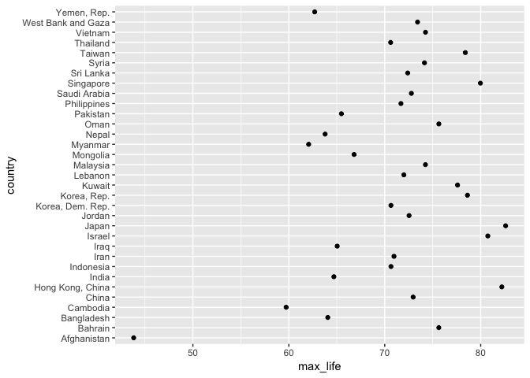
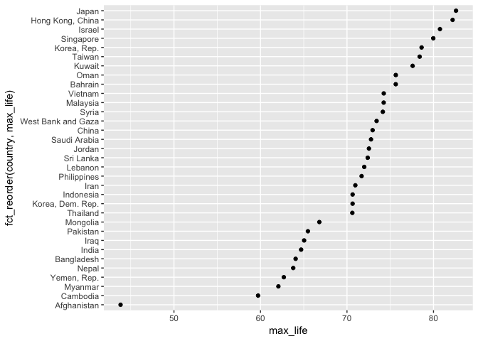
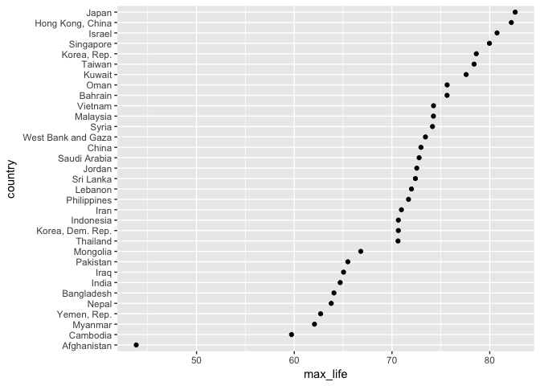
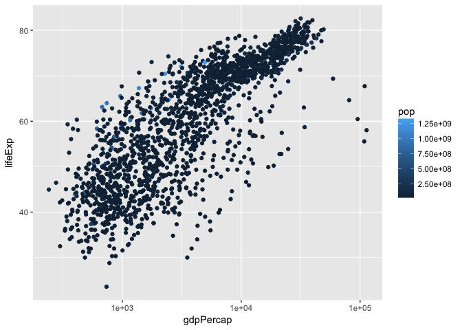
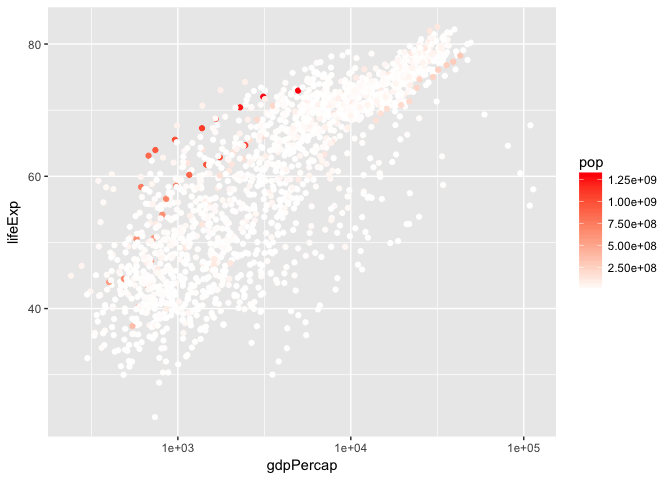
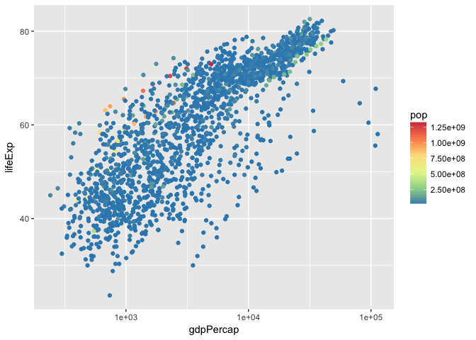

Hw05 545
================
tom
2017-10-19

My assignment starts with Gapminder version.

*warminig up- set up the environment*

``` r
suppressPackageStartupMessages(library(tidyverse))
suppressPackageStartupMessages(library(gapminder))
suppressPackageStartupMessages(library(forcats))
```

forcats allows us to use fct\_reorder, etc.

#### Drop Oceania. Filter the Gapminder data to remove observations associated with the continent of Oceania.Additionally, remove unused factor levels. Provide concrete information on the data before and after removing these rows and Oceania; address the number of rows and the levels of the affected factors.

``` r
nrow(gapminder)
```

    ## [1] 1704

``` r
nlevels(gapminder$continent)
```

    ## [1] 5

``` r
h_continent<-gapminder %>% 
  filter(continent!="Oceania")
  nlevels(h_continent$continent)
```

    ## [1] 5

``` r
  nrow(h_continent)
```

    ## [1] 1680

I dropped Oceania rows. number of rows: 1704-&gt;1608 number of levels didn't change.

``` r
 h_continent_drop<-h_continent %>% 
  droplevels()

 nlevels( h_continent_drop$continent)
```

    ## [1] 4

``` r
 levels(h_continent_drop$continent)
```

    ## [1] "Africa"   "Americas" "Asia"     "Europe"

So I dropped unused level with base ftn.

``` r
h_continent_drop2<-h_continent$continent %>% 
   fct_drop()

nlevels(h_continent_drop2)
```

    ## [1] 4

``` r
levels(h_continent_drop2)
```

    ## [1] "Africa"   "Americas" "Asia"     "Europe"

And I dropped unused level with fct ftn.

#### Reorder the levels of country or continent. Use the forcats package to change the order of the factor levels, based on a principled summary of one of the quantitative variables. Consider experimenting with a summary statistic beyond the most basic choice of the median.

``` r
gapminder$country %>%
  levels() %>% head()#original order.
```

    ## [1] "Afghanistan" "Albania"     "Algeria"     "Angola"      "Argentina"  
    ## [6] "Australia"

``` r
fct_reorder(gapminder$country, gapminder$lifeExp, mean, .desc=TRUE) %>% 
  levels() %>% head()#changed.
```

    ## [1] "Iceland"     "Sweden"      "Norway"      "Netherlands" "Switzerland"
    ## [6] "Canada"

Descending order, by mean value of lifeExp, I reordeer the levels of country factor.

#### Explore the effects of arrange(). Does merely arranging the data have any effect on, say, a figure?

For this question, I will make a graph about maximum lifeExp for each country.

``` r
gap_life<-gapminder %>% 
  filter(continent=="Asia") %>% 
  group_by(country) %>% 
  summarise(max_life=max(lifeExp)) %>% 
  arrange(desc(max_life))

head(gap_life)
```

    ## # A tibble: 6 x 2
    ##            country max_life
    ##             <fctr>    <dbl>
    ## 1            Japan   82.603
    ## 2 Hong Kong, China   82.208
    ## 3           Israel   80.745
    ## 4        Singapore   79.972
    ## 5      Korea, Rep.   78.623
    ## 6           Taiwan   78.400

``` r
gap_life$country %>% 
  levels() %>% 
  head()
```

    ## [1] "Afghanistan" "Albania"     "Algeria"     "Angola"      "Argentina"  
    ## [6] "Australia"

the data is arranged by max\_life but the factor order is still alphabetic, keeping all of levels.

``` r
gap_life %>% 
  ggplot(aes(x=max_life, y=country, colours=country))+geom_point()
```

 <br/> And as you see, the factor level is not reordered. It starts with Afghanistan and end with Yemen. Merely arranging the data doesn't have any effect on figure.

#### Explore the effects of reordering a factor and factor reordering coupled with arrange(). Especially, what effect does this have on a figure?

``` r
gap_life %>% 
  ggplot(aes(x=max_life, y=fct_reorder(country, max_life)))+geom_point()
```

 <br/> the effects of reordering a factor is on this figure. it helps us to see the meaning well.

For the effect of factor reordering coupled with arrange(),

``` r
gap_life<-gapminder %>% 
  filter(continent=="Asia") %>% 
  group_by(country) %>% 
  summarise(max_life=max(lifeExp)) %>% 
  arrange(desc(max_life)) %>% 
  mutate(country=fct_reorder(country, max_life))   # I reordered factor!

knitr::kable(head(gap_life))
```

| country          |  max\_life|
|:-----------------|----------:|
| Japan            |     82.603|
| Hong Kong, China |     82.208|
| Israel           |     80.745|
| Singapore        |     79.972|
| Korea, Rep.      |     78.623|
| Taiwan           |     78.400|

``` r
gap_life %>% 
  ggplot(aes(x=max_life, y=country, colours=country))+geom_point()
```

 <br/> By combining reordering and arrange, we can produce decent tables and figure.

*File I/O* \#\#\#\#Experiment with one or more of write\_csv()/read\_csv() (and/or TSV friends), saveRDS()/readRDS(), dput()/dget(). I highly recommend you fiddle with the factor levels, i.e. make them non-alphabetical (see previous section). Explore whether this survives the round trip of writing to file then reading back in.

I created something new, by grouped-summarization of Gapminder. It's each contry from each continent's average population over the years.

``` r
gap_pop <- gapminder %>%
  group_by(country, continent) %>% 
  summarise(ave_pop = mean(pop)) %>% 
  ungroup()
str(gap_pop)
```

    ## Classes 'tbl_df', 'tbl' and 'data.frame':    142 obs. of  3 variables:
    ##  $ country  : Factor w/ 142 levels "Afghanistan",..: 1 2 3 4 5 6 7 8 9 10 ...
    ##  $ continent: Factor w/ 5 levels "Africa","Americas",..: 3 4 1 1 2 5 4 3 3 4 ...
    ##  $ ave_pop  : num  15823715 2580249 19875406 7309390 28602240 ...

<br/> Country and continent variables are already factors. I will change the factor order.

``` r
gap_pop <- gap_pop %>% 
  mutate(country = fct_reorder(country, desc(ave_pop)))
head(levels(gap_pop$country))
```

    ## [1] "China"         "India"         "United States" "Indonesia"    
    ## [5] "Brazil"        "Japan"

<br/> China has the largest population in common sense for sure. it matches with the factor order. nice.

So I will start my process of csv, RDS, and dput/get.

For csv.

``` r
write_csv(gap_pop, "gap_pop.csv")
```

I wrote it.

``` r
gap_pop_csv<-read.csv("gap_pop.csv")
head(gap_pop_csv)
```

    ##       country continent  ave_pop
    ## 1 Afghanistan      Asia 15823715
    ## 2     Albania    Europe  2580249
    ## 3     Algeria    Africa 19875406
    ## 4      Angola    Africa  7309390
    ## 5   Argentina  Americas 28602240
    ## 6   Australia   Oceania 14649312

Its weird that I need to put "" inside of the read.csv ftn. cuz as you can see below,

``` r
(gap_tsv <- system.file("gapminder.tsv", package = "gapminder"))
```

    ## [1] "/Library/Frameworks/R.framework/Versions/3.4/Resources/library/gapminder/gapminder.tsv"

``` r
gapminder_tsv <- read_tsv(gap_tsv)
```

    ## Parsed with column specification:
    ## cols(
    ##   country = col_character(),
    ##   continent = col_character(),
    ##   year = col_integer(),
    ##   lifeExp = col_double(),
    ##   pop = col_integer(),
    ##   gdpPercap = col_double()
    ## )

when we do read.tsv, we don't need to put "" inside of (). Anyway, I am gonna explore whether this csv's factor order survives the round trip of writing to file then reading back in.

``` r
head(levels(gap_pop_csv$country))
```

    ## [1] "Afghanistan" "Albania"     "Algeria"     "Angola"      "Argentina"  
    ## [6] "Australia"

``` r
head(levels(gap_pop$country))
```

    ## [1] "China"         "India"         "United States" "Indonesia"    
    ## [5] "Brazil"        "Japan"

No. it changed.

Then I am gonna see a result of RDS.

``` r
saveRDS(gap_pop, "gap_pop.rds")
gap_pop_rds <- readRDS("gap_pop.rds")
head(levels(gap_pop_rds$country))
```

    ## [1] "China"         "India"         "United States" "Indonesia"    
    ## [5] "Brazil"        "Japan"

``` r
head(levels(gap_pop$country))
```

    ## [1] "China"         "India"         "United States" "Indonesia"    
    ## [5] "Brazil"        "Japan"

RDS saves it!!!!and I can see the rds is like a extension name.

Then I will see how weird dput/get look like, comparing it with csv and RDS process.

``` r
dput(gap_pop, "gap_pop_dput.txt")
gap_pop_dget <- dget("gap_pop_dput.txt")

head(scan("/Users/hyeongcheolpark/monk/STAT545-hw02-Hyeongcheol-Park/STAT545-hw-Hyeongcheol-Park/Hw05/gap_pop_dput.txt",what=""))
```

    ## [1] "structure(list(country" "="                     
    ## [3] "structure(c(41L,"       "113L,"                 
    ## [5] "35L,"                   "72L,"

it seems dput/get saves file as a txt file, which looks weird. At first, I tried read.table("/Users/hyeongcheolpark/monk/STAT545-hw02-Hyeongcheol-Park/STAT545-hw-Hyeongcheol-Park/Hw05/gap\_pop\_dput.txt",header=FALSE). But it didn't work...So I googled other method and find scan ftn. it was my first mountain hard to climb this time. Please let me know if you know why, my future reviewers :)

As checked the shape of dput.txt, let me check the factor order.

``` r
head(levels(gap_pop_dget$country))
```

    ## [1] "China"         "India"         "United States" "Indonesia"    
    ## [5] "Brazil"        "Japan"

``` r
head(levels(gap_pop$country))
```

    ## [1] "China"         "India"         "United States" "Indonesia"    
    ## [5] "Brazil"        "Japan"

Nice. Except write/read CSV, dget and RDS both save the order.

#### Visualization design

##### Remake at least one figure or create a new one, in light of something you learned in the recent class meetings about visualization design and color. Maybe juxtapose your first attempt and what you obtained after some time spent working on it. Reflect on the differences. If using Gapminder, you can use the country or continent color scheme that ships with Gapminder. Consult the guest lecture from Tamara Munzner and everything here.

``` r
(g1<-ggplot(gapminder, aes(gdpPercap, lifeExp)) +
        geom_point(aes(colour=pop)) +
        scale_x_log10())
```

 <br/> I will start with this one. the color is by population.

``` r
g1+scale_colour_gradient2(low="blue", mid="white", high="red")
```

 <br/> I changed colors with diverging scale.

And with distiller ftn;

``` r
g1 + scale_colour_distiller(palette="Spectral")
```

 <br/> It doesn't seem right because we can see many countrys have low population. I think the previous trial is better to understand the data.

#### Writing figures to file

##### Use ggsave() to explicitly save a plot to file. Then load and embed it in your report. You can play around with various options

``` r
g2<-g1+scale_colour_gradient2(low="blue", mid="white", high="red")
ggsave("myplot.pdf", g2, width = 12, height = 6)
ggsave("myplot.bmp", g2, width = 12, height = 6)
ggsave("myplot.png", g2, width = 12, height = 6)
```

  
