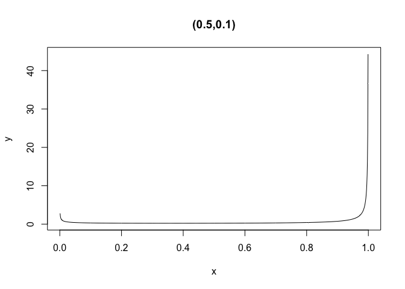
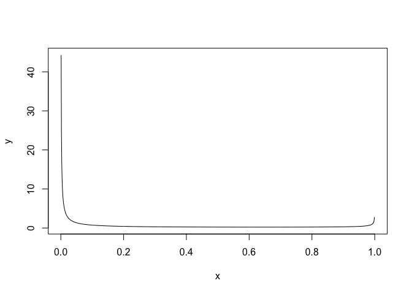
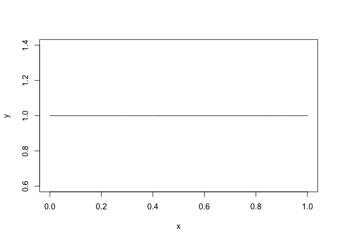
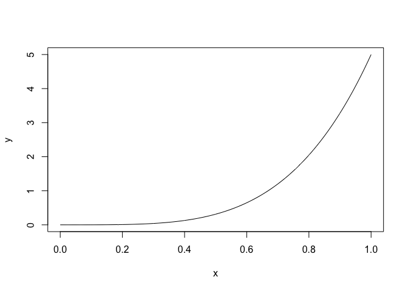
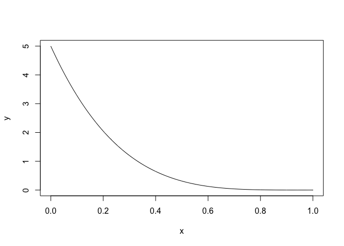
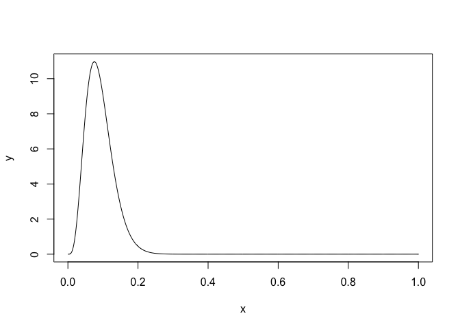
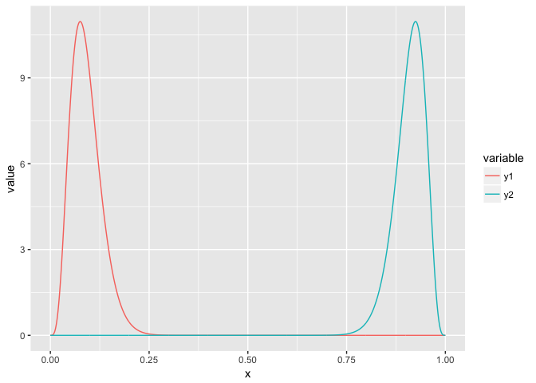
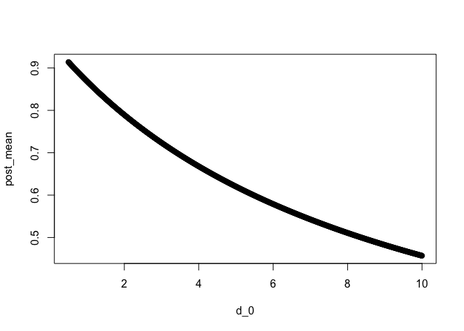

560 assgn8
================
tom
2017-11-16

``` r
x<-seq(0,1,0.001)
y<-dbeta(x,0.5,0.1)
plot(x,y,type = "l",main = "(0.5,0.1)")
```



``` r
x<-seq(0,1,0.001)
y<-dbeta(x,0.1, 0.5) 
plot(x,y,type = "l")
```



``` r
x<-seq(0,1,0.001)
y<-dbeta(x,0.5, 0.5) 
plot(x,y,type = "l")
```


``` r
x<-seq(0,1,0.001)
y<-dbeta(x,1, 1) 
plot(x,y,type = "l")
```



``` r
x<-seq(0,1,0.001)
y<-dbeta(x,5, 1) 
plot(x,y,type = "l")
```



``` r
x<-seq(0,1,0.001)
y<-dbeta(x,1, 5) 
plot(x,y,type = "l")
```



``` r
x<-seq(0,1,0.001)
y<-dbeta(x,5, 20) 
plot(x,y,type = "l")
```


``` r
x<-seq(0,1,0.001)
y<-dbeta(x,5, 50)
plot(x,y,type = "l")
```



1.  Select two additional pairs based on your own curiosity and plot them.

``` r
library(ggplot2)
library(reshape2)
```

``` r
x  <- seq(0, 1, 0.001)
y1 <- dbeta(x,7, 3)
y2 <- dbeta(x,8, 2)
df <- data.frame(x, y1, y2)
df2 <- melt(data = df, id.vars = "x")
ggplot(data = df2, aes(x = x, y = value, colour = variable)) + geom_line()
```


1.  Show that the density functions with parameters (a, b) and (b, a) are mirror images of each other.

``` r
a=5
b=50
x  <- seq(0, 1, 0.001)
y1 <- dbeta(x,a,b)
y2 <- dbeta(x,b,a)
df <- data.frame(x, y1, y2)
df2 <- melt(data = df, id.vars = "x")
ggplot(data = df2, aes(x = x, y = value, colour = variable)) + geom_line()
```

 3(a)

``` r
n<-20
df<-30
x<-c(1.1777518, -0.5867896,  0.2283789, -0.1735369, -0.2328192,
     1.0955114,  1.2053680, -0.7216797, -0.3387580,   0.1620835,
     1.4173256, 0.0240219, -0.6647623,  0.6214567,   0.7466441,
     1.9525066, -1.2017093,  1.9736293,  -0.1168171,  0.4511754)
a_square<-(2-(sum(x))^2/(n+1)+sum(x^2))/((n+1)*df)
b<-sum(x)/(n+1)

a<-sqrt(a_square)


qnst <- function(p,mu,sigma,nu) return(mu + sigma*qt(p,df=nu))

qnst(0.75,b,a,df)
```

    ## [1] 0.4483564

3(b)

``` r
var_mu<-a_square*df/(df-2)

b^2+var_mu
```

    ## [1] 0.1416475

4(a)

``` r
mu_0<-seq(-2,2,0.01)
t<-(sum(x)+mu_0)/(n+1)
plot(mu_0,t)
```


4(b)

``` r
d_0<-seq(0.5, 10,0.01)
post_mean<-(sum((x-mean(x))^2)-(n*(mean(x))^2/(n+1))+2)/(n+2*d_0-2)
plot(d_0,post_mean)
```


